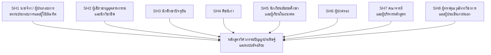

# ① การสังเคราะห์ความต้องการของผู้มีส่วนได้ส่วนเสีย (Stakeholders' Needs)

> ขั้นแรกของ OBE: จำแนกผู้มีส่วนได้ส่วนเสีย **8 กลุ่ม (SH1–SH8)** และสังเคราะห์ความต้องการเป็น **18 ข้อ (N1–N18)** แบ่งเป็น 2 กลุ่มเพื่อความโปร่งใสของแหล่งที่มาของหลักฐาน

## 1.1 กรอบผู้มีส่วนได้ส่วนเสีย 8 กลุ่ม

ข้อมูลสำรวจเดิมรายงานผู้ตอบเป็น **4 กลุ่มรวม** เนื่องจากรวมบทบาทหลายประเภทไว้ในตัวเลือกเดียว เอกสารฉบับนี้จึงแยกบทบาทที่ปรากฏอยู่แล้วออกเป็น **8 กลุ่มวิเคราะห์** เพื่อให้การรับฟังเสียง การระบุความคาดหวัง และการสอบย้อนกลับ Needs → GA → PLO ชัดเจนขึ้น โดย **ไม่เพิ่มผู้ตอบและไม่ประมาณจำนวนรายกลุ่มย่อย**

### ภาพรวมกลุ่มผู้มีส่วนได้ส่วนเสีย

### นิยาม บทบาท และความคาดหวังของแต่ละกลุ่ม

| รหัส    | กลุ่มผู้มีส่วนได้ส่วนเสีย                          | สถานะ/หลักฐานในข้อมูลเดิม     | ความคาดหวังหลักต่อหลักสูตร                                                                                              | Needs ที่เกี่ยวข้องโดยตรง                   |
| ------- | -------------------------------------------------- | ----------------------------- | ----------------------------------------------------------------------------------------------------------------------- | ------------------------------------------- |
| **SH1** | นายจ้าง ผู้ประกอบการ สถานประกอบการ และผู้ใช้บัณฑิต | แยกจากกลุ่มรวมภาคเอกชน 27 ราย | บัณฑิตทำงานได้จริง บูรณาการวิศวกรรม–AI จัดการข้อมูล Deploy ระบบอย่างคุ้มค่า ปลอดภัย และทำงานเป็นทีมได้                  | N1–N7, N10–N11                              |
| **SH2** | ผู้เชี่ยวชาญอุตสาหกรรมและนักวิชาชีพ                | แยกจากกลุ่มรวมภาคเอกชน 27 ราย | เนื้อหาทันเทคโนโลยีและมาตรฐานวิชาชีพ มีความลึกตาม Track เข้าใจกระบวนการจริง จริยธรรม ความปลอดภัย และข้อกำกับ            | N1, N3–N6, N9, N12–N13, N16, N18            |
| **SH3** | นักศึกษาปัจจุบัน                                   | แยกจากกลุ่มผู้เรียนรวม 23 ราย | ได้ใช้อุปกรณ์จริง เรียนแบบ Workshop/Project มีเส้นทางการเรียนชัดเจน ได้ทักษะสื่อสารและเตรียมพร้อมสู่อาชีพ               | N6–N10                                      |
| **SH4** | ศิษย์เก่า                                          | แยกจากกลุ่มผู้เรียนรวม 23 ราย | หลักสูตรสอดคล้องงานจริง ลดช่องว่างทักษะ สนับสนุนการพัฒนาอาชีพและการเรียนรู้เทคโนโลยีใหม่ตลอดชีวิต                       | N3, N6–N7, N9–N11                           |
| **SH5** | นักเรียนมัธยมศึกษาตอนปลายและผู้เรียนในอนาคต        | แยกจากกลุ่มผู้เรียนรวม 23 ราย | เห็นเส้นทางการเรียนและอาชีพ เข้าใจความแตกต่างของ 3 Tracks เข้าถึงการเรียนรู้และโอกาสทางการศึกษาได้                      | N6–N9, N11, N17                             |
| **SH6** | ผู้ปกครอง                                          | ผู้ตอบโดยตรง 1 ราย            | คุณภาพและความปลอดภัยของการศึกษา ค่าใช้จ่ายเหมาะสม และมีโอกาสได้งาน โดยเฉพาะในภาคตะวันออกเฉียงเหนือ                      | N3, N11, N17                                |
| **SH7** | คณาจารย์และผู้บริหารหลักสูตร                       | แยกจากกลุ่มวิชาการรวม 4 ราย   | โครงสร้างหลักสูตรมีความต่อเนื่อง สอนได้จริง ประเมินผลตาม OBE ได้ ทันเทคโนโลยี และสอดคล้องทรัพยากร/ศักยภาพของมหาวิทยาลัย | N1, N4, N6–N10, N12–N13, N15–N16, N18       |
| **SH8** | ผู้ทรงคุณวุฒิทางวิชาการและผู้ประเมินภายนอก         | แยกจากกลุ่มวิชาการรวม 4 ราย   | มาตรฐานวิชาการและวิชาชีพ ความทันสมัยขององค์ความรู้ Constructive Alignment การประกันคุณภาพ และการสอบย้อนกลับผลลัพธ์      | N1–N2, N4–N5, N9–N10, N12–N13, N15–N16, N18 |

> [!important] ข้อจำกัดของข้อมูลจำนวนผู้ตอบ
> ต้นฉบับให้จำนวนเฉพาะกลุ่มรวม ได้แก่ **SH1+SH2 = 27**, **SH3+SH4+SH5 = 23**, **SH6 = 1** และ **SH7+SH8 = 4** รวม 55 ราย จึงไม่ควรนำจำนวน 27, 23 หรือ 4 ไปใส่ซ้ำในแต่ละกลุ่มย่อย และควรเพิ่มคำถามระบุบทบาทแบบแยกกลุ่มในการสำรวจรอบถัดไป

### การจัดลำดับความสำคัญด้วย Power–Interest Matrix

การจัดกลุ่มนี้ประเมิน **อำนาจ/อิทธิพลต่อการตัดสินใจหลักสูตร (Power)** และ **ระดับความสนใจหรือผลกระทบที่ได้รับจากหลักสูตร (Interest)** ในบริบทการบริหารหลักสูตร ไม่ใช่การจัดอันดับคุณค่าหรือความสำคัญของบุคคล และควรทบทวนเมื่อบทบาทของผู้มีส่วนได้ส่วนเสียเปลี่ยนแปลง

|               | **Interest สูง**                                                                                                                                     | **Interest ต่ำหรือเป็นครั้งคราว**                                            |
| ------------- | ---------------------------------------------------------------------------------------------------------------------------------------------------- | ---------------------------------------------------------------------------- |
| **Power สูง** | **HPHI — Manage Closely** SH1 นายจ้าง/ผู้ประกอบการ/ผู้ใช้บัณฑิต SH2 ผู้เชี่ยวชาญอุตสาหกรรมและนักวิชาชีพ SH7 คณาจารย์และผู้บริหารหลักสูตร | **HPLI — Keep Satisfied** SH8 ผู้ทรงคุณวุฒิทางวิชาการและผู้ประเมินภายนอก |
| **Power ต่ำ** | **LPHI — Keep Informed** SH3 นักศึกษาปัจจุบัน SH4 ศิษย์เก่า SH6 ผู้ปกครอง                                                                | **LPLI — Monitor** SH5 นักเรียนมัธยมศึกษาและผู้เรียนในอนาคต              |

#### เหตุผลและกลยุทธ์รายกลุ่ม

| กลุ่ม Priority | Stakeholders | เหตุผลในการจัดกลุ่ม | กลยุทธ์การบริหารความสัมพันธ์ |
|---|---|---|---|
| **HPHI** High Power–High Interest | **SH1, SH2, SH7** | SH1 กำหนดความต้องการสมรรถนะและโอกาสจ้างงาน; SH2 มีอิทธิพลต่อมาตรฐานและความทันสมัยเฉพาะอุตสาหกรรม; SH7 รับผิดชอบออกแบบ จัดการเรียนรู้ ประเมิน และปรับปรุงหลักสูตรโดยตรง | **Manage Closely:** ร่วมออกแบบหลักสูตรและโจทย์จริง ตั้ง Advisory Board ทวนสอบ PLO/CLO/รายวิชา และปิดวงจร feedback ด้วยหลักฐานการปรับปรุง |
| **HPLI** High Power–Low/Periodic Interest | **SH8** | ผู้ทรงคุณวุฒิและผู้ประเมินมีอำนาจเชิงมาตรฐานหรือให้ข้อเสนอที่ส่งผลต่อการอนุมัติ แต่เข้าร่วมเป็นช่วงตามรอบวิพากษ์และประกันคุณภาพ | **Keep Satisfied:** ส่งข้อมูลสรุปที่ครบถ้วน เชิญทวนสอบในจุดตัดสินใจสำคัญ และติดตามการตอบข้อเสนอแนะอย่างเป็นระบบ |
| **LPHI** Low Power–High Interest | **SH3, SH4, SH6** | ได้รับผลกระทบโดยตรงจากคุณภาพการเรียน โอกาสอาชีพ ค่าใช้จ่าย และความเชื่อมั่น แต่มีอำนาจอนุมัติหลักสูตรอย่างเป็นทางการต่ำกว่า HPHI/HPLI | **Keep Informed:** สื่อสารสม่ำเสมอ เปิดช่องรับฟังที่เข้าถึงง่าย สำรวจประสบการณ์และผลลัพธ์ และรายงานว่าข้อเสนอถูกนำไปใช้อย่างไร |
| **LPLI** Low Power–Low/Developing Interest | **SH5** | ยังไม่ได้เป็นผู้เรียนโดยตรงและระดับการมีส่วนร่วมต่อเนื่องยังต่ำ แต่เป็นฐานผู้เรียนในอนาคตและมีความสำคัญต่อการเข้าถึงหลักสูตร | **Monitor:** สื่อสารภาพหลักสูตรและเส้นทางอาชีพผ่าน Open House/สื่อดิจิทัล สำรวจความสนใจเป็นระยะ และยกระดับเป็น LPHI เมื่อเข้าสู่กระบวนการสมัครหรือเข้าศึกษา |

> [!important] Priority สำคัญที่สุด
> **SH1 นายจ้าง ผู้ประกอบการ สถานประกอบการ และผู้ใช้บัณฑิต จัดเป็น HPHI** เพราะมีทั้งอิทธิพลสูงต่อสมรรถนะที่หลักสูตรต้องผลิตและมีความสนใจสูงต่อคุณภาพบัณฑิตที่จะเข้าสู่การทำงาน จึงต้องมีส่วนร่วมตั้งแต่กำหนด Needs, ทวนสอบ PLO, ให้โจทย์โครงงาน/สหกิจ จนถึงประเมินผลบัณฑิต

### แผนการรับฟังและใช้ข้อมูลที่เสนอ

| กลุ่ม | วิธีรับฟัง/มีส่วนร่วม                                          | รอบเวลาที่เสนอ                             | การนำผลไปใช้                                                                            |
| ----- | -------------------------------------------------------------- | ------------------------------------------ | --------------------------------------------------------------------------------------- |
| SH1   | แบบสำรวจผู้ใช้บัณฑิต สัมภาษณ์ และ Employer Advisory Board      | อย่างน้อยปีละ 1 ครั้ง                      | ปรับสมรรถนะเป้าหมาย โจทย์โครงงาน สหกิจ และเทคโนโลยีที่ตลาดต้องการ                       |
| SH2   | Focus group, Technical Advisory Panel และทวนสอบคำอธิบายรายวิชา | ปีละ 1 ครั้งหรือเมื่อเทคโนโลยีเปลี่ยนสำคัญ | ปรับเนื้อหาเฉพาะ Track เครื่องมือ มาตรฐาน และข้อกำกับ                                   |
| SH3   | แบบประเมินรายวิชา สนทนากลุ่ม และประเมิน YLO สิ้นชั้นปี         | ทุกภาคเรียน/ทุกชั้นปี                      | ปรับลำดับรายวิชา ภาระการเรียน วิธีสอน และการสนับสนุนผู้เรียน                            |
| SH4   | Alumni tracer study และสัมภาษณ์หลังทำงาน                       | หลังจบ 1 และ 3 ปี                          | ตรวจความสอดคล้องของ PLO กับงานจริงและช่องว่างทักษะหลังสำเร็จการศึกษา                    |
| SH5   | แบบสำรวจความสนใจ กิจกรรม Open House และทดลองเรียน              | ปีละ 1 ครั้ง                               | ปรับการสื่อสารหลักสูตร เส้นทาง Track และกิจกรรมเตรียมความพร้อม                          |
| SH6   | แบบสำรวจ/ประชุมผู้ปกครอง                                       | ปีละ 1 ครั้ง                               | สื่อสารค่าใช้จ่าย ความปลอดภัย คุณภาพ และแนวทางอาชีพในพื้นที่                            |
| SH7   | Curriculum retreat, CLO–PLO review และประชุมผลประเมิน          | ทุกภาคเรียนและทบทวนใหญ่ปีละ 1 ครั้ง        | ปรับ Constructive Alignment ทรัพยากร ผู้สอน และแผนปรับปรุงคุณภาพ                        |
| SH8   | Peer review และการวิพากษ์หลักสูตรโดยผู้ทรงคุณวุฒิ              | ก่อนอนุมัติและตามรอบทบทวนหลักสูตร          | ยืนยันมาตรฐาน ความทันสมัย ความสอดคล้อง OBE/AUN-QA/TABEE และความน่าเชื่อถือของการประเมิน |

## 1.2 สรุปผลการสำรวจความคิดเห็นผู้มีส่วนได้ส่วนเสีย

หลักสูตรสำรวจความคิดเห็นด้วยแบบสอบถามออนไลน์ มีผู้ตอบรวม **55 ราย** จำแนกเป็น:

| กลุ่ม | ผู้มีส่วนได้ส่วนเสีย                                         | จำนวน |
| ----- | ------------------------------------------------------------ | ----: |
| 1     | ภาคเอกชน/สถานประกอบการ/ผู้ใช้บัณฑิต/ผู้เชี่ยวชาญในอุตสาหกรรม |    27 |
| 2     | นักศึกษาปัจจุบัน/ศิษย์เก่า/นักเรียนระดับมัธยมศึกษาตอนปลาย    |    23 |
| 3     | ผู้ปกครอง                                                    |     1 |
| 4     | คณาจารย์/ผู้ทรงคุณวุฒิทางวิชาการ                             |     4 |

**ผลการสำรวจที่สำคัญ:**

1. **ปัญหา (Pain point) ที่ผู้ใช้บัณฑิตพบมากที่สุด** คือ การขาดแคลนวิศวกรที่เข้าใจทั้งงานโครงสร้างวิศวกรรมและโมเดล AI ควบคู่กัน (**13/27**) รองลงมาคืองบประมาณโครงสร้างพื้นฐานสูง (10/27) และข้อมูลไร้ระเบียบ/ไม่มีคุณภาพ (9/27)
2. **คะแนนความสำคัญของทักษะ** (จากผู้ใช้บัณฑิต): จริยธรรมและความปลอดภัยสูงสุด **4.26/5** → ทักษะวิศวกรรมแกนหลัก 4.22 → ทักษะ AI เชิงลึก 4.19 → Data & Cloud 4.07 → Soft Skills 4.04
3. **ความคาดหวังของผู้เรียน**: เรียนจากอุปกรณ์จริงสูงสุด **4.87/5** → Workshop 4.74 → โครงงานจากโจทย์จริงและสหกิจศึกษาระยะยาว 4.57 (เท่ากัน)
4. **เทคโนโลยีที่ตลาดต้องการรายกลุ่มความเชี่ยวชาญ**: การวิเคราะห์ข้อมูลเพื่อพยากรณ์ผลผลิตและ Precision Farming สำหรับ **แขนงวิชาเกษตรอัจฉริยะ**; PLC/SCADA หุ่นยนต์อุตสาหกรรม และระบบอัตโนมัติในโรงงานสำหรับ **แขนงวิชาปัญญาประดิษฐ์ภาคอุตสาหกรรม**; Generative AI/LLM, MLOps และธุรกิจเทคโนโลยีระดับองค์กรสำหรับ **แขนงวิชานวัตกรรมปัญญาประดิษฐ์ระดับองค์กร**

## 1.3 ความต้องการที่ได้จากการสำรวจโดยตรง (N1–N11)

**ตารางที่ 1** ความต้องการจากผลการสำรวจ พร้อมหลักฐานสนับสนุน

| Need    | รายละเอียด                                                                                                                                                         | หลักฐานจากผลสำรวจ                                                                                                         | หลักฐานภายนอก                                                                                                                          |
| ------- | ------------------------------------------------------------------------------------------------------------------------------------------------------------------ | ------------------------------------------------------------------------------------------------------------------------- | -------------------------------------------------------------------------------------------------------------------------------------- |
| **N1**  | บูรณาการวิศวกรรมแกนหลัก (ไฟฟ้า อิเล็กทรอนิกส์ กลศาสตร์ ระบบควบคุม) เข้ากับ AI ได้จริง เช่น ควบคุมหุ่นยนต์/โดรนร่วมกับโมเดล AI                                      | Pain point อันดับ 1 (13/27); ทักษะวิศวกรรมแกนหลัก 4.22/5                                                                  | TDRI: ตำแหน่ง Robotics & Automation และ AI/ML Engineer; WEF: AI & ML Specialists อาชีพโตเร็ว 1 ใน 3                                    |
| **N2**  | ทักษะวิศวกรรมข้อมูลครบวงจร: เก็บ ทำความสะอาด จัดการคุณภาพข้อมูล วิเคราะห์ และสร้างโมเดล ML/DL/Computer Vision                                                      | Pain point ข้อมูลไร้ระเบียบ (9/27); AI เชิงลึก 4.19, Data & Cloud 4.07                                                    | WEF: AI and Big Data ทักษะโตเร็วอันดับ 1; TDRI: Data Scientist/Analyst + Data Engineer รวม **> 13,000 ตำแหน่ง/ปี**                     |
| **N3**  | ออกแบบ ติดตั้ง (Deploy) และขยายผล (Scale) ระบบ AI ในสภาพแวดล้อมจริงภายใต้ข้อจำกัดงบประมาณ โซลูชันไม่ซับซ้อน ราคาเข้าถึงได้ ผู้ใช้ดูแลเองได้                        | งบโครงสร้างพื้นฐานสูง (10/27), ระบบพัฒนาแล้วใช้จริงไม่ได้ (2/27); ภาคเกษตร "นวัตกรรมไม่ซับซ้อน ราคาไม่แพง เกษตรกรดูแลได้" | แผนปฏิบัติการ AI แห่งชาติ ยุทธศาสตร์ 2; แผนพัฒนาฯ ฉบับ 13 หมุดหมาย 1                                                                   |
| **N4**  | จริยธรรม AI ความมั่นคงปลอดภัยไซเบอร์ และการใช้ข้อมูลอย่างถูกต้อง ตรวจสอบผลลัพธ์ AI ก่อนใช้งาน                                                                      | คะแนนความสำคัญสูงสุด 4.26/5; Pain point ขาดความรู้จริยธรรม/ไซเบอร์ (6/27)                                                 | แนวปฏิบัติจริยธรรม AI ของไทย (6 หลักการ); WEF: Networks & Cybersecurity ทักษะโตเร็วอันดับ 2                                            |
| **N5**  | สมรรถนะเฉพาะกลุ่มความเชี่ยวชาญ: T1 Precision Farming/IoT/โดรน/พยากรณ์ผลผลิต; T2 PLC-SCADA/หุ่นยนต์/Predictive Maintenance/Digital Twin; T3 Generative AI-LLM/MLOps | เสียงนำรายแทรค: PLC/SCADA+หุ่นยนต์ 12/27, วิเคราะห์ข้อมูลพยากรณ์ผลผลิต 11/27, Generative AI/LLM 11/27                     | แผนพัฒนาฯ ฉบับ 13 หมุดหมาย 1 (T1) และ 6 (T2–3); แผนปฏิบัติการ AI แห่งชาติ                                                              |
| **N6**  | การเรียนรู้แบบลงมือปฏิบัติ (Hands-on): อุปกรณ์จริง Workshop โครงงานโจทย์จริงจากภาคเอกชน และสหกิจศึกษา 6–8 เดือน                                                    | อุปกรณ์จริง 4.87, Workshop > บรรยาย 4.74, โครงงานโจทย์จริง 4.57, สหกิจระยะยาว 4.57                                        | แผนพัฒนาฯ ฉบับ 13 หมุดหมาย 12 (กำลังคนสมรรถนะสูง); WEF: นายจ้าง 63% ระบุ Skills Gap เป็นอุปสรรคหลัก                                    |
| **N7**  | ภาษาอังกฤษเชิงเทคนิค (และภาษาจีนบางส่วน) การสื่อสาร การนำเสนอ และการทำงานเป็นทีม                                                                                   | ประเด็นที่ถูกกล่าวถึงมากสุดในคำตอบปลายเปิดของทุกกลุ่ม; Soft Skills 4.04                                                   | WEF: Leadership, Social Influence, Collaboration ยังเป็น Core Skills ควบคู่ทักษะเทคโนโลยี                                              |
| **N8**  | ความคิดเชิงผู้ประกอบการ: แปลงโมเดล AI เป็นผลิตภัณฑ์/บริการ/สตาร์ทอัพ รวมถึงการบริหารโครงการและเศรษฐศาสตร์ AI                                                       | ผู้เรียน 10/23 ต้องการเป็นนวัตกรหรือสร้างสตาร์ทอัพ; ความเห็นกลุ่มผู้ใช้บัณฑิตและคณาจารย์                                  | แผนพัฒนาฯ ฉบับ 13 หมุดหมาย 1 (ผู้ประกอบการเกษตร); WEF: นายจ้างครึ่งหนึ่งวางแผนปรับทิศทางธุรกิจตามโอกาสจาก AI                           |
| **N9**  | รู้เท่าทันเทคโนโลยีอุบัติใหม่ (Generative AI, Agentic AI, Prompt Engineering, AI Workflow) และการเรียนรู้ตลอดชีวิต                                                 | คำตอบปลายเปิดกลุ่มผู้เรียนและคณาจารย์ (AI Literacy, Agentic AI, Prompt Engineering)                                       | WEF: ทักษะ 39% เปลี่ยน/ล้าสมัยภายในปี 2030, Curiosity & Lifelong Learning ติด 10 ทักษะโตเร็ว; TDRI: ทักษะ AI เป็นมาตรฐานใหม่ของนายจ้าง |
| **N10** | การคิดวิเคราะห์และคิดเชิงวิพากษ์ ใช้ AI อย่างมีวิจารณญาณ ไม่เชื่อผลลัพธ์โดยไม่ไตร่ตรอง                                                                             | คณาจารย์ (คิดวิเคราะห์เชิงสร้างสรรค์/วิพากษ์); ผู้ใช้บัณฑิต ("ป้องกันการใช้ข้อมูลจาก AI โดยไม่ไตร่ตรอง")                  | WEF: Analytical Thinking เป็น Core Skill อันดับ 1 (7 ใน 10 บริษัทถือว่าจำเป็น)                                                         |
| **N11** | ผลิตกำลังคนตอบโจทย์การจ้างงานและการพัฒนาเทคโนโลยีในภาคตะวันออกเฉียงเหนือและชุมชนท้องถิ่น                                                                           | ผู้ปกครองให้ความสำคัญสูงสุดกับโอกาสได้งานในพื้นที่ภาคอีสาน; ผู้ใช้บัณฑิตภาคเกษตรในพื้นที่                                 | แผนพัฒนาฯ ฉบับ 13 หมุดหมาย 1 และโมเดลเศรษฐกิจ BCG; แผนปฏิบัติการ AI แห่งชาติ (Inclusion and Social Well-being)                         |

## 1.4 ความต้องการเชิงแนวโน้มจากมาตรฐานสากลและนโยบายระดับชาติ (N12–N18)

ความต้องการกลุ่มนี้ไม่ได้ปรากฏชัดในผลสำรวจ แต่สังเคราะห์จากรายงานแนวโน้มตลาดแรงงานโลก นโยบาย/แผนระดับชาติ และมาตรฐานวิชาชีพสากล เพื่อให้หลักสูตร **มองไปข้างหน้า (Forward-looking)** รองรับอาชีพที่จะเกิดใหม่ในระยะ 5–10 ปี

**ตารางที่ 2** ความต้องการเชิงแนวโน้ม

| Need | รายละเอียด | แหล่งอ้างอิง |
|---|---|---|
| **N12** | วิศวกรรม AI ที่คำนึงถึงความยั่งยืนและสิ่งแวดล้อม (Sustainable/Green AI) เช่น ประสิทธิภาพพลังงาน AI เพื่อเกษตรคาร์บอนต่ำ | WEF: Environmental Stewardship ติด 10 ทักษะโตเร็วเป็นครั้งแรก, Green Transition +34 ล้านตำแหน่งภายในปี 2030; แผนฯ 13 (BCG); IEA GAPC v4 ข้อ WA6 |
| **N13** | การคิดเชิงระบบ (Systems Thinking) ออกแบบระบบอัจฉริยะที่หลายเทคโนโลยีทำงานร่วมกันครบวงจร (เซนเซอร์–ข้อมูล–โมเดล–การควบคุม–ธุรกิจ) | WEF: Systems Thinking เป็นแกนหลักและสำคัญยิ่งขึ้นถึงปี 2030; IEA GAPC เน้น Complex Engineering Problems |
| **N14** | ระบบ AI รองรับการเปลี่ยนแปลงโครงสร้างประชากร: สังคมสูงวัย แรงงานภาคเกษตรขาดแคลน ระบบอัตโนมัติทดแทนแรงงาน | WEF: Demographic Shifts เป็น 1 ใน 5 แนวโน้มหลัก; ประเทศรายได้สูงเผชิญประชากรวัยแรงงานลดลง |
| **N15** | เทคโนโลยี AI ภาษาไทยและอธิปไตยปัญญาประดิษฐ์ (Thai NLP / Sovereign AI) ใช้และต่อยอดโครงสร้างพื้นฐาน AI ของประเทศ | แผนปฏิบัติการ AI แห่งชาติ: National AI Service Platform (AI for Thai) API > 60 รายการ; โครงการ ThaiLLM ของ อว.; Supercomputer Lanta |
| **N16** | ธรรมาภิบาล AI ระดับองค์กรและการปฏิบัติตามกฎหมาย (AI Governance & Regulatory Compliance) เช่น พ.ร.บ. คุ้มครองข้อมูลส่วนบุคคล และร่างกฎหมาย AI | แนวปฏิบัติจริยธรรม AI (6 หลักการ); ETDA/AIGC: Generative AI Governance Guideline; ร่าง พ.ร.บ. ส่งเสริมนวัตกรรม AI |
| **N17** | ปัญญาประดิษฐ์เพื่อลดความเหลื่อมล้ำและการเข้าถึงดิจิทัล (Inclusive AI / Digital Access) | WEF: Broadening Digital Access แนวโน้มส่งผลต่อธุรกิจมากสุด (60% ของนายจ้าง), +19 ล้านตำแหน่งภายในปี 2030; แผนปฏิบัติการ AI แห่งชาติ (Inclusion and Social Well-being) |
| **N18** | ความรู้ข้ามศาสตร์เชิงลึกในโดเมน (Domain Expertise): เกษตรศาสตร์ (T1), กระบวนการผลิต/ลีน (T2), ธุรกิจ/การเงิน (T3) | ตลาดแรงงาน AI ปี 2026 ให้ผลตอบแทนผู้เชี่ยวชาญเฉพาะทางสูงกว่า Generalist 30–50% และงาน AI ~75% ต้องการ Domain Experts (Second Talent, 2026; DataCamp, 2026) |

> [!tip] เชื่อมกับหลักฐานตลาดแรงงานใน Vault
> N1, N2, N9 → [[../01_Labor_Market_Research/07_Thailand_Labor_Market|TDRI + ตลาดไทย]] · N18 → [[../01_Labor_Market_Research/09_Additional_Research_2026|Domain Expertise Premium]] · N12–N17 → [[../01_Labor_Market_Research/06_Report_Sources|WEF/นโยบายชาติ]]

[[00_OBE_Home|กลับหน้าหลัก OBE]] | [[02_Graduate_Attributes|ถัดไป: ลักษณะบัณฑิต →]]
