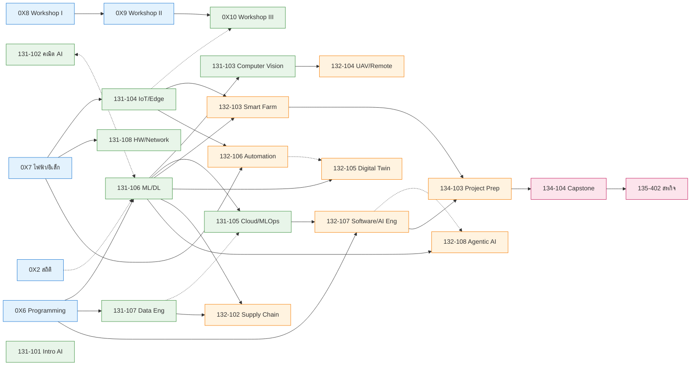

# ⑧ Dependencies · YLO · แผนการเรียน 4 ชั้นปี

> ออกแบบลำดับวิชา (ก่อน–หลัง 3 ระดับ) → ผลลัพธ์การเรียนรู้รายชั้นปี (YLO) → แผนการเรียน 8 ภาคเรียน (130 นก.)
> อ้างอิง [[07_Curriculum_PLO_Mapping]] และ [[04_Course_Descriptions_2570/11_Course_Index|Course Index]] · จัดทำ 20 กรกฎาคม 2569 / 2026-07-20

## 1. ประเภทของการเชื่อมโยงวิชา (Dependency Types)

| ประเภท | สัญลักษณ์ | ความหมาย | การบังคับ |
|---|---|---|---|
| **Hard Pre** | `──▶` เส้นทึบ | วิชาบังคับก่อน ต้อง**สอบผ่าน**ก่อนลงทะเบียน | บังคับ (real link) |
| **Weak Pre** | `┈▶` เส้นประ | วิชา**แนะนำ**ให้เรียนก่อน เสริมความเข้าใจ แต่ไม่บังคับ | ไม่บังคับ (not real link) |
| **Co-requisite** | `◀┈▶` เส้นจุดสองทาง | เรียน**คู่ขนานภาคเรียนเดียวกัน**ได้ (perroquet) | เรียนพร้อมกัน |

> [!tip] หลักการออกแบบลำดับ
> - **เส้นทางวิกฤต (Critical Path)** ของหลักสูตร: Programming → Math/ML → CV/Cloud → Track Core → Capstone → Co-op
> - ใช้ **Co-req** แก้คอขวด เช่น *คณิต AI ↔ ML/DL* เพื่อไม่ต้องยืดสายวิชาออกไปอีก 1 ภาคเรียน
> - **Weak Pre** ใช้กับความรู้ที่ช่วยเสริมแต่อาจารย์ทบทวนให้ได้ในคาบ (ไม่ล็อกการลงทะเบียน)

## 2. แผนภาพลำดับวิชาแกน (Critical-Path Backbone)

*(เส้นทึบ = Hard Pre, เส้นประ = Weak Pre, เส้นจุดสองทาง = Co-req · แสดงเฉพาะสายหลัก)*

## 3. ตารางวิชาก่อน–หลัง (ครบ 32 วิชาแกน)

| รหัส | วิชา | Hard Pre | Weak Pre (แนะนำ) | Co-req |
|---|---|---|---|---|
| 0X1 | เศรษฐศาสตร์วิศวกรรม | — | — | — |
| 0X2 | สถิติและวิเคราะห์ข้อมูล | — | คณิตม.ปลาย | — |
| 0X3 | ความร้อนและของไหล | — | ฟิสิกส์ | — |
| 0X4 | เขียนแบบวิศวกรรม | — | — | — |
| 0X5 | กลศาสตร์วัสดุ | — | ฟิสิกส์ | — |
| 0X6 | การเขียนโปรแกรมพื้นฐาน | — | — | — |
| 0X7 | ไฟฟ้าและอิเล็กทรอนิกส์ | — | — | — |
| 0X8 | ปฏิบัติการ I | — | 0X4 | — |
| 0X9 | ปฏิบัติการ II | 0X8 | 0X7 | — |
| 0X10 | ปฏิบัติการ III | 0X9 | 131-104 | — |
| 131-101 | ความรู้เบื้องต้น AI | — | 0X6 | — |
| 131-102 | คณิตศาสตร์ AI | — | 0X2 | — |
| 131-106 | ML / Deep Learning | 0X6 | 0X2 | **131-102** |
| 131-107 | วิศวกรรมข้อมูล/Big Data | 0X6 | 0X2 | — |
| 131-103 | คอมพิวเตอร์วิทัศน์ | 131-106 | 0X6 | — |
| 131-104 | IoT / Edge | 0X7 | 0X6 | — |
| 131-105 | Cloud / MLOps | 131-106 | 131-107 | — |
| 131-108 | HW/Network สำหรับ AI | 0X7 | 131-104, 131-105 | — |
| 132-101 | ผลิตภัณฑ์/ธุรกิจ AI | — | 131-101, 0X1 | — |
| 132-102 | AI ห่วงโซ่การผลิต | 131-107, 131-106 | 131-101 | — |
| 132-103 | ฟาร์มอัจฉริยะ | 131-104, 131-106 | 131-103 | — |
| 132-104 | UAV/Remote Sensing | 131-103 | 131-104 | — |
| 132-105 | โรงงานอัจฉริยะ/Digital Twin | 131-106 | 132-106 | 132-106 |
| 132-106 | ระบบอัตโนมัติ/หุ่นยนต์ | 0X7, 131-104 | 0X10 | — |
| 132-107 | พัฒนาซอฟต์แวร์/AI Eng | 0X6, 131-105 | 131-107 | — |
| 132-108 | ระบบเอเจนต์ AI | 131-106 | 131-105 | 132-107 |
| 134-101 | สัมมนา I | — | 131-101 | — |
| 134-102 | สัมมนา II | 134-101 | — | — |
| 134-103 | เตรียมโครงงาน | 134-101, ผ่านแกนแขนง ≥50% | — | 134-102 |
| 134-104 | โครงงาน (Capstone) | 134-103 | — | — |
| 135-401 | เตรียมสหกิจ | ผ่านแกนแขนง ≥75% | 134-103 | — |
| 135-402 | สหกิจศึกษา | 135-401, 134-104 | — | — |

> **วิชาเลือกชีพ (EN-135-1xx):** Hard Pre = วิชาแกนแขนงที่เกี่ยวข้อง (เช่น เลือกเกษตร Hard← 132-103; เลือกอุตสาหกรรม Hard← 132-106/105; เลือกนวัตกรรม Hard← 132-107) · ดู [[04_Course_Descriptions_2570/11_Course_Index|Course Index]]

## 4. ผลลัพธ์การเรียนรู้รายชั้นปี (Year Learning Outcomes — YLO)

| YLO | เมื่อจบชั้นปี ผู้เรียนสามารถ… | PLO (I=Introduce, R=Reinforce, M=Master) |
|---|---|---|
| **YLO1 · ปี 1** *รากฐานวิศวกรรม & โปรแกรม* | ประยุกต์คณิตศาสตร์/สถิติ/ฟิสิกส์วิศวกรรม เขียนโปรแกรม Python เบื้องต้น เขียนแบบ ประกอบวงจร/ฮาร์ดแวร์ และทำงานปฏิบัติการเป็นทีม | PLO1-I · PLO2-I · PLO5-I · PLO6-I |
| **YLO2 · ปี 2** *แกน AI & ระบบอัจฉริยะ* | พัฒนาโมเดล ML/DL, จัดการ Data Pipeline, สร้างระบบ IoT/Edge, Deploy บน Cloud, ประยุกต์ Computer Vision และตระหนักจริยธรรม/ความปลอดภัย AI | PLO1-R · PLO2-R · PLO6-R · PLO4-I · PLO7-I |
| **YLO3 · ปี 3** *บูรณาการเฉพาะแขนง & สื่อสาร* | ออกแบบระบบอัจฉริยะเฉพาะโดเมน (เกษตร/อุตสาหกรรม/องค์กร), วิเคราะห์–พยากรณ์ข้อมูล, สื่อสาร/นำเสนอผล และทำงานข้ามศาสตร์เป็นทีม | PLO2-R · PLO3-R · PLO4-R · PLO5-R · PLO6-R · PLO7-R |
| **YLO4 · ปี 4** *วิชาชีพ · นวัตกรรม · เรียนรู้ตลอดชีวิต* | ทำโครงงาน/สหกิจแก้ปัญหาจริงในสถานประกอบการ, แสดงความเป็นผู้ประกอบการ, ยึดจรรยาบรรณ/จริยธรรม AI และเรียนรู้เทคโนโลยีอุบัติใหม่ด้วยตนเอง | PLO2-M · PLO3-M · PLO4-M · PLO5-M · PLO7-M · (PLO1/PLO6-M) |

## 5. แผนการเรียน 4 ชั้นปี (8 ภาคเรียน · 130 นก.)

### 🟦 ชั้นปีที่ 1 — รากฐาน (35 นก.)

**ภาคเรียน 1 (16 นก.)**

| รหัส | วิชา | นก. |
|---|---|--:|
| GE-010-001 | ภาษาอังกฤษง่ายนิดเดียว | 3 |
| GE-010-004 | คุณค่ามหาวิทยาลัยกาฬสินธุ์ | 3 |
| EN-001-0X2 | สถิติและการวิเคราะห์ข้อมูล | 3 |
| EN-001-0X4 | การเขียนแบบวิศวกรรม | 3 |
| EN-001-0X6 | การเขียนโปรแกรมพื้นฐานสำหรับ AI | 3 |
| EN-001-0X8 | ปฏิบัติการวิศวกรรมเชิงบูรณาการ I | 1 |

**ภาคเรียน 2 (19 นก.)**

| รหัส | วิชา | นก. |
|---|---|--:|
| GE-010-003 | ดิจิทัลกับชีวิตวิถีใหม่ | 3 |
| GE-010-005 | ชีวิตออกแบบได้ | 3 |
| EN-001-0X1 | เศรษฐศาสตร์วิศวกรรม | 3 |
| EN-001-0X3 | วิศวกรรมความร้อนและของไหล | 3 |
| EN-001-0X5 | กลศาสตร์วัสดุและการออกแบบโครงสร้าง | 3 |
| EN-001-0X7 | ไฟฟ้าและอิเล็กทรอนิกส์ | 3 |
| EN-001-0X9 | ปฏิบัติการวิศวกรรมเชิงบูรณาการ II | 1 |

### 🟩 ชั้นปีที่ 2 — แกน AI (37 นก.)

**ภาคเรียน 3 (19 นก.)**

| รหัส | วิชา | นก. |
|---|---|--:|
| GE-010-002 | ภาษาอังกฤษฟุดฟิดฟอฟัน | 3 |
| GE-010-006 | ปรัชญามนุษย์ สังคมและเศรษฐศาสตร์ | 3 |
| EN-131-101 | ความรู้เบื้องต้นสำหรับ AI | 3 |
| EN-131-102 | คณิตศาสตร์วิศวกรรม AI *(co-req ↔ ML/DL)* | 3 |
| EN-131-106 | การเรียนรู้ของเครื่องและการเรียนรู้เชิงลึก | 3 |
| EN-131-107 | วิศวกรรมข้อมูลและข้อมูลขนาดใหญ่ | 3 |
| EN-001-0X10 | ปฏิบัติการวิศวกรรมเชิงบูรณาการ III | 1 |

**ภาคเรียน 4 (18 นก.)**

| รหัส | วิชา | นก. |
|---|---|--:|
| GE-020-008 | การพัฒนาธุรกิจในสังคมดิจิทัล | 3 |
| GE-020-009 | ผู้นำแห่งศตวรรษที่ 21 | 3 |
| EN-131-103 | คอมพิวเตอร์วิทัศน์ *(Hard← ML/DL)* | 3 |
| EN-131-104 | IoT และ Edge Computing | 3 |
| EN-131-105 | Cloud และ MLOps *(Hard← ML/DL)* | 3 |
| EN-131-108 | โครงสร้างพื้นฐานฮาร์ดแวร์/เครือข่าย AI | 3 |

### 🟧 ชั้นปีที่ 3 — เฉพาะแขนง & สื่อสาร (33 นก.)

**ภาคเรียน 5 (16 นก.)**

| รหัส | วิชา | นก. |
|---|---|--:|
| EN-132-101 | ผลิตภัณฑ์และธุรกิจ AI | 3 |
| EN-132-103 | ระบบฟาร์มอัจฉริยะและเกษตรแม่นยำ | 3 |
| EN-132-106 | ระบบอัตโนมัติและหุ่นยนต์ | 3 |
| EN-132-107 | การพัฒนาซอฟต์แวร์และวิศวกรรม AI | 3 |
| EN-134-101 | สัมมนา AI I | 1 |
| EN-135-1xx | วิชาเลือกชีพ 1 | 3 |

**ภาคเรียน 6 (17 นก.)**

| รหัส | วิชา | นก. |
|---|---|--:|
| EN-132-102 | AI สำหรับห่วงโซ่การผลิตและอุปทาน | 3 |
| EN-132-104 | UAV และการตรวจวัดระยะไกล | 3 |
| EN-132-105 | โรงงานอัจฉริยะและ Digital Twin *(co-req ↔ Automation)* | 3 |
| EN-132-108 | ระบบเอเจนต์ AI | 3 |
| EN-134-102 | สัมมนา AI II | 1 |
| EN-134-103 | การเตรียมความพร้อมโครงงาน *(co-req ↔ สัมมนา II)* | 1 |
| EN-135-1xx | วิชาเลือกชีพ 2 | 3 |

### 🟥 ชั้นปีที่ 4 — วิชาชีพ & นวัตกรรม (25 นก.)

**ภาคเรียน 7 (19 นก.)**

| รหัส | วิชา | นก. |
|---|---|--:|
| EN-134-104 | โครงงานวิศวกรรม AI (Capstone) | 3 |
| EN-135-401 | เตรียมความพร้อมสหกิจศึกษา | 1 |
| EN-135-1xx | วิชาเลือกชีพ 3 | 3 |
| EN-135-1xx | วิชาเลือกชีพ 4 | 3 |
| EN-135-1xx | วิชาเลือกชีพ 5 | 3 |
| — | วิชาเลือกเสรี 1 | 3 |
| — | วิชาเลือกเสรี 2 | 3 |

**ภาคเรียน 8 (6 นก.)**

| รหัส | วิชา | นก. |
|---|---|--:|
| EN-135-402 | สหกิจศึกษา (≥ 16 สัปดาห์) | 6 |

### สรุปหน่วยกิตตามแผน

| ชั้นปี | ภาค 1/3/5/7 | ภาค 2/4/6/8 | รวม/ปี |
|---|--:|--:|--:|
| ปี 1 | 16 | 19 | 35 |
| ปี 2 | 19 | 18 | 37 |
| ปี 3 | 16 | 17 | 33 |
| ปี 4 | 19 | 6 | 25 |
| **รวม** | | | **130** ✅ |

## 6. หมายเหตุ

1. **ภาคเรียน 8 = สหกิจอย่างเดียว (6 นก.)** — นักศึกษาต้องผ่านวิชาแกนแขนง ≥75% และโครงงาน (134-104) ก่อนออกสหกิจ
2. **Co-requisite 3 คู่:** คณิต AI ↔ ML/DL · Digital Twin ↔ Automation · เตรียมโครงงาน ↔ สัมมนา II
3. **สายวิกฤต** ที่ห้ามสลับ: `0X6 → 131-106 → 131-103/105 → 132-xxx → 134-104 → 135-402` — หากตกวิชาใดในสายนี้จะดีเลย์การจบ
4. แผนนี้เป็น **ฉบับร่างเชิงลำดับ (sequencing draft)** — ยืนยันจำนวนหน่วยกิตต่อภาค (ระเบียบ มกส. มัก 18–22) และเงื่อนไขวิชาก่อนตามข้อบังคับก่อนใช้จริง

[[07_Curriculum_PLO_Mapping|← Curriculum Mapping]] | [[00_OBE_Home|หน้าหลัก OBE]] | [[04_Course_Descriptions_2570/11_Course_Index|Course Index]]
