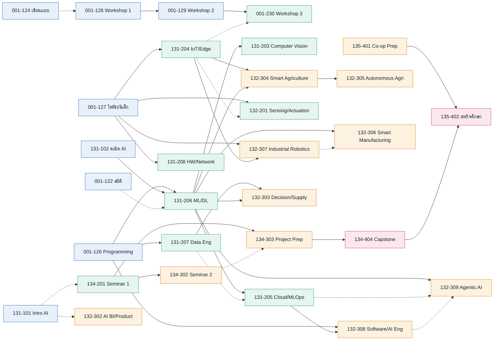

# ⑧ Dependencies · YLO · แผนการเรียน 4 ชั้นปี

> ออกแบบลำดับวิชา (ก่อน–หลัง 3 ระดับ) → ผลลัพธ์การเรียนรู้รายชั้นปี (YLO) → แผนการเรียน 8 ภาคการศึกษา (**133 นก. — ยอดที่ยืนยันแล้ว**)
> อ้างอิง [[07_Curriculum_PLO_Mapping]] · [[../04_Course_Descriptions_2570/11_Course_Index|Course Index]] · [[../05_TQF2_Academic_Drafts/10_Course_Learning_Outcomes_CLO_Mapping|CLO Mapping]]
> ปรับปรุง 30 กรกฎาคม 2569 / 2026-07-30 — จัดลำดับใหม่ให้ **ทุกภาคการศึกษาที่ 1–7 ไม่น้อยกว่า 15 หน่วยกิต** โดย **ภาค 8 ยกเว้นเกณฑ์** เพราะสงวนไว้ให้สหกิจศึกษาเต็มเวลา 6 หน่วยกิต พร้อม**ปรับรหัสรายวิชาให้เลขตัวที่สามตรงกับชั้นปีที่เปิดสอน** *(กฎนี้ถูกยกเลิกแล้วเมื่อ 24 สิงหาคม 2569 — ดูหลักการกำหนดรหัสฉบับปัจจุบันด้านล่าง)*
> รอบปรับล่าสุด 31 กรกฎาคม 2569 / 2026-07-31 — **ย้าย EN-714-17001 เตรียมความพร้อมสหกิจศึกษา จากภาค 7 ไปภาค 6** ตาม [[../05_TQF2_Academic_Drafts/17_Stakeholder_Feedback_Round2_and_Action_Plan#C1 ย้าย EN-714-17001 เตรียมความพร้อมสหกิจศึกษา จากภาค 7 ไปภาค 6|ข้อเสนอแนะรอบที่ 2 ข้อ C1]] เพื่อให้ผู้เรียนได้สถานประกอบการก่อนเลือกวิชาชีพเลือกสองวิชาสุดท้ายและก่อนกำหนดโจทย์โครงงาน · การกระจายหน่วยกิตจึงเป็น **19–19–19–19–19–17–15–6**

> [!important] หลักการกำหนดรหัสรายวิชา (Course Numbering Rule)
> ใช้ตาม **ประกาศมหาวิทยาลัยกาฬสินธุ์ เรื่อง ระบบการกำหนดรหัสวิชา** (ประกาศ ณ วันที่ 30 เมษายน พ.ศ. 2569) — ตัวอักษร 2 ตัว + ตัวเลขอารบิก 8 ตัว รูปแบบ `XX-XXX-XXXXX`
>
> **`EN-714-1⟨หมวด⟩⟨ลำดับ 3 หลัก⟩`**
>
> | ตำแหน่ง | ความหมายตามประกาศ | ค่าที่หลักสูตรนี้ใช้ |
> |---|---|---|
> | 1–2 | กลุ่มสาขาระดับภาพกว้าง (Broad field) | `EN` วิศวกรรม การผลิต และการก่อสร้าง |
> | 3–5 | ลำดับสาขาวิชา (Detailed field) | `714` อุปกรณ์อิเล็กทรอนิกส์และระบบอัตโนมัติ |
> | 6 | ระดับการศึกษา | `1` ปริญญาตรี |
> | 7 | หมวดรายวิชาในสาขาวิชา | `1` แกน/พื้นฐาน · `2` ชีพบังคับ · `4` เลือก · `6` ฝึกปฏิบัติในสถานประกอบการ · `7` สหกิจศึกษา |
> | 8–10 | ลำดับรายวิชาในกลุ่มวิชา | `001`–`999` นับใหม่ในแต่ละหมวด เรียงตามลำดับการเรียนก่อน–หลัง |
>
> **ข้อกำหนดที่มาแทนกฎเดิม**
> 1. **รหัสไม่บอกชั้นปีอีกต่อไป** — การทวนสอบว่าวิชาบังคับก่อนอยู่ในภาคที่เร็วกว่า ให้ตรวจจากตารางในหัวข้อ 3 และแผนการเรียนในหัวข้อ 5 แทน ซึ่งแม่นกว่าเดิมเพราะระบุถึงระดับภาคการศึกษา
> 2. **รหัสเป็นค่าตายตัวเมื่อประกาศใช้** — รายวิชาที่เพิ่มภายหลังให้ต่อท้ายกลุ่มเสมอ **ห้ามเรียงเลขใหม่** เพราะการเรียงใหม่คือการเปลี่ยนรหัสของวิชาเดิม ทำให้ใบแสดงผลการเรียนของผู้เรียนรุ่นก่อนสอบย้อนกลับไม่ได้ · การเรียงตามลำดับการเรียนเป็นคุณสมบัติของรุ่นแรกเท่านั้น
> 3. **ข้อยกเว้น 2 ข้อของกฎเดิมยกเลิกแล้ว** — คลังวิชาเลือก (หมวด 4) และกลุ่มสหกิจศึกษา (หมวด 7) ถูกแยกออกจากกันด้วยตำแหน่งที่ 7 ในตัวรหัสอยู่แล้ว จึงไม่ต้องอาศัยข้อยกเว้นอีก
>
> ตารางแปลงรหัสเดิม → รหัสใหม่ ครบทั้ง 89 รายวิชา อยู่ที่ [[../04_Course_Descriptions_2570/12_Course_Code_Migration_KSU_Standard|ตารางแปลงรหัสรายวิชา]]

## 1. ประเภทของการเชื่อมโยงวิชา (Dependency Types)

| ประเภท | สัญลักษณ์ | ความหมาย | การบังคับ |
|---|---|---|---|
| **Hard Pre** | `──▶` เส้นทึบ | วิชาบังคับก่อน ต้อง**สอบผ่าน**ก่อนลงทะเบียน | บังคับ (real link) |
| **Weak Pre** | `┈▶` เส้นประ | วิชา**แนะนำ**ให้เรียนก่อน เสริมความเข้าใจ แต่ไม่บังคับ | ไม่บังคับ (not real link) |
| **Co-requisite** | `◀┈▶` เส้นจุดสองทาง | เรียน**คู่ขนานภาคการศึกษาเดียวกัน**ได้ | เรียนพร้อมกัน |

> [!tip] หลักการออกแบบลำดับ
> - **เส้นทางวิกฤต (Critical Path)** ของหลักสูตร: Programming → Math AI → ML/DL → Cloud/CV → Core Track → Project Prep → Capstone → Co-op
> - **ยกเลิกคอขวด co-requisite เดิม** — ฉบับก่อนต้องเรียน *คณิต AI ↔ ML/DL* คู่ขนาน ฉบับนี้ย้าย EN-714-12001 และ EN-714-12002 ไปปี 1 ทำให้ EN-714-12003 การเรียนรู้ของเครื่องในภาค 3 มีคณิตศาสตร์ครบเป็น **วิชาก่อนที่สอบผ่านแล้ว** ซึ่งมั่นคงกว่าการเรียนพร้อมกัน
> - **Weak Pre** ใช้กับความรู้ที่ช่วยเสริมแต่อาจารย์ทบทวนให้ได้ในคาบ (ไม่ล็อกการลงทะเบียน)

## 2. แผนภาพลำดับวิชาแกน (Critical-Path Backbone)

*(เส้นทึบ = Hard Pre · เส้นประ = Weak Pre · เส้นจุดสองทาง = Co-req · แสดงเฉพาะสายหลัก)*

## 3. ตารางวิชาก่อน–หลัง (แกนบังคับ 33 วิชา)

> รหัสในตารางย่อรูปแบบ `EN-` ออก · ภาค = ภาคการศึกษาตามแผนในหัวข้อ 5

| รหัส | วิชา | ภาค | Hard Pre | Weak Pre (แนะนำ) | Co-req |
|---|---|--:|---|---|---|
| 001-122 | สถิติและการวิเคราะห์ข้อมูล | 1 | — | คณิต ม.ปลาย | — |
| 001-124 | การเขียนแบบวิศวกรรม | 1 | — | — | — |
| 001-126 | การเขียนโปรแกรมพื้นฐานสำหรับ AI | 1 | — | — | — |
| 001-128 | ปฏิบัติการวิศวกรรมเชิงบูรณาการ 1: การสร้างชิ้นงานและการติดตั้งเซนเซอร์ | 1 | — | 001-124 | — |
| 131-101 | ความรู้เบื้องต้นสำหรับ AI | 1 | — | 001-126 | — |
| 001-121 | เศรษฐศาสตร์วิศวกรรมและต้นทุน | 2 | — | — | — |
| 001-123 | วิศวกรรมความร้อนและของไหล | 2 | — | ฟิสิกส์ | — |
| 001-125 | กลศาสตร์วัสดุและการออกแบบโครงสร้าง | 2 | — | ฟิสิกส์ | — |
| 001-127 | พื้นฐานไฟฟ้าและอิเล็กทรอนิกส์ | 2 | — | — | — |
| 001-129 | ปฏิบัติการวิศวกรรมเชิงบูรณาการ 2: ระบบขับเคลื่อนและการควบคุมอัตโนมัติ | 2 | 001-128 | — | **001-127** |
| 131-102 | คณิตศาสตร์วิศวกรรม AI | 2 | — | 001-122 | — |
| 131-204 | ระบบ IoT อัจฉริยะและ Edge | 3 | 001-127 | 001-126 | — |
| 131-206 | การเรียนรู้ของเครื่องและเชิงลึก | 3 | 001-126, **131-102** | 001-122 | — |
| 131-207 | วิศวกรรมข้อมูลและข้อมูลขนาดใหญ่ | 3 | 001-126 | 001-122 | — |
| 001-230 | ปฏิบัติการวิศวกรรมเชิงบูรณาการ 3: การบูรณาการระบบและการส่งมอบ | 3 | 001-129 | 131-204 | — |
| 131-203 | คอมพิวเตอร์วิทัศน์และการวิเคราะห์ภาพ | 4 | 131-206 | 001-126 | — |
| 131-205 | ระบบคลาวด์และ MLOps | 4 | 131-206 | 131-207 | — |
| 131-208 | โครงสร้างพื้นฐานฮาร์ดแวร์/เครือข่าย AI | 4 | 001-127 | 131-204 | **131-205** |
| 132-201 | ระบบตรวจวัดและขับเคลื่อนอัจฉริยะ | 4 | 001-127 | 131-204 | — |
| 134-201 | สัมมนาวิศวกรรม AI 1 | 4 | — | 131-101 | — |
| 132-302 | ธุรกิจอัจฉริยะและผลิตภัณฑ์ AI | 5 | — | 131-101, 001-121 | — |
| 132-304 | ระบบเกษตรอัจฉริยะ | 5 | 131-204, 131-206 | 131-203 | — |
| 132-307 | ระบบอัตโนมัติและหุ่นยนต์อุตสาหกรรม | 5 | 001-127, 131-204 | 001-230 | — |
| 132-308 | วิศวกรรมซอฟต์แวร์และ AI | 5 | 001-126, 131-205 | 131-207 | — |
| 134-302 | สัมมนาวิศวกรรม AI 2 | 5 | 134-201 | — | — |
| 132-303 | ระบบตัดสินใจอัจฉริยะและห่วงโซ่อุปทาน | 6 | 131-207, 131-206 | 131-101 | — |
| 132-305 | ระบบอัตโนมัติทางการเกษตร | 6 | 132-304 | 131-203 | — |
| 132-306 | ระบบการผลิตอัจฉริยะ | 6 | 131-206 | 132-307 | — |
| 132-309 | ระบบเอเจนต์ปัญญาประดิษฐ์ | 6 | 131-206 | 131-205, 132-308 | — |
| 134-303 | การเตรียมความพร้อมโครงงาน | 6 | 134-201, ผ่านแกน ≥ 50% | 134-302 | — |
| 135-401 | เตรียมความพร้อมสหกิจศึกษา | 6 | ผ่านแกน ≥ 75% | 134-302 | **134-303** |
| 134-404 | โครงงานวิศวกรรม AI (Capstone) | 7 | 134-303 | — | — |
| 135-402 | สหกิจศึกษา | 8 | 135-401, 134-404 | — | — |

> **วิชาเลือกชีพ (EN-714-14xxx):** Hard Pre = วิชาแกนที่เกี่ยวข้องตามแขนง (แขนงเกษตร Hard← 132-304 · แขนงอุตสาหกรรม Hard← 132-306/307 · แขนงนวัตกรรมองค์กร Hard← 132-308) · ดู [[../04_Course_Descriptions_2570/11_Course_Index|Course Index]]

> [!check] ผลการทวนสอบลำดับ
> ตรวจแล้วว่า **วิชาบังคับก่อน (Hard Pre) ทุกรายการอยู่ในภาคการศึกษาที่เร็วกว่าวิชาที่ต้องใช้อย่างเคร่งครัด** ไม่มีการอ้างย้อนกลับหรืออ้างภาคเดียวกัน · **Co-requisite ทั้ง 3 คู่อยู่ภาคเดียวกันจริง** · ไม่มี Weak Pre รายการใดถูกจัดไว้หลังวิชาที่อ้างถึง
> **การทวนสอบเงื่อนไข EN-714-17001 หลังย้ายไปภาค 6:** เมื่อสิ้นภาค 5 ผู้เรียนสะสมวิชาแกนบังคับ (กลุ่ม 2.1 + 2.2 + 2.3 + 2.5 รวม 81 หน่วยกิต) ได้ **65 หน่วยกิต หรือร้อยละ 80** จึงยังผ่านเงื่อนไข “ผ่านแกน ≥ 75%” โดยไม่ต้องผ่อนปรนเกณฑ์

## 4. ผลลัพธ์การเรียนรู้รายชั้นปี (Year Learning Outcomes — YLO)

| YLO | เมื่อจบชั้นปี ผู้เรียนสามารถ… | PLO (I=Introduce, R=Reinforce, M=Mastery) |
|---|---|---|
| **YLO1 · ปี 1** *พื้นฐานวิศวกรรม ข้อมูล และปัญญาประดิษฐ์* | ประยุกต์คณิตศาสตร์ สถิติ และคณิตศาสตร์สำหรับปัญญาประดิษฐ์ เขียนโปรแกรมภาษาไพทอน อ่านและจัดทำแบบ ประกอบวงจรและชิ้นงาน อธิบายขอบเขตและข้อจำกัดของปัญญาประดิษฐ์ และทำงานปฏิบัติการเป็นทีม | PLO1-I · PLO2-I · PLO4-I · PLO5-I · PLO6-I · PLO7-I |
| **YLO2 · ปี 2** *การพัฒนาและทดสอบองค์ประกอบระบบอัจฉริยะ* | พัฒนาตัวแบบ ML/DL จัดการกระบวนงานข้อมูล สร้างระบบ IoT/Edge นำตัวแบบขึ้นใช้งานบนคลาวด์ ประยุกต์คอมพิวเตอร์วิทัศน์ ออกแบบระบบตรวจวัดและขับเคลื่อน และประเมินคุณภาพกับความมั่นคงปลอดภัย | PLO1-R · PLO2-R · PLO4-R · PLO6-R |
| **YLO3 · ปี 3** *การบูรณาการระบบตามโดเมนและแขนงวิชา* | ออกแบบและบูรณาการระบบอัจฉริยะเฉพาะโดเมน (เกษตร/อุตสาหกรรม/องค์กร) วิเคราะห์–พยากรณ์และตัดสินใจจากข้อมูล สื่อสารต่อผู้รับสารหลายกลุ่ม จัดทำหลักฐานธรรมาภิบาล และบริหารทีมข้ามศาสตร์ | PLO2-M · PLO3-R→M · PLO4-M · PLO5-R→M · PLO6-M · PLO7-R→M |
| **YLO4 · ปี 4** *การส่งมอบระบบและการปฏิบัติงานวิชาชีพ* | ส่งมอบโครงงานและปฏิบัติงานสหกิจศึกษาแก้ปัญหาจริงในสถานประกอบการ ประเมินคุณค่าทางธุรกิจและ BCG ยึดจรรยาบรรณและธรรมาภิบาลปัญญาประดิษฐ์ และเรียนรู้เทคโนโลยีอุบัติใหม่ด้วยตนเอง | PLO1-M · PLO2-M · PLO3-M · PLO4-M · PLO5-M · PLO6-M · PLO7-M |

## 5. แผนการเรียน 4 ชั้นปี (8 ภาคการศึกษา · 133 นก.)

> **เกณฑ์ภาระการเรียน:** **ทุกภาคการศึกษาที่ 1–7 ไม่น้อยกว่า 15 หน่วยกิต** — ภาค 1–5 อยู่ที่ 19 หน่วยกิต ภาค 6–7 อยู่ที่ 16 หน่วยกิต · **ภาค 8 ยกเว้นเกณฑ์** เพราะเป็นสหกิจศึกษาเต็มเวลา 6 หน่วยกิต

### 🟦 ชั้นปีที่ 1 — พื้นฐานวิศวกรรม ข้อมูล และปัญญาประดิษฐ์ (38 นก.)

**ภาคการศึกษาที่ 1 (19 นก.)** · *Engineering, Programming and Data Foundations*

| รหัส | วิชา | นก. |
|---|---|--:|
| GE-010-001 | ภาษาอังกฤษง่ายนิดเดียว | 3 |
| GE-010-004 | คุณค่ามหาวิทยาลัยกาฬสินธุ์ | 3 |
| EN-714-11007 | สถิติและการวิเคราะห์ข้อมูลสำหรับวิศวกรรม | 3 |
| EN-714-11001 | การเขียนแบบวิศวกรรมและการวางผังระบบ | 3 |
| EN-714-11002 | การเขียนโปรแกรมพื้นฐานสำหรับปัญญาประดิษฐ์ | 3 |
| EN-714-11004 | ปฏิบัติการวิศวกรรมเชิงบูรณาการ 1: การสร้างชิ้นงานและการติดตั้งเซนเซอร์ | 1 |
| EN-714-12001 | ความรู้เบื้องต้นสำหรับปัญญาประดิษฐ์ | 3 |

**ภาคการศึกษาที่ 2 (19 นก.)** · *Physical, Electrical and Quantitative Foundations*

| รหัส | วิชา | นก. |
|---|---|--:|
| GE-010-003 | ดิจิทัลกับชีวิตวิถีใหม่ | 3 |
| EN-714-11009 | เศรษฐศาสตร์วิศวกรรมและการวิเคราะห์ต้นทุน | 3 |
| EN-714-11005 | วิศวกรรมความร้อนและของไหลในระบบอัจฉริยะ | 3 |
| EN-714-11003 | กลศาสตร์วัสดุและการออกแบบโครงสร้าง | 3 |
| EN-714-11006 | พื้นฐานไฟฟ้าและอิเล็กทรอนิกส์สำหรับระบบอัจฉริยะ | 3 |
| EN-714-11008 | ปฏิบัติการวิศวกรรมเชิงบูรณาการ 2: ระบบขับเคลื่อนและการควบคุมอัตโนมัติ *(co-req ↔ 001-127)* | 1 |
| EN-714-12002 | คณิตศาสตร์วิศวกรรมปัญญาประดิษฐ์ | 3 |

### 🟩 ชั้นปีที่ 2 — การพัฒนาและทดสอบองค์ประกอบระบบอัจฉริยะ (37 นก.)

**ภาคการศึกษาที่ 3 (19 นก.)** · *AI, Data and Sensing Foundations*

| รหัส | วิชา | นก. |
|---|---|--:|
| GE-010-002 | ภาษาอังกฤษฟุดฟิดฟอฟัน | 3 |
| GE-010-005 | ชีวิตออกแบบได้ | 3 |
| GE-010-006 | ปรัชญามนุษย์ สังคมและเศรษฐศาสตร์ | 3 |
| EN-714-11010 | ปฏิบัติการวิศวกรรมเชิงบูรณาการ 3: การบูรณาการระบบและการส่งมอบ | 1 |
| EN-714-12005 | ระบบ IoT อัจฉริยะและการประมวลผลที่ขอบเครือข่าย | 3 |
| EN-714-12003 | การเรียนรู้ของเครื่องและการเรียนรู้เชิงลึก *(Hard← 131-102)* | 3 |
| EN-714-12004 | วิศวกรรมข้อมูลและข้อมูลขนาดใหญ่ | 3 |

**ภาคการศึกษาที่ 4 (19 นก.)** · *AI Platforms, Decision Foundations and Academic Seminar*

| รหัส | วิชา | นก. |
|---|---|--:|
| GE-020-008 | การพัฒนาธุรกิจในสังคมดิจิทัล | 3 |
| GE-020-009 | ผู้นำแห่งศตวรรษที่ 21 | 3 |
| EN-714-12006 | คอมพิวเตอร์วิทัศน์และการวิเคราะห์ภาพ *(Hard← 131-206)* | 3 |
| EN-714-12007 | ระบบคลาวด์และการดำเนินการเรียนรู้ของเครื่อง *(Hard← 131-206)* | 3 |
| EN-714-12008 | โครงสร้างพื้นฐานฮาร์ดแวร์และเครือข่ายสำหรับ AI *(co-req ↔ 131-205)* | 3 |
| EN-714-12009 | ระบบตรวจวัดและขับเคลื่อนอัจฉริยะ | 3 |
| EN-714-12017 | สัมมนาวิศวกรรมปัญญาประดิษฐ์และระบบอัจฉริยะ 1 | 1 |

> ครบหมวดวิชาศึกษาทั่วไป 24 หน่วยกิต และกลุ่มวิชาแกนปัญญาประดิษฐ์ 24 หน่วยกิต ณ สิ้นปี 2

### 🟧 ชั้นปีที่ 3 — การบูรณาการระบบตามโดเมนและแขนงวิชา (37 นก.)

**ภาคการศึกษาที่ 5 (19 นก.)** · *Domain Systems Integration and Technology Review*

| รหัส | วิชา | นก. |
|---|---|--:|
| EN-714-12009 | ธุรกิจอัจฉริยะและการออกแบบผลิตภัณฑ์ปัญญาประดิษฐ์ | 3 |
| EN-714-12011 | ระบบเกษตรอัจฉริยะ | 3 |
| EN-714-12012 | ระบบอัตโนมัติและหุ่นยนต์อุตสาหกรรมอัจฉริยะ | 3 |
| EN-714-12013 | วิศวกรรมซอฟต์แวร์และปัญญาประดิษฐ์ | 3 |
| EN-714-12018 | สัมมนาวิศวกรรมปัญญาประดิษฐ์และระบบอัจฉริยะ 2 *(Hard← 134-201)* | 1 |
| EN-714-14xxx | วิชาเลือกชีพ 1 | 3 |
| EN-714-14xxx | วิชาเลือกชีพ 2 | 3 |

**ภาคการศึกษาที่ 6 (17 นก.)** · *Advanced Intelligent Systems, Project and Workplace Preparation*

| รหัส | วิชา | นก. |
|---|---|--:|
| EN-714-12010 | ระบบตัดสินใจอัจฉริยะและการจัดการห่วงโซ่อุปทาน | 3 |
| EN-714-12015 | ระบบอัตโนมัติทางการเกษตร *(Hard← 132-304)* | 3 |
| EN-714-12012 | ระบบการผลิตอัจฉริยะ | 3 |
| EN-714-12014 | ระบบเอเจนต์ปัญญาประดิษฐ์ | 3 |
| EN-714-12018 | การเตรียมความพร้อมโครงงาน *(Hard← 134-201 · แนะนำ 134-302)* | 1 |
| EN-714-17001 | เตรียมความพร้อมสหกิจศึกษา *(co-req ↔ 134-303)* | 1 |
| EN-714-14xxx | วิชาเลือกชีพ 3 | 3 |

### 🟥 ชั้นปีที่ 4 — การส่งมอบระบบและการปฏิบัติงานวิชาชีพ (21 นก.)

**ภาคการศึกษาที่ 7 (15 นก.)** · *Capstone and Workplace-aligned Professional Electives*

| รหัส | วิชา | นก. |
|---|---|--:|
| EN-714-12019 | โครงงานวิศวกรรมปัญญาประดิษฐ์และระบบอัจฉริยะ (Capstone) | 3 |
| EN-714-14xxx | วิชาเลือกชีพ 4 *(เลือกให้สอดคล้องกับสถานประกอบการสหกิจที่ได้รับการตอบรับ)* | 3 |
| EN-714-14xxx | วิชาเลือกชีพ 5 *(เลือกให้สอดคล้องกับสถานประกอบการสหกิจที่ได้รับการตอบรับ)* | 3 |
| — | วิชาเลือกเสรี 1 | 3 |
| — | วิชาเลือกเสรี 2 | 3 |

**ภาคการศึกษาที่ 8 (6 นก.)** · *Cooperative Education*

| รหัส | วิชา | นก. |
|---|---|--:|
| EN-714-17002 | สหกิจศึกษา (≥ 16 สัปดาห์) | 6 |

### สรุปหน่วยกิตตามแผน

| ชั้นปี | ภาคต้น | ภาคปลาย | รวม/ปี | เกณฑ์ ≥ 15 |
|---|--:|--:|--:|:--:|
| ปี 1 | 19 | 19 | 38 | ✅ |
| ปี 2 | 19 | 19 | 38 | ✅ |
| ปี 3 | 19 | 17 | 36 | ✅ |
| ปี 4 | 15 | 6 | 21 | ภาค 7 ✅ · ภาค 8 ยกเว้น (สหกิจ) |
| **รวม** | | | **133** | ✅ |

### ตรวจยอดตามหมวดวิชา

| หมวด / กลุ่ม | นก. ที่กำหนด | นก. ในแผน | ภาคที่เรียน |
|---|--:|--:|---|
| 1. ศึกษาทั่วไป (GE) | 24 | 24 | 1, 2, 3, 4 |
| 2.1 พื้นฐานและปฏิบัติการวิศวกรรม (EN-001) | 24 | 24 | 1, 2, 3 |
| 2.2 แกนปัญญาประดิษฐ์ (EN-131) | 24 | 24 | 1, 2, 3, 4 |
| 2.3 วิชาชีพบังคับ (EN-132) | 27 | 27 | 4, 5, 6 |
| 2.4 วิชาชีพเลือก (EN-714-14xxx) | 15 | 15 | 5 (2 วิชา), 6 (1 วิชา), 7 (2 วิชา) |
| 2.5 โครงงานและสัมมนา (EN-134) | 6 | 6 | 4, 5, 6, 7 |
| 2.6 ประสบการณ์ภาคสนาม (EN-714-17xxx) | 7 | 7 | 6, 8 |
| 3. เลือกเสรี | 6 | 6 | 7 |
| **รวม** | **133** | **133** | |

## 6. การเปลี่ยนรหัสรายวิชา

รหัสรายวิชาทั้งหมดปรับเป็นชุด `EN-714-1xxxx` ตามประกาศมหาวิทยาลัยกาฬสินธุ์ เรื่อง ระบบการกำหนดรหัสวิชา เมื่อวันที่ 24 สิงหาคม 2569 (ปรับแล้วทั้ง Vault และเว็บ Curriculum Explorer)

ตารางแปลงครบทั้ง 89 รายวิชา พร้อมรหัสเดิมและหมายเหตุรายกลุ่ม อยู่ที่ [[../04_Course_Descriptions_2570/12_Course_Code_Migration_KSU_Standard|ตารางแปลงรหัสรายวิชา]] · ฉบับเครื่องอ่านอยู่ที่ `curriculum-graph/data/course-code-map-2569.json`

> [!info] บันทึกการเปลี่ยนรหัสรอบก่อนหน้า
> หัวข้อนี้เคยบันทึกการปรับรหัสภายในชุด `EN-1xx-xxx` รอบที่ทำให้เลขตัวที่สามตรงกับชั้นปี ซึ่งถูกแทนที่ทั้งหมดแล้ว ดูฉบับเดิมได้จากประวัติ Git ของไฟล์นี้

## 7. หมายเหตุและเงื่อนไข

1. **ภาคการศึกษาที่ 8 = สหกิจศึกษาอย่างเดียว (6 นก.)** — นักศึกษาต้องผ่านวิชาแกน ≥ 75% ผ่าน EN-714-17001 ในภาค 6 และผ่าน EN-714-12019 ในภาค 7 ก่อนออกปฏิบัติงาน
2. **Co-requisite 3 คู่:** EN-714-11008 ↔ EN-714-11006 · EN-714-12008 ↔ EN-714-12007 · **EN-714-17001 ↔ EN-714-12018** เพื่อให้การค้นหาสถานประกอบการและการกำหนดโจทย์โครงงานเกิดขึ้นพร้อมกันในภาค 6 (เดิมมีคู่ EN-714-12018 ↔ EN-714-12018 แต่เมื่อสัมมนา 2 ย้ายไปภาค 5 จึงกลายเป็นวิชาแนะนำให้เรียนก่อน)
3. **สายวิกฤตที่ห้ามสลับ:** `001-126 → 131-102 → 131-206 → 131-205 → 132-308 → 134-303 → 134-404 → 135-402` และสายสัมมนา `134-201 → 134-302 → 134-303` — หากตกวิชาใดในสายนี้จะทำให้สำเร็จการศึกษาช้าลง
4. **วิชาเลือกชีพ 2 วิชาอยู่ในปี 4** แต่คงรหัส EN-714-14xxx ตามมติให้คลังวิชาเลือกใช้เลข 3xx ทั้งกลุ่ม และ **EN-714-17001 เปิดสอนในปี 3 แต่คงรหัส 4xx** ตามข้อยกเว้นที่ระบุไว้ในหลักการกำหนดรหัสข้างต้น
4.1 วิชาเลือกชีพวิชาที่ 4 และ 5 ในภาค 7 ให้ผู้เรียนเลือกโดยอ้างอิงลักษณะงานของสถานประกอบการสหกิจที่ได้รับการตอบรับแล้วในภาค 6 และให้อาจารย์ที่ปรึกษาตรวจความสอดคล้องก่อนลงทะเบียน
5. แผนนี้จัดทำบนฐาน **133 หน่วยกิตซึ่งเป็นยอดที่ยืนยันแล้ว** และใช้ **ชุดรหัสรายวิชาปัจจุบัน** เป็นชุดเดียวทั้งเอกสาร ตรงกับ [[../04_Course_Descriptions_2570/11_Course_Index|Course Index]]
6. ต้องยืนยันกับระเบียบมหาวิทยาลัยว่าเพดานหน่วยกิตต่อภาคการศึกษารองรับ 19 หน่วยกิตได้ และภาคการศึกษาที่ 7 ซึ่งมี 15 หน่วยกิตไม่ต่ำกว่าเกณฑ์ขั้นต่ำของนักศึกษาสถานะปกติ

> [!check] ผลข้างเคียงเชิงบวกของการย้าย EN-714-17001
> เดิมภาค 7 มีรายวิชาที่กำหนดแน่นอน 4 หน่วยกิต (โครงงาน 3 + เตรียมสหกิจ 1) ส่วนที่เหลือเติมได้ด้วยวิชาเลือกที่มีหน่วยกิตละ 3 เท่านั้น ยอดรวมจึงเป็นไปได้เฉพาะ 4, 7, 10, 13, 16, … ทำให้ **15 หน่วยกิตพอดีเป็นไปไม่ได้ทางเลขคณิต** และต้องใช้ 16 หน่วยกิต
> เมื่อย้ายเตรียมสหกิจออกไป ภาค 7 เหลือโครงงาน 3 หน่วยกิต บวกวิชาเลือก 4 รายการ จึงลงตัวที่ **15 หน่วยกิตพอดี** ซึ่งเป็นค่าต่ำสุดที่ผ่านเกณฑ์ และภาค 6 เพิ่มเป็น 17 หน่วยกิต
> ภาระของภาค 6 ที่เพิ่มขึ้น 1 หน่วยกิตเป็นภาระเชิงกิจกรรมการค้นหาสถานประกอบการซึ่งเกิดขึ้นควบคู่กับการเตรียมข้อเสนอโครงงานอยู่แล้ว จึงใช้โจทย์และสถานประกอบการชุดเดียวกันได้

> [!warning] ต้องปรับ YLO ของรายวิชาสัมมนาตามชั้นปีใหม่
> [[../05_TQF2_Academic_Drafts/10_Course_Learning_Outcomes_CLO_Mapping|CLO Mapping]] ยังผูก CLO ของ EN-714-12017 สัมมนา 1 ไว้กับ **YLO3.3/3.4** และ EN-714-12018 สัมมนา 2 กับ **YLO3.3/3.4** ตามเดิมที่ทั้งสองวิชาอยู่ปี 3 เมื่อสัมมนา 1 ย้ายไปปี 2 ควรทบทวนว่า CLO ของวิชานี้ควรผูกกับ **YLO2.3** (การสื่อสารผลการวิเคราะห์และทางเลือกการออกแบบ) แทนหรือไม่ ประเด็นนี้เป็นการตัดสินใจเชิงวิชาการของคณะกรรมการ จึงยังไม่แก้ในเอกสาร CLO Mapping

---

[[07_Curriculum_PLO_Mapping|← Curriculum Mapping]] · [[00_OBE_Home|หน้าหลัก OBE]] · [[../04_Course_Descriptions_2570/11_Course_Index|Course Index]] · [[../05_TQF2_Academic_Drafts/10_Course_Learning_Outcomes_CLO_Mapping|CLO Mapping]]
