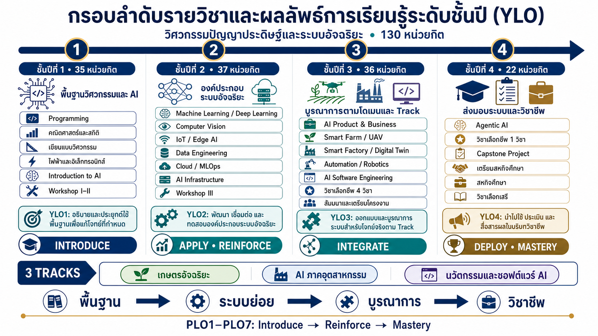
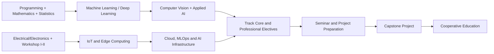

# กรอบลำดับรายวิชาตามชั้นปีและการเชื่อมโยง YLO

> หลักสูตรวิศวกรรมปัญญาประดิษฐ์และระบบอัจฉริยะ พ.ศ. 2570 — ร่างเพื่อพิจารณา
> อัปเดต 21 กรกฎาคม 2569 / 2026-07-21

เอกสารนี้เสนอการจัดลำดับรายวิชา **130 หน่วยกิต** เป็น 8 ภาคการศึกษา โดยใช้แนวคิด Curriculum Scaffolding จาก **พื้นฐาน → พัฒนาองค์ประกอบ → บูรณาการระบบ → ปฏิบัติงานวิชาชีพ** และเชื่อมกับผลลัพธ์การเรียนรู้ระดับชั้นปี (Year Learning Outcomes: YLOs)

## ภาพสรุปสำหรับนำเสนอ



> ภาพสรุปแสดงรายวิชาแกนและกลุ่มรายวิชาสำคัญ ส่วนรายชื่อรายวิชาและหน่วยกิตฉบับเต็มอยู่ในตารางแผนการศึกษา 8 ภาคเรียนด้านล่าง

เปิด [เว็บกราฟหลักสูตรแบบโต้ตอบ](dashboard.html) เพื่อกรองตามชั้นปี ดูเส้นทางรายวิชา 8 ภาคเรียน และคลิกเปิดรายละเอียดของแต่ละรายวิชา

> [!warning] สถานะเอกสาร
> เป็นกรอบเสนอสำหรับจัดทำแผนการศึกษาและ Curriculum Mapping ยังไม่ใช่แผนการศึกษาที่ผ่านการอนุมัติ รหัสแบบ `0X` และรหัสวิชาเลือกที่ซ้ำต้องยืนยันตาม [[10_Data_Quality_and_Decisions|ข้อสังเกตและประเด็นเพื่อพิจารณา]]

### สมมติฐานที่ใช้จัดแผน

- ใช้โครงสร้างล่าสุดจาก CSV และ [[../03_OBE_PLO_Design_2570/07_Curriculum_PLO_Mapping|Curriculum–PLO Mapping]] ซึ่งรวมได้ 130 หน่วยกิต; ตัวเลข 98 หน่วยกิตในเอกสารสรุปรุ่นก่อนยังเป็นประเด็นที่ต้องปรับให้ตรงกัน
- ถือว่า EN-132-101–108 เป็นวิชาบังคับร่วม 24 หน่วยกิตตามบัญชีล่าสุด หากคณะกรรมการกำหนดให้แยกบังคับคนละชุดตาม Track ต้องจัดแผนใหม่
- ใช้ GE-020-008 และ GE-020-009 เป็นวิชาเลือกศึกษาทั่วไป 6 หน่วยกิตตามรายการที่แนบ และเว้น “วิชาเลือกเสรี” ไว้เป็นช่องตามเกณฑ์มหาวิทยาลัย
- ลำดับในเอกสารเป็น prerequisite เชิงสาระ ยังไม่ใช่รายวิชาบังคับก่อนอย่างเป็นทางการ

## 1. หลักการจัดลำดับการเรียนรู้

```text
ชั้นปีที่ 1                 ชั้นปีที่ 2                    ชั้นปีที่ 3                    ชั้นปีที่ 4
Engineering + AI           AI Subsystems                 Domain Integration            Professional Deployment
Foundations                and Infrastructure            and Track Practice            and Validation
       │                           │                              │                             │
       └── YLO1 ──────────────────┴── YLO2 ──────────────────────┴── YLO3 ────────────────────┴── YLO4
           Introduce                  Apply/Reinforce                 Integrate                    Mastery
```

หลักการสำคัญมีดังนี้

1. เรียนการเขียนโปรแกรม คณิตศาสตร์ สถิติ และพื้นฐาน AI ก่อน Machine Learning, Computer Vision และ Data Engineering
2. เรียนไฟฟ้า อิเล็กทรอนิกส์ และ Workshop ก่อน IoT, Edge AI, Automation และ Robotics
3. เรียน AI Core และโครงสร้างพื้นฐานก่อนวิชาบูรณาการตามโดเมนและวิชาเลือกเฉพาะแขนง
4. เรียนสัมมนาและการเตรียมโครงงานก่อนโครงงานวิศวกรรม และเรียนเตรียมสหกิจก่อนออกปฏิบัติงานจริง
5. พัฒนา PLO แบบ **I–R–M:** Introduce ในปี 1, Reinforce ในปี 2–3 และ Mastery ในโครงงาน/สหกิจปี 4

### สายความรู้และเงื่อนไขก่อนเรียนเชิงสาระ



## 2. ผลลัพธ์การเรียนรู้ระดับชั้นปี (YLOs)

### YLO1 — พื้นฐานวิศวกรรม ข้อมูล และปัญญาประดิษฐ์

เมื่อสิ้นสุดชั้นปีที่ 1 นักศึกษาสามารถอธิบายและประยุกต์ใช้หลักการพื้นฐานทางคณิตศาสตร์ สถิติ วิทยาศาสตร์ และวิศวกรรมศาสตร์ ตลอดจนทักษะด้านไฟฟ้าอิเล็กทรอนิกส์ การเขียนโปรแกรมคอมพิวเตอร์ และวิทยาการปัญญาประดิษฐ์เบื้องต้น เพื่อแก้ปัญหาเชิงวิชาการที่กำหนดให้ สามารถรวบรวมและวิเคราะห์ข้อมูลเบื้องต้น สร้างสรรค์ชิ้นงานทางวิศวกรรมภายใต้มาตรฐานความปลอดภัย ตลอดจนสามารถสื่อสารและทำงานร่วมกับผู้อื่นได้อย่างมีประสิทธิภาพโดยยึดมั่นในจริยธรรมทางวิชาการ เพื่อเตรียมความพร้อมสำหรับการเรียนรู้ในระดับสูงขึ้น

- **ระดับ:** Introduce / Apply ในโจทย์ที่กำหนด
- **PLO ที่รองรับ:** PLO1, PLO2, PLO3, PLO4, PLO5, PLO6 และ PLO7 ระดับเริ่มต้น
- **หลักฐานปลายปี:** โปรแกรม Python, แบบวิศวกรรม, วงจร/เซนเซอร์ต้นแบบ, รายงานการวิเคราะห์ข้อมูล และผลงาน Workshop II

**ผลลัพธ์การเรียนรู้ย่อย (Sub-YLOs):**
- **YLO1.1** เข้าใจและประยุกต์ใช้พื้นฐานทางคณิตศาสตร์ วิทยาศาสตร์ และสถิติศาสตร์ เพื่อเป็นรากฐานสำหรับการเรียนรู้ปัญญาประดิษฐ์ในระดับสูงขึ้น (สอดคล้องกับ PLO1)
- **YLO1.2** อธิบายหลักการทำงานเบื้องต้นของการเขียนโปรแกรมคอมพิวเตอร์ ระบบไฟฟ้าอิเล็กทรอนิกส์ และวิทยาการปัญญาประดิษฐ์ (PLO1; PLO2)
- **YLO1.3** ปฏิบัติงานทางวิศวกรรมพื้นฐานอย่างปลอดภัย มีระเบียบวินัย และยึดมั่นในความซื่อสัตย์และจรรยาบรรณวิชาชีพ (PLO4)
- **YLO1.4** สามารถทำงานร่วมกับผู้อื่นในกิจกรรมกลุ่มหรือปฏิบัติการทางวิศวกรรม พร้อมแสดงความมุ่งมั่นในการเรียนรู้ (PLO5; PLO7)

### YLO2 — การพัฒนาและทดสอบองค์ประกอบระบบอัจฉริยะ

เมื่อสิ้นสุดชั้นปีที่ 2 นักศึกษาสามารถพัฒนา เชื่อมโยง และทดสอบองค์ประกอบของระบบอัจฉริยะ ซึ่งบูรณาการกระบวนการจัดการข้อมูล ตัวแบบการเรียนรู้ของเครื่องและการเรียนรู้เชิงลึก (Machine Learning/Deep Learning) วิสัยทัศน์คอมพิวเตอร์ เทคโนโลยีอินเทอร์เน็ตของสรรพสิ่ง (IoT/Edge) การประมวลผลแบบคลาวด์ และโครงสร้างพื้นฐานทางเครือข่าย โดยสามารถออกแบบการทดลอง ประเมินสมรรถนะของระบบ ตลอดจนตระหนักถึงความปลอดภัยของระบบ ความเป็นส่วนตัวของข้อมูล และข้อจำกัดทางวิศวกรรมอย่างเป็นระบบ

- **ระดับ:** Apply / Reinforce ในระบบย่อย
- **PLO ที่รองรับ:** PLO1, PLO2, PLO4 และ PLO6 เป็นหลัก; PLO3, PLO5 และ PLO7 เป็นส่วนสนับสนุน
- **หลักฐานปลายปี:** Data/ML pipeline, โมเดล CV, ระบบ IoT–Edge–Cloud, ผลการทดลองเปรียบเทียบ และการสาธิตระบบบูรณาการ

**ผลลัพธ์การเรียนรู้ย่อย (Sub-YLOs):**
- **YLO2.1** ประยุกต์ความรู้ทางวิศวกรรมเพื่อวิเคราะห์และพัฒนาองค์ประกอบของระบบอัจฉริยะ (เช่น IoT, Cloud, หรือเครือข่าย) ในเบื้องต้น (PLO1; PLO2)
- **YLO2.2** พัฒนาและทดสอบตัวแบบการเรียนรู้ของเครื่อง (Machine Learning) หรือการวิเคราะห์ภาพ (Computer Vision) สำหรับประยุกต์ใช้ในระบบจำลอง (PLO2; PLO6)
- **YLO2.3** รวบรวมข้อมูล วิเคราะห์ผลเบื้องต้น และสื่อสารจัดทำรายงานเชิงวิชาการด้านวิศวกรรมปัญญาประดิษฐ์ได้อย่างเป็นระบบ (PLO3; PLO6)
- **YLO2.4** แสดงออกถึงความรับผิดชอบในการทำงานกลุ่ม และตระหนักถึงข้อจำกัดด้านความปลอดภัยและความเป็นส่วนตัวของข้อมูล (PLO4; PLO5)

### YLO3 — การบูรณาการระบบตามโดเมนและแขนงวิชา

เมื่อสิ้นสุดชั้นปีที่ 3 นักศึกษาสามารถวิเคราะห์ ออกแบบ และบูรณาการระบบปัญญาประดิษฐ์หรือระบบอัจฉริยะประยุกต์สำหรับบริบทเฉพาะทาง (อาทิ เกษตรกรรม อุตสาหกรรม หรือนวัตกรรมปัญญาประดิษฐ์ระดับองค์กร) โดยสามารถวิเคราะห์ข้อกำหนด ความต้องการ และข้อจำกัด เลือกสรรเทคโนโลยีที่เหมาะสม ประเมินผลสัมฤทธิ์ของการดำเนินงาน ปฏิบัติงานร่วมกับทีมสหวิทยาการ สื่อสารข้อมูลเชิงเทคนิคกับผู้มีส่วนได้ส่วนเสีย ตลอดจนบูรณาการมิติด้านความเป็นไปได้ทางธุรกิจ จริยธรรมวิชาชีพ ความปลอดภัย และการพัฒนาอย่างยั่งยืนเข้าสู่กระบวนการตัดสินใจทางวิศวกรรม

- **ระดับ:** Reinforce / Integrate ในโจทย์เปิดและโจทย์จากภาคส่วนจริง
- **PLO ที่รองรับ:** PLO1–PLO7 โดยเน้น PLO2, PLO3, PLO5, PLO6 และ PLO7
- **หลักฐานปลายปี:** ต้นแบบตาม Track, รายงานออกแบบระบบ, Dashboard/ผลทดลอง, การนำเสนอสัมมนา และข้อเสนอโครงงานที่ผ่านการพิจารณา

**ผลลัพธ์การเรียนรู้ย่อย (Sub-YLOs):**
- **YLO3.1** ออกแบบ วิเคราะห์ และบูรณาการระบบปัญญาประดิษฐ์หรือระบบอัจฉริยะสำหรับประยุกต์ใช้ในภาคเกษตรกรรม อุตสาหกรรม หรือซอฟต์แวร์ระดับกลาง (PLO1; PLO2)
- **YLO3.2** ออกแบบและดำเนินการทดลองทางวิศวกรรมอัจฉริยะ พร้อมวิเคราะห์และตีความหมายข้อมูลที่ซับซ้อนอย่างถูกต้อง (PLO6)
- **YLO3.3** นำเสนอผลงานหรือรายงานทางเทคนิคด้วยการใช้สื่อดิจิทัลและแผงควบคุมอัจฉริยะ (Dashboard) ได้อย่างมีประสิทธิภาพ (PLO3)
- **YLO3.4** พิจารณาความเป็นไปได้ทางธุรกิจและประเมินผลกระทบของการนำเทคโนโลยีมาใช้ต่อสังคมและสิ่งแวดล้อมได้อย่างเหมาะสม (PLO4; PLO7)

### YLO4 — การส่งมอบระบบและการปฏิบัติงานวิชาชีพ

เมื่อสิ้นสุดชั้นปีที่ 4 นักศึกษาสามารถพัฒนานวัตกรรม นำไปประยุกต์ใช้งานจริง ประเมินผลสัมฤทธิ์ และนำเสนอผลลัพธ์ของระบบปัญญาประดิษฐ์หรือระบบอัจฉริยะในการแก้ปัญหาบริบทโลกแห่งความจริง ภายใต้ข้อจำกัดทางเทคนิค เศรษฐศาสตร์ สังคม สิ่งแวดล้อม กฎหมาย และจริยธรรม โดยแสดงออกถึงความรับผิดชอบต่อวิชาชีพในฐานะสมาชิกหรือผู้นำทีม ตลอดจนสามารถประเมินตนเองเพื่อวางแผนการเรียนรู้ตลอดชีวิตและการพัฒนานวัตกรรมอย่างต่อเนื่อง

- **ระดับ:** Deploy / Evaluate / Mastery ในบริบทวิชาชีพ
- **PLO ที่รองรับ:** PLO1–PLO7 ระดับบูรณาการและประเมินผล
- **หลักฐานปลายปี:** Capstone ที่ผ่านการทดสอบ รายงานและการสอบปากเปล่า ผลประเมินสหกิจจากสถานประกอบการ Learning Portfolio และข้อเสนอคุณค่าหรือความเป็นไปได้ของนวัตกรรม

**ผลลัพธ์การเรียนรู้ย่อย (Sub-YLOs):**
- **YLO4.1** ประยุกต์ใช้ความรู้ทางวิศวกรรมปัญญาประดิษฐ์ในการแก้ปัญหาจริงในภาคเกษตรและอุตสาหกรรมผ่านการทำโครงงาน (Capstone) (PLO1; PLO2)
- **YLO4.2** ปฏิบัติงานในสถานประกอบการ (สหกิจศึกษา) ได้อย่างมีประสิทธิภาพ โดยบูรณาการการทำงานเป็นทีมและแสดงภาวะผู้นำ (PLO5)
- **YLO4.3** วิเคราะห์ผลการดำเนินงาน สรุปผลสัมฤทธิ์ และสื่อสารข้อมูลเชิงเทคนิคกับผู้มีส่วนได้ส่วนเสียอย่างเป็นมืออาชีพ (PLO3; PLO6)
- **YLO4.4** วางแผนการเรียนรู้เพื่อก้าวทันเทคโนโลยีอุบัติใหม่ และแสดงแนวทางการเป็นผู้ประกอบการด้านนวัตกรรมหรือเทคโนโลยี (PLO7)

## 3. YLO ↔ PLO และระดับการพัฒนา

สัญลักษณ์: **I** = Introduce · **R** = Reinforce · **M** = Mastery/ประเมินผลระดับปลายทาง

| YLO | PLO1 | PLO2 | PLO3 | PLO4 | PLO5 | PLO6 | PLO7 |
|---|:---:|:---:|:---:|:---:|:---:|:---:|:---:|
| **YLO1 — พื้นฐาน** | I | I | I | I | I | I | I |
| **YLO2 — ระบบย่อย** | R | R | R | R | R | R | R |
| **YLO3 — บูรณาการตาม Track** | R | M | R | R | M | M | R |
| **YLO4 — วิชาชีพ** | M | M | M | M | M | M | M |

> [!note] การตีความ
> ตัวอักษร M ใน YLO3 หมายถึงการประเมินระดับความสามารถของระบบในบริบท Track แต่ PLO ระดับหลักสูตรยังยืนยันผลสัมฤทธิ์ปลายทางอีกครั้งผ่าน Capstone และสหกิจศึกษาใน YLO4

## 4. แผนการศึกษาที่เสนอ 8 ภาคการศึกษา

### ชั้นปีที่ 1 ภาคการศึกษาที่ 1 — Engineering and AI Foundations

| รหัส | รายวิชา | นก. | บทบาทต่อ YLO |
|---|---|---:|---|
| GE-010-001 | ภาษาอังกฤษง่ายนิดเดียว | 3 | YLO1: การสื่อสารพื้นฐาน |
| GE-010-004 | คุณค่ามหาวิทยาลัยกาฬสินธุ์ | 3 | YLO1: จริยธรรมและอัตลักษณ์ |
| EN-001-024 | การเขียนแบบวิศวกรรมและการวางผังระบบ | 3 | YLO1: การสื่อสารแบบและการคิดเชิงระบบ |
| EN-001-026 | การเขียนโปรแกรมพื้นฐานสำหรับปัญญาประดิษฐ์ | 3 | YLO1: Programming/Data foundation |
| EN-131-101 | ความรู้เบื้องต้นสำหรับปัญญาประดิษฐ์ | 3 | YLO1: ภาพรวม AI และ Responsible AI |
| EN-001-028 | ปฏิบัติการวิศวกรรมเชิงบูรณาการ I | 1 | YLO1: ความปลอดภัย เครื่องมือ และ teamwork |
|  | **รวม** | **16** | |

### ชั้นปีที่ 1 ภาคการศึกษาที่ 2 — Quantitative and Hardware Foundations

| รหัส | รายวิชา | นก. | บทบาทต่อ YLO |
|---|---|---:|---|
| GE-010-002 | ภาษาอังกฤษฟุดฟิดฟอฟัน | 3 | YLO1: การสื่อสารในบริบทพหุวัฒนธรรม |
| GE-010-003 | ดิจิทัลกับชีวิตวิถีใหม่ | 3 | YLO1: Digital literacy และ cybersecurity |
| GE-010-005 | ชีวิตออกแบบได้ | 3 | YLO1: การเรียนรู้และวางแผนตนเอง |
| EN-001-022 | สถิติและการวิเคราะห์ข้อมูลสำหรับวิศวกร | 3 | YLO1: วิเคราะห์ข้อมูลและออกแบบการทดลองเบื้องต้น |
| EN-001-027 | พื้นฐานไฟฟ้าและอิเล็กทรอนิกส์สำหรับระบบอัจฉริยะ | 3 | YLO1: วงจร เซนเซอร์ และระบบขับเคลื่อน |
| EN-131-102 | คณิตศาสตร์วิศวกรรมปัญญาประดิษฐ์ | 3 | YLO1: ฐานคณิตศาสตร์สำหรับโมเดล AI |
| EN-001-029 | ปฏิบัติการวิศวกรรมเชิงบูรณาการ II | 1 | YLO1: Sensor–Microcontroller integration |
|  | **รวม** | **19** | |

### ชั้นปีที่ 2 ภาคการศึกษาที่ 1 — Intelligent Components

| รหัส | รายวิชา | นก. | บทบาทต่อ YLO |
|---|---|---:|---|
| GE-010-006 | ปรัชญามนุษย์ สังคมและเศรษฐศาสตร์ | 3 | YLO1→2: การคิดเชิงวิพากษ์และผลกระทบสังคม |
| GE-020-008 | การพัฒนาธุรกิจในสังคมดิจิทัล | 3 | YLO2: มุมมองธุรกิจและผู้ประกอบการ |
| EN-001-023 | วิศวกรรมความร้อนและของไหลในระบบอัจฉริยะ | 3 | YLO2: ข้อจำกัดกายภาพและพลังงาน |
| EN-001-025 | กลศาสตร์วัสดุและการออกแบบโครงสร้าง | 3 | YLO2: การออกแบบโครงสร้างภายใต้ข้อจำกัด |
| EN-131-104 | ระบบ IoT อัจฉริยะและการประมวลผลที่ขอบเครือข่าย | 3 | YLO2: Sensor–Edge–Network subsystem |
| EN-131-106 | การเรียนรู้ของเครื่องและการเรียนรู้เชิงลึก | 3 | YLO2: พัฒนาและประเมินโมเดล ML/DL |
| EN-001-030 | ปฏิบัติการวิศวกรรมเชิงบูรณาการ III | 1 | YLO2: ทดสอบระบบ PLC/Edge AI แบบบูรณาการ |
|  | **รวม** | **19** | |

### ชั้นปีที่ 2 ภาคการศึกษาที่ 2 — AI Platform and Deployment Foundations

| รหัส | รายวิชา | นก. | บทบาทต่อ YLO |
|---|---|---:|---|
| GE-020-009 | ผู้นำแห่งศตวรรษที่ 21 | 3 | YLO2: ภาวะผู้นำและการทำงานเป็นทีม |
| EN-001-021 | เศรษฐศาสตร์วิศวกรรมและการวิเคราะห์ต้นทุน | 3 | YLO2: ความคุ้มทุนและข้อจำกัดเศรษฐกิจ |
| EN-131-103 | คอมพิวเตอร์วิทัศน์และการวิเคราะห์ภาพ | 3 | YLO2: CV model และการวิเคราะห์ผล |
| EN-131-105 | ระบบคลาวด์และการดำเนินการเรียนรู้ของเครื่อง | 3 | YLO2: Deployment, MLOps และ monitoring |
| EN-131-107 | วิศวกรรมข้อมูลและข้อมูลขนาดใหญ่ | 3 | YLO2: Data pipeline และ data quality |
| EN-131-108 | โครงสร้างพื้นฐานฮาร์ดแวร์และเครือข่ายสำหรับ AI | 3 | YLO2: Compute/network/security infrastructure |
|  | **รวม** | **18** | |

### ชั้นปีที่ 3 ภาคการศึกษาที่ 1 — Domain Integration I

| รหัส | รายวิชา | นก. | บทบาทต่อ YLO |
|---|---|---:|---|
| EN-132-101 | การออกแบบผลิตภัณฑ์และธุรกิจปัญญาประดิษฐ์ | 3 | YLO3: Product discovery และ feasibility |
| EN-132-102 | ปัญญาประดิษฐ์สำหรับห่วงโซ่การผลิตและอุปทาน | 3 | YLO3: Operations analytics และ decision support |
| EN-132-103 | ระบบฟาร์มอัจฉริยะและเกษตรแม่นยำ | 3 | YLO3: บูรณาการ AI/IoT ในภาคเกษตร |
| EN-132-104 | อากาศยานไร้คนขับและการตรวจวัดระยะไกลสำหรับเกษตรกรรม | 3 | YLO3: UAV, Remote Sensing และข้อกำกับ |
| วิชาเลือกชีพ 1–2 | เลือกจากแขนงที่กำหนด | 6 | YLO3: เพิ่มความลึกเฉพาะ Track |
| EN-134-101 | สัมมนาวิศวกรรมปัญญาประดิษฐ์และระบบอัจฉริยะ I | 1 | YLO3: สืบค้น วิจารณ์ และสื่อสารเทคโนโลยี |
|  | **รวม** | **19** | |

### ชั้นปีที่ 3 ภาคการศึกษาที่ 2 — Domain Integration II

| รหัส | รายวิชา | นก. | บทบาทต่อ YLO |
|---|---|---:|---|
| EN-132-105 | โรงงานอัจฉริยะและเทคโนโลยีดิจิทัลทวิน | 3 | YLO3: Simulation และ industrial optimization |
| EN-132-106 | ระบบควบคุมอัตโนมัติและหุ่นยนต์ในอุตสาหกรรม | 3 | YLO3: PLC/SCADA/Robotics integration |
| EN-132-107 | การพัฒนาซอฟต์แวร์และวิศวกรรมปัญญาประดิษฐ์ | 3 | YLO3: AI SDLC, CI/CD และ teamwork |
| วิชาเลือกชีพ 3–4 | เลือกจากแขนงที่กำหนด | 6 | YLO3: ประยุกต์และบูรณาการเฉพาะ Track |
| EN-134-102 | สัมมนาวิศวกรรมปัญญาประดิษฐ์และระบบอัจฉริยะ II | 1 | YLO3: ประเมินเทคโนโลยีและผลกระทบ |
| EN-134-103 | การเตรียมความพร้อมโครงงานวิศวกรรมปัญญาประดิษฐ์และระบบอัจฉริยะ | 1 | YLO3→4: ข้อเสนอโครงงานและแผนประเมินผล |
|  | **รวม** | **17** | |

### ชั้นปีที่ 4 ภาคการศึกษาที่ 1 — Capstone and Professional Preparation

| รหัส | รายวิชา | นก. | บทบาทต่อ YLO |
|---|---|---:|---|
| EN-132-108 | ระบบเอเจนต์ปัญญาประดิษฐ์เชิงการวางแผน | 3 | YLO4: เทคโนโลยีอุบัติใหม่และระบบ Agentic AI |
| วิชาเลือกชีพ 5 | เลือกจากแขนงที่กำหนด | 3 | YLO4: ความเชี่ยวชาญขั้นสูงเฉพาะ Track |
| EN-134-104 | โครงงานวิศวกรรมปัญญาประดิษฐ์และระบบอัจฉริยะ | 3 | YLO4: Capstone บูรณาการ PLO1–7 |
| EN-135-401 | เตรียมความพร้อมสหกิจศึกษา | 1 | YLO4: ความพร้อมและจริยธรรมวิชาชีพ |
| วิชาเลือกเสรี 1–2 | เลือกตามเกณฑ์มหาวิทยาลัย | 6 | YLO4: ความรู้ข้ามศาสตร์/การเรียนรู้ด้วยตนเอง |
|  | **รวม** | **16** | |

### ชั้นปีที่ 4 ภาคการศึกษาที่ 2 — Cooperative Education

| รหัส | รายวิชา | นก. | บทบาทต่อ YLO |
|---|---|---:|---|
| EN-135-402 | สหกิจศึกษา | 6 | YLO4: ปฏิบัติงานจริง ส่งมอบผลลัพธ์ และประเมินสมรรถนะวิชาชีพ |
|  | **รวม** | **6** | |

## 5. สรุปหน่วยกิตตามชั้นปี

| ชั้นปี | ภาค 1 | ภาค 2 | รวมต่อปี | YLO หลัก |
|---:|---:|---:|---:|---|
| 1 | 16 | 19 | **35** | YLO1 |
| 2 | 19 | 18 | **37** | YLO2 |
| 3 | 19 | 17 | **36** | YLO3 |
| 4 | 16 | 6 | **22** | YLO4 |
|  |  | **รวมหลักสูตร** | **130** | |

> [!tip] ภาระการเรียน
> ภาคเรียนที่ 8 กำหนดเฉพาะสหกิจศึกษาเพื่อให้นักศึกษาปฏิบัติงานเต็มเวลา ส่วนภาคเรียนปกติอยู่ระหว่าง 16–19 หน่วยกิต

## 6. ลำดับวิชาเลือกตาม Track

นักศึกษาเลือก **5 วิชา / 15 หน่วยกิต** โดยเสนอให้เรียน 2 วิชาในปี 3 ภาค 1, 2 วิชาในปี 3 ภาค 2 และ 1 วิชาในปี 4 ภาค 1

### Track 1 — เกษตรอัจฉริยะ

| ระดับ       | ช่วงที่แนะนำ | รายวิชาใน Pool                                                                                                          | เหตุผลการจัดลำดับ                                               |
| ----------- | ------------ | ----------------------------------------------------------------------------------------------------------------------- | --------------------------------------------------------------- |
| Foundation  | ปี 3/1       | เกษตรกรรมอัจฉริยะและการจัดชลประทาน; ปัญญาประดิษฐ์สำหรับเกษตรกรรมแม่นยำ; GIS และการวิเคราะห์พื้นที่                      | สร้างความเข้าใจโดเมน ข้อมูลเชิงพื้นที่ และการตัดสินใจระดับฟาร์ม |
| Integration | ปี 3/2       | การพยากรณ์ข้อมูลฟาร์มด้วย AI; การวิเคราะห์ข้อมูลเซนเซอร์; Computer Vision เพื่อคัดเกรด; Plant Factory; ปศุสัตว์อัจฉริยะ | บูรณาการข้อมูล โมเดล เซนเซอร์ และระบบควบคุม                     |
| Advanced    | ปี 4/1       | การจัดการการผลิตพืชด้วย AI; หุ่นยนต์และระบบอัตโนมัติทางการเกษตร; เทคโนโลยีหลังการเก็บเกี่ยว                             | แก้ปัญหาแบบ end-to-end และเชื่อม Capstone/สหกิจ                 |

**ชุดแนะนำ 5 วิชา:** AI สำหรับเกษตรแม่นยำ → การพยากรณ์ข้อมูลฟาร์ม → การวิเคราะห์ข้อมูลเซนเซอร์ → Computer Vision เพื่อคัดเกรด → หุ่นยนต์เกษตร

### Track 2 — ปัญญาประดิษฐ์ภาคอุตสาหกรรม

| ระดับ | ช่วงที่แนะนำ | รายวิชาใน Pool | เหตุผลการจัดลำดับ |
|---|---|---|---|
| Foundation | ปี 3/1 | เครื่องมือวัดและการควบคุมกระบวนการ; เทคโนโลยีอุตสาหกรรมเกษตรและการแปรรูป | เข้าใจกระบวนการจริง เครื่องมือวัด มาตรฐาน และข้อจำกัดโรงงาน |
| Integration | ปี 3/2 | Predictive Maintenance; ระบบลำเลียง/คลังสินค้า; DSS; โรงสีข้าว; อ้อยและน้ำตาล; มันสำปะหลังและแป้ง; IoT สำหรับการเก็บรักษา; ระบบอบแห้ง | ใช้ AI/IoT/ข้อมูลเพื่อควบคุม วิเคราะห์ และเพิ่มประสิทธิภาพกระบวนการ |
| Advanced | ปี 4/1 | วิศวกรรมระบบขนถ่ายวัสดุอัตโนมัติ; หุ่นยนต์อุตสาหกรรมและระบบขับเคลื่อน | บูรณาการระบบอัตโนมัติขั้นสูงและเชื่อม Capstone/สหกิจ |

**ชุดแนะนำ 5 วิชา:** เครื่องมือวัดและควบคุม → Predictive Maintenance → เทคโนโลยีอุตสาหกรรมเกษตร → เลือกหนึ่งระบบการผลิตหลักของพื้นที่ (ข้าว/อ้อย/มัน) → หุ่นยนต์อุตสาหกรรม

### Track 3 — นวัตกรรมปัญญาประดิษฐ์ระดับองค์กร

| ระดับ | ช่วงที่แนะนำ | รายวิชาใน Pool | เหตุผลการจัดลำดับ |
|---|---|---|---|
| Foundation | ปี 3/1 | วิศวกรรมข้อมูลขั้นสูงและการวางท่อข้อมูล; การออกแบบ UX/UI สำหรับระบบอัจฉริยะ | วางฐานข้อมูล สถาปัตยกรรมสารสนเทศ และ human-centered design |
| Integration | ปี 3/2 | Generative AI ประยุกต์; การทดสอบและประกันคุณภาพซอฟต์แวร์ AI; Microservices บน Cloud | สร้าง ทดสอบ deploy และกำกับคุณภาพ AI software |
| Advanced | ปี 4/1 | การออกแบบประสบการณ์ผู้ใช้สำหรับระบบอัจฉริยะ หรือวิชาขั้นสูงที่คณะกรรมการกำหนด | เชื่อม product validation, Capstone และการใช้จริง |

**ชุดแนะนำ 5 วิชา:** Advanced Data Engineering → UX/UI → Generative AI → AI Software QA → Cloud Microservices

> [!warning] รายวิชา UX
> EN-135-126 และ EN-135-127 มีชื่อและขอบเขตใกล้กันมาก จึงไม่นับทั้งสองวิชาในชุดแนะนำเดียวกันจนกว่าจะปรับ CLO และขอบเขตให้ต่างกันอย่างชัดเจน

## 7. จุดตรวจประเมิน YLO (Year Gates)

| จุดประเมิน | หลักฐานร่วมขั้นต่ำ | เกณฑ์ตัดสินที่เสนอ |
|---|---|---|
| สิ้นปี 1 — YLO1 Gate | Programming assignment + แบบ/ต้นแบบ + Data report + teamwork reflection | ผ่านองค์ประกอบสำคัญของ rubric ทุกด้านอย่างน้อยระดับ 2 จาก 4 |
| สิ้นปี 2 — YLO2 Gate | ระบบย่อย AI–Data–IoT/Cloud + experiment report + security/ethics checklist | ระบบทำงานตามข้อกำหนดหลัก ผลทดลองทำซ้ำได้ และไม่มีความเสี่ยงร้ายแรงที่ไม่ถูกจัดการ |
| สิ้นปี 3 — YLO3 Gate | Track prototype + design dossier + stakeholder presentation + project proposal | ผ่าน design review; traceability จาก need → requirement → test; พร้อมเริ่ม Capstone |
| สิ้นปี 4 — YLO4 Gate | Capstone + oral defense + cooperative evaluation + learning portfolio | ผ่าน rubric ของ PLO1–7 ตามเกณฑ์หลักสูตร และผลประเมินสถานประกอบการไม่ต่ำกว่าเกณฑ์ |

## 8. ความเชื่อมโยงเอกสาร

- รายละเอียดคำอธิบายรายวิชา → [[00_Course_Descriptions_Home]]
- PLO 7 ข้อ → [[../03_OBE_PLO_Design_2570/04_PLOs_7_OBE]]
- Curriculum–PLO Mapping → [[../03_OBE_PLO_Design_2570/07_Curriculum_PLO_Mapping]]
- Target Skills → [[../03_OBE_PLO_Design_2570/03_Target_Skills]]
- โครงสร้าง 130 หน่วยกิต → [[../02_Current_Curriculum_2570/03_Curriculum_Structure]]

[[00_Course_Descriptions_Home|← หน้าหลักคำอธิบายรายวิชา]]
