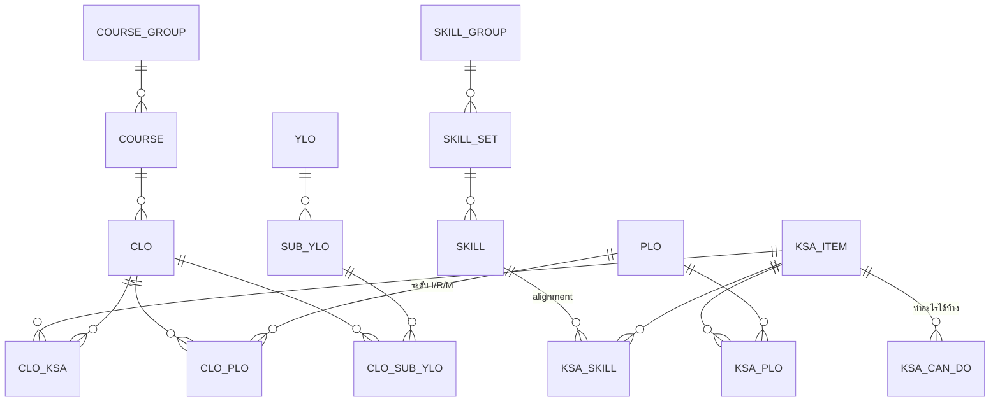
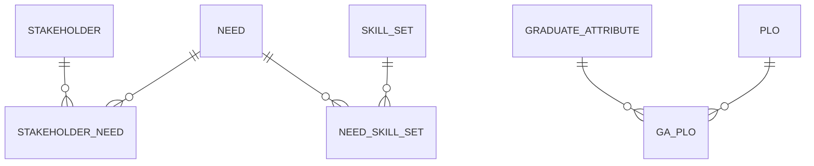
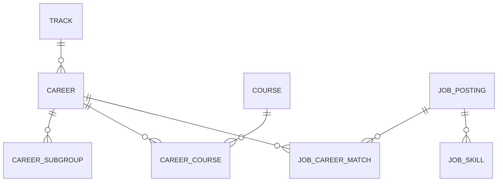
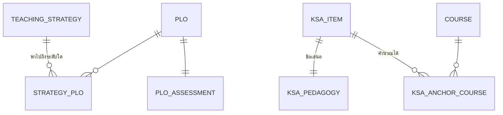
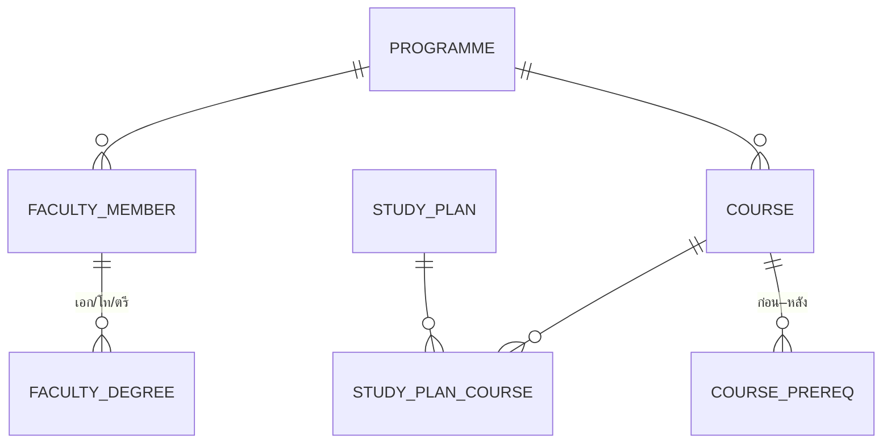

# แบบฐานข้อมูลหลักสูตรและความสัมพันธ์ (Curriculum Database Design)

> แปลงข้อมูลที่กระจายอยู่ในวอลต์และในไฟล์ข้อมูลของเว็บ ให้เป็น **แบบฐานข้อมูลเชิงสัมพันธ์** ที่เก็บได้ครบและตรวจความสอดคล้องได้อัตโนมัติ
>
> สคริปต์จริงอยู่ที่ `curriculum-graph/data/schema.sql` (PostgreSQL 14+)
> ทดสอบโหลดจริงแล้ว: **46 ตาราง · 4 มุมมอง · 8 ชนิดข้อมูล · 54 คีย์นอก · 11 เงื่อนไขตรวจสอบ**

---

## 1. หลักการออกแบบ 3 ข้อ

### 1.1 ใช้รหัสในเอกสารเป็นคีย์หลักโดยตรง

`PLO1` `K1` `HS1` `AISK01` `EN-131-102` เป็นรหัสที่นิ่ง มีความหมาย และถูกอ้างข้ามเอกสารอยู่แล้ว จึงใช้เป็น primary key ตรง ๆ ไม่สร้างเลขลำดับซ่อนไว้ให้ต้องแปลกลับไปมา — เวลาอ่านตารางเชื่อมจะเห็นความหมายทันทีโดยไม่ต้อง join

### 1.2 ทุกความสัมพันธ์ที่ไม่ได้มาจากเอกสารตรง ๆ ต้องบอกที่มา

วอลต์มีข้อมูลสามชนิดปนกัน การเก็บโดยไม่แยกจะทำให้ข้อเสนอกลายเป็นข้อเท็จจริงภายในไม่กี่รอบแก้ไข

| ค่า | ความหมาย | ตัวอย่างในระบบ |
|---|---|---|
| `stated` | เอกสารระบุตรง | KSA ของ CLO วิชาบังคับ |
| `derived` | คำนวณจากข้อมูลอื่น | รายวิชาแกนของแต่ละ KSA · KSA ของวิชาชีพเลือกที่อนุมานผ่าน AISK |
| `authored` | ข้อเสนอที่ยังไม่ผ่านการรับรอง | กลยุทธ์การสอนและวิธีประเมินรายข้อ KSA |

### 1.3 ระดับต่าง ๆ เก็บเป็นชนิดข้อมูลจำกัดค่า ไม่ใช่ข้อความอิสระ

`irm_level` (I/R/M) · `depth_level` (L1–L4) · `ksa_dimension` (K/S/A) · `skill_family` (HS/SS/EF) · `prereq_kind` (hard/weak/coreq) — ฐานข้อมูลจะปฏิเสธค่าที่พิมพ์ผิดตั้งแต่ตอนบันทึก

---

## 2. แผนภาพความสัมพันธ์

### 2.1 แกนกลาง — จากทักษะสู่รายวิชา



**ทิศทางการอ่าน:** `SKILL (HS/SS/EF)` เป็นชั้นหลักฐานตลาดแรงงาน → `KSA_ITEM` เป็นชั้นที่ให้คะแนนได้ → `CLO` อ้าง KSA → `PLO` และ `SUB_YLO` รับผลจาก CLO

> [!important] กติกาที่ฐานข้อมูลบังคับ
> `CLO` **ไม่มีคีย์นอกไปยัง `SKILL` โดยตรง** — ต้องผ่าน `KSA_ITEM` เสมอ ตรงกับสถาปัตยกรรมที่ตกลงกันว่า CLO อ้าง KSA เท่านั้น ไม่อ้างทักษะดิบ

### 2.2 ที่มาของหลักสูตร



### 2.3 อาชีพและหลักฐานตลาดแรงงาน



> [!warning] กับดักที่เคยทำให้ข้อมูลพัง
> `CAREER_SUBGROUP.id` ใช้รูปแบบ `C01-S01` ซึ่ง**หน้าตาเหมือนรหัสทักษะ `S1`** ตอนทำ migration ด้วย regex เคยเกือบเปลี่ยน `C01-S01` เป็น `C01-SS01` มาแล้ว จึงเขียนเตือนไว้ในสคริปต์ตรงตารางนี้

### 2.4 การสอนและการประเมิน



### 2.5 หลักสูตร อาจารย์ และแผนการเรียน



---

## 3. จุดที่ออกแบบเป็นพิเศษเพราะข้อมูลจริงบังคับ

### 3.1 คลังวิชาชีพเลือกต้องแยกจากวิชาที่เรียนจริง

`course_group.is_elective_pool` และ `pick_count` พร้อมเงื่อนไขบังคับว่าถ้าเป็นคลังต้องระบุจำนวนที่ต้องเลือก

```sql
CHECK (NOT is_elective_pool OR pick_count IS NOT NULL)
```

เหตุผล: คลังมี **57 รายวิชา** แต่ผู้เรียนเลือก **5 วิชา** การนับรวมทำให้ `YLO3.1` แสดง 159 CLO ทั้งที่จริงมี 15 มุมมอง `vw_plo_coverage` จึงแยกคอลัมน์ `required_*` ออกจาก `elective_*` และเขียนกำกับไว้ว่าให้อ่านเฉพาะฝั่งบังคับในการตัดสินการบรรลุ

### 3.2 แผน ก และแผน ข ใช้รายวิชาต่างกัน

`study_plan_course` แยกตารางแทนการเก็บภาคเรียนไว้ใน `course` เพราะ `EN-134-403` (แผน ก) กับ `EN-134-404` (แผน ข) เป็นทางเลือกแทนกัน

### 3.3 KSA ของวิชาชีพเลือกเป็นค่าอนุมาน

`course_ksa.source` บังคับให้ระบุที่มาเสมอ — 54 วิชาที่อนุมานผ่าน AISK จะถูกทำเครื่องหมาย `derived` และต้องไม่ถูกอ่านเป็นรหัสที่เอกสารระบุ

### 3.4 มุมมองตรวจสอบความสอดคล้อง 4 ตัว

| มุมมอง | ตรวจอะไร | ค่าที่ถูกต้อง |
|---|---|---|
| `vw_skill_ksa_gap` | ทักษะที่ยังไม่มี K หรือ S รองรับ | ต้องว่าง |
| `vw_skill_set_without_attitude` | ชุดทักษะที่ไม่มีมิติทัศนคติเลย | ต้องว่าง — ไม่งั้น Skill Transcript ไม่มีอะไรให้ประเมินเชิงพฤติกรรม |
| `vw_ksa_orphan` | KSA ที่ไม่มีวิชาบังคับใดอ้างถึง | ต้องว่าง |
| `vw_plo_coverage` | ความครอบคลุม PLO แยกบังคับ/เลือก | ทุก PLO ต้องมี `required_top_level = M` |

ทั้งสี่ตัวคือข้อผิดพลาดที่เคยเกิดจริงในวอลต์ระหว่างการจัดทำ — `SS7`/`SS8` เคยไม่มี Knowledge, `AISK04`/`AISK05` เคยไม่มี Attitude, `K2` เคยไม่มีวิชาบังคับอ้างถึง การทำเป็นมุมมองทำให้จับได้ทันทีแทนที่จะต้องไล่ตรวจด้วยมือ

---

## 4. การนำเข้าข้อมูลจากระบบปัจจุบัน

ไฟล์ข้อมูลของเว็บเป็นแหล่งที่สมบูรณ์ที่สุดอยู่แล้ว จึงนำเข้าจากที่นั่นได้โดยตรง

| ตารางปลายทาง | แหล่งข้อมูล |
|---|---|
| `programme`, `faculty_member`, `faculty_degree` | `facultyData.js` + เล่มหมวดที่ 1 |
| `course`, `course_group`, `course_prereq`, `study_plan_course` | `data.js` (`COURSES`, `STRUCTURE`, `PLANS`) |
| `plo`, `ylo`, `sub_ylo` | `data.js` (`PLO_DETAIL`, `YLO_DETAIL`) |
| `clo`, `clo_plo`, `clo_sub_ylo`, `clo_skill_set` | `cloData.js` (`CLO_LIST`) |
| `ksa_item`, `ksa_can_do`, `ksa_skill` | `ksaData.js` |
| `clo_ksa`, `course_ksa` | `courseKsaData.js` |
| `skill`, `skill_set`, `skill_group`, `skill_track` | `obeData.js` |
| `stakeholder`, `need`, `graduate_attribute` | `obeData.js` |
| `career`, `career_course` | `data.js` (`CAREERS`) |
| `job_posting`, `job_career_match`, `job_skill` | `data/jobsdb-*.json` |
| `teaching_strategy`, `strategy_plo`, `plo_assessment` | `teachingData.js` |
| `ksa_pedagogy`, `ksa_anchor_course` | `ksaPedagogyData.js` |
| `reference_doc` | `refData.js` |

> [!note] ยังไม่ได้เขียนสคริปต์นำเข้า
> เอกสารนี้ให้แบบและสคริปต์สร้างตารางเท่านั้น ตัวโหลดข้อมูล (ETL) ยังไม่ได้ทำ
> ถ้าจะทำ ควรเขียนเป็น generator อีกตัวในชุดเดิมเพื่อให้ฐานข้อมูลสร้างใหม่จากวอลต์ได้เสมอ ไม่ใช่แก้ในฐานข้อมูลแล้วหลุดจากเอกสาร

---

## 5. ผลการทดสอบ

โหลด `schema.sql` เข้า PostgreSQL จริงภายในทรานแซกชันแล้วย้อนกลับ ไม่ทิ้งวัตถุใดไว้

| รายการ | ผล |
|---|--:|
| ตาราง | 46 |
| มุมมอง | 4 |
| ชนิดข้อมูลจำกัดค่า | 8 |
| คีย์นอก | 54 |
| เงื่อนไขตรวจสอบ | 11 |
| คีย์นอกที่ชี้ไปตารางที่ไม่มี | 0 |
| ข้อผิดพลาดตอนโหลด | 0 |

ทดสอบเงื่อนไขด้วยการพยายามบันทึกคลังวิชาเลือกที่ไม่ระบุ `pick_count` — ฐานข้อมูลปฏิเสธตามที่ออกแบบไว้

---

[[18_KSA_Codebook|สมุดรหัส KSA]] | [[19_Course_and_CLO_KSA_Tables|ตารางรหัส KSA รายวิชาและราย CLO]] | [[20_KSA_Teaching_and_Assessment|กลยุทธ์การสอนรายข้อ KSA]] | [[00_TQF2_Drafts_Home|หน้าหลักร่างวิชาการ]]
