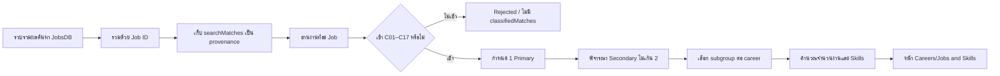

# ข้อมูลและระเบียบวิธี

## 1. ขอบเขตข้อมูล

| รายการ | รายละเอียด |
|---|---|
| แหล่งข้อมูล | JobsDB Thailand |
| วันที่ Snapshot | 2026-07-28 |
| หน่วยวิเคราะห์ | ประกาศงานไม่ซ้ำตาม Job ID |
| จำนวนงานดิบ | 7,424 |
| ขอบเขตอาชีพ | C01–C17 |
| โมเดลช่วยจำแนก | Gemini 2.5 Flash-Lite |
| เวอร์ชันกฎ | `semantic-career-v1` |

ข้อมูลต้นทางและผลวิเคราะห์อยู่ในโครงการ `curriculum-graph`:

- `curriculum-graph/data/jobsdb-careers-raw.json` — ข้อมูลที่รวบรวมจากผลค้นหา
- `curriculum-graph/src/jobsData.json` — ข้อมูลสำหรับหน้าเว็บและผลจำแนก

## 2. ความหมายของความสัมพันธ์สองชนิด

### `searchMatches`

บันทึกว่า Job ID นั้นปรากฏจากคำค้นหรือกลุ่มค้นหาใด มีประโยชน์สำหรับตรวจที่มาของข้อมูลและประเมิน recall ของคำค้น แต่ไม่ยืนยันว่าเนื้องานอยู่ในอาชีพนั้น

ตัวอย่าง false positive ที่อาจเกิดขึ้น:

- คำว่า automation พบงาน Power Automate/RPA แต่ไม่ใช่ Industrial Automation
- คำว่า IoT พบในรายการเทคโนโลยีทั่วไป แต่ไม่มีบริบทเกษตร
- คำว่า research อยู่ใน market research แต่ไม่ใช่ AI Researcher
- งานหนึ่งปรากฏจากหลายคำค้นจนถูกนับซ้ำหลาย C

### `classifiedMatches`

เป็นความสัมพันธ์ที่ได้จากการอ่านและประเมินเนื้อหาของแต่ละงาน ประกอบด้วย:

- `careerId` — C01–C17
- `subId` — กลุ่มย่อยที่เหมาะสมที่สุดภายใน C
- `role` — Primary หรือ Secondary
- `confidence` — ความเชื่อมั่น
- `reason` — เหตุผลแบบย่อจากหลักฐานในงาน

> [!important]
> หน้าเว็บ จำนวนงานราย C/กลุ่มย่อย และ Skills statistics ต้องใช้ `classifiedMatches` เท่านั้น

## 3. หน่วยข้อมูลที่ใช้ตัดสิน

แต่ละ Job ID ถูกพิจารณาแยกจากกันโดยใช้:

- ชื่อตำแหน่ง
- company/job classification
- คำอธิบายงานและหน้าที่
- คุณสมบัติที่ต้องการ
- สรุปงานและ Skills ที่สกัดได้

คำค้นที่ทำให้พบงานถูกจงใจไม่นำมาใช้เป็นเหตุผลจำแนก เพื่อลด confirmation bias

## 4. กฎความสัมพันธ์

| กฎ | ค่า |
|---|---:|
| Primary สูงสุด | 1 อาชีพต่องาน |
| Primary confidence ขั้นต่ำ | 0.70 |
| Secondary สูงสุด | 2 อาชีพต่องาน |
| Secondary confidence ขั้นต่ำ | 0.65 |
| กลุ่มย่อย | 1 กลุ่มย่อยต่ออาชีพที่ยอมรับ |
| ไม่พบหลักฐานเพียงพอ | ไม่มี `classifiedMatches` |

Primary หมายถึงแกนหลักของบทบาท ส่วน Secondary หมายถึงหน้าที่สำคัญที่มีหลักฐานชัด แต่ไม่ใช่แกนหลัก การมีหลาย relation จึงไม่ใช่ duplicate Job ID

## 5. กระบวนการ

การประมวลผลใช้ batch size 10, concurrency 12 และ checkpoint/resume เพื่อให้สามารถทำต่อได้หากกระบวนการหยุด โดยประมวลผลครบ 7,424 งาน

## 6. ผลควบคุมคุณภาพเชิงโครงสร้าง

| การตรวจ | ผล |
|---|---|
| งานที่ประมวลผล | 7,424/7,424 |
| Primary เกิน 1 | ไม่พบ |
| Secondary เกิน 2 | ไม่พบ |
| Primary ต่ำกว่า 0.70 | ไม่พบ |
| Secondary ต่ำกว่า 0.65 | ไม่พบ |
| ค่า confidence Primary เฉลี่ย | 0.814 |
| ช่วง confidence Primary | 0.70–0.98 |
| ค่า confidence Secondary เฉลี่ย | 0.674 |
| ช่วง confidence Secondary | 0.65–0.80 |

## 7. วิธีคำนวณ Skills

- แต่ละ C มี taxonomy Technical Skills 20 รายการที่ออกแบบให้ตรงกับโดเมน
- Soft Skills ใช้ taxonomy ร่วม 10 รายการเพื่อเปรียบเทียบข้ามอาชีพ
- นับ Skill ไม่เกินหนึ่งครั้งต่อ Job ID ต่อ C แม้ข้อความจะกล่าวถึงหลายครั้ง
- งานต้องมี `classifiedMatches` ของ C นั้นก่อนจึงเข้าตัวหาร
- เมื่อเลือก subgroup จะคำนวณใหม่จากเฉพาะงานที่ถูกจำแนกเข้ากลุ่มย่อยนั้น

## 8. ข้อจำกัด

- Snapshot เป็นภาพของผลค้นหา ณ วันหนึ่ง ไม่ใช่จำนวน vacancy ทั้งตลาดแรงงานไทย
- ประกาศซ้ำข้ามเวลา/บริษัทอาจมีข้อความคล้ายกัน แม้ Job ID ไม่ซ้ำ
- การจำแนกด้วยโมเดลมีความคลาดเคลื่อนเชิงความหมาย จึงควรสุ่มตรวจโดยผู้เชี่ยวชาญ
- การสกัด Skill แบบคำศัพท์/รูปแบบอาจเกิด false positive หรือ false negative
- จำนวนต่ำในอาชีพเฉพาะทางอาจสะท้อนคำเรียกตำแหน่งที่หลากหลาย ไม่ได้แปลว่าไม่มีความต้องการทักษะนั้น

อ่านเกณฑ์เฉพาะแต่ละอาชีพต่อที่ [[03_Classification_Policy_C01_C17|เกณฑ์จำแนก C01–C17]]
