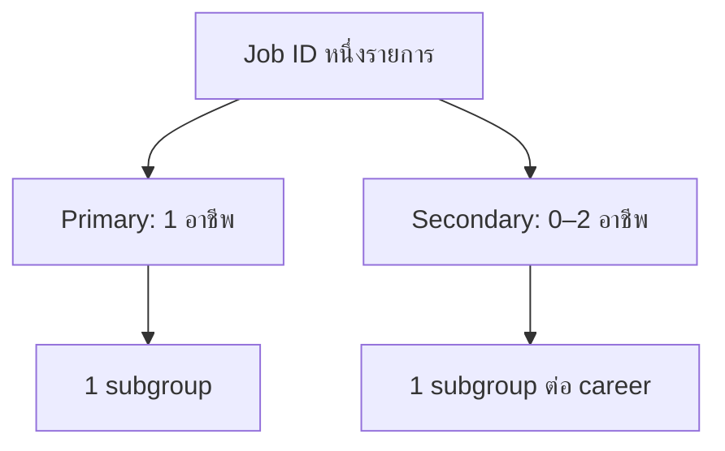

# คุณภาพข้อมูลและงานที่สัมพันธ์หลายอาชีพ

## เหตุใดผลรวมรายอาชีพจึงมากกว่าจำนวนงาน

ข้อมูลมี 3 ระดับที่ต้องแยกจากกัน:

| ระดับ | จำนวน | ความหมาย |
|---|---:|---|
| Job IDs | 7,424 | ประกาศงานไม่ซ้ำ |
| Accepted Job IDs | 3,278 | งานที่เข้า C01–C17 อย่างน้อยหนึ่งกลุ่ม |
| Classified relations | 5,377 | ความสัมพันธ์ Job ↔ Career ที่ผ่านเกณฑ์ |

งานที่ยอมรับทุกงานมี Primary หนึ่งรายการ และ 2,017 งานมี Secondary อย่างน้อยหนึ่งรายการ ดังนั้นผลรวมราย C จึงเป็น 5,377 ไม่ใช่ 3,278 กรณีนี้คือ **multiple relation** ไม่ใช่ duplicate Job ID

## โครงสร้างความสัมพันธ์

ตัวอย่างเชิงแนวคิด:

- งาน AI Solutions ที่พัฒนา Python/API ด้วย อาจเป็น C02 Primary + C06 Secondary
- งาน Production Engineer ที่ทำ predictive maintenance อาจเป็น C14 Primary + C16 Secondary
- งาน Data Analyst ที่สร้าง decision model อาจเป็น C12 Primary + C15 Secondary

## คู่ความสัมพันธ์ที่พบบ่อย

ทิศทางในตารางคือ Primary → Secondary

| อันดับ | Primary → Secondary | งาน |
|---:|---|---:|
| 1 | C02 → C06 | 172 |
| 2 | C14 → C16 | 85 |
| 3 | C12 → C07 | 82 |
| 4 | C06 → C07 | 74 |
| 5 | C02 → C12 | 73 |
| 6 | C14 → C17 | 70 |
| 7 | C14 → C13 | 59 |
| 8 | C12 → C15 | 59 |
| 9 | C06 → C02 | 56 |
| 10 | C14 → C15 | 50 |
| 11 | C16 → C14 | 46 |
| 12 | C07 → C12 | 45 |
| 13 | C04 → C13 | 44 |
| 14 | C12 → C02 | 43 |
| 15 | C04 → C16 | 43 |
| 16 | C15 → C12 | 43 |
| 17 | C14 → C12 | 37 |
| 18 | C14 → C04 | 36 |
| 19 | C14 → C07 | 36 |
| 20 | C04 → C05 | 35 |

คู่เหล่านี้สะท้อนธรรมชาติของงานจริง เช่น solution–software, production–maintenance และ analytics–decision support แต่ไม่ควรใช้เป็นเหตุผลให้เพิ่ม Secondary โดยอัตโนมัติ ทุก relation ต้องมีหลักฐานจากงานนั้น

## สิ่งที่แก้ไขจากวิธีเดิม

| ปัญหาเดิม | แนวทางใหม่ |
|---|---|
| งานถูกนับเข้าหลาย C เพราะปรากฏจากหลายคำค้น | เก็บคำค้นไว้ใน `searchMatches` และจำแนกใหม่ทีละ Job |
| ผลรวม 7,424/19,866 ถูกตีความเป็นจำนวนงานของอาชีพ | แสดง Job IDs, accepted jobs และ relations แยกกัน |
| งาน RPA เข้า Automation/Control | กำหนด industrial control gate สำหรับ C04 |
| งาน IoT ทั่วไปเข้า Smart Agriculture | กำหนด agriculture + smart technology gate สำหรับ C03 |
| dashboard เข้า DSS | C15 ต้องมี decision/optimization/simulation/OR; dashboard ทั่วไปเข้า C12 |
| Skills ไม่เปลี่ยนตามอาชีพที่เลือก | คำนวณจาก `classifiedMatches` ของ C/subgroup ที่เลือกเท่านั้น |

## ประเด็นคุณภาพที่ยังต้องดำเนินการ

### 1. C11 Procurement false positive

ตัวตรวจ Technical Skill เดิมให้ Procurement 228/228 งาน คาดว่า pattern `tor` จับคำอื่น เช่น monitor ควร:

1. เปลี่ยนเป็นคำเต็มและ word boundary เช่น `terms of reference`, `procurement`, `TOR document`
2. หลีกเลี่ยง token สั้น `tor`
3. รัน skill extraction ใหม่เฉพาะ C11
4. เปรียบเทียบตัวอย่าง true/false positive ก่อนเผยแพร่

### 2. ตรวจทานโดยผู้เชี่ยวชาญ

ควรสุ่มอย่างน้อย:

- Primary confidence ใกล้ 0.70
- Secondary confidence ใกล้ 0.65
- งานใน C ที่มี domain gate เช่น C03, C13–C17
- งานที่มี 3 relations
- subgroup ที่มีจำนวนต่ำหรือเป็นศูนย์

รายงาน precision แยก C และ subgroup พร้อมบันทึก confusion pair ที่พบ

### 3. ความซ้ำเชิงเนื้อหา

Job ID ไม่ซ้ำไม่ได้รับประกันว่าเนื้อหาประกาศไม่ซ้ำ ควรสร้าง fingerprint จาก title + company + normalized description เพื่อระบุ:

- repost ของบริษัทเดียวกัน
- ตำแหน่งเดียวกันหลายสถานที่
- agency posting ที่คัดลอกคำอธิบาย

ควรรายงานทั้ง **unique Job ID** และ **deduplicated posting cluster** หากนำไปประมาณขนาดตลาด

### 4. Temporal validity

Snapshot วันที่ 2026-07-28 ควรระบุทุกครั้งที่อ้างตัวเลข และไม่ควรเปรียบเทียบข้ามรอบเก็บข้อมูลหาก query set หรือ classification policy เปลี่ยนโดยไม่ versioning

## สรุปหลักการรายงาน

> [!important]
> เขียนว่า “พบ 3,278 ประกาศงานไม่ซ้ำที่เข้า C01–C17 และมี 5,377 ความสัมพันธ์ที่ผ่านการจำแนก”  
> ไม่เขียนว่า “มี 5,377 งาน” เพราะจะนับงานหลายอาชีพซ้ำ

ดูตัวอย่างการตัดความสัมพันธ์ที่ไม่เกี่ยวข้องใน [[07_Audit_Case_93021513|กรณี JobsDB #93021513]]
