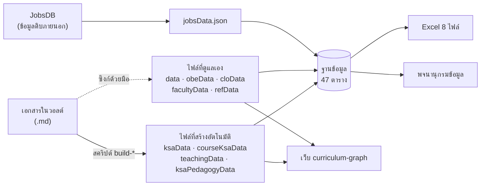

# ดัชนีสายที่มาของข้อมูล (Data Lineage)

> ตอบคำถามเดียว: **ข้อมูลในตารางนี้มาจากไฟล์ไหนในวอลต์**
>
> วอลต์มีเอกสารหลายสิบไฟล์และบางไฟล์ยาวหลายร้อยบรรทัด ดัชนีนี้ลัดให้ไปถึงต้นทางได้โดยไม่ต้องไล่อ่าน
>
> **สร้างอัตโนมัติ** จาก `curriculum-graph/scripts/build-db-lineage.mjs` · สั่งสร้างใหม่ด้วย `npm run db:lineage`

## สายข้อมูลโดยรวม



> [!important] ทิศทางเดียว
> เอกสารในวอลต์คือต้นทางเสมอ ฐานข้อมูลกับ Excel เป็นปลายทาง
> แก้ที่ปลายทางแล้วข้อมูลจะหายในการสร้างรอบถัดไป

## ประเภทของแหล่งข้อมูล

| ประเภท | ความหมาย | วิธีแก้ข้อมูล |
|---|---|---|
| **สร้างอัตโนมัติ** | แก้ที่เอกสารในวอลต์แล้วรันสคริปต์ | แก้ที่เอกสารในวอลต์แล้วรันสคริปต์ ห้ามแก้ไฟล์ .js |
| **ซิงก์ด้วยมือ** | ต้องแก้ทั้งเอกสารและไฟล์ .js ให้ตรงกันเอง | ต้องแก้ทั้งเอกสารและไฟล์ .js ให้ตรงกันเอง |
| **ข้อมูลดิบ** | ผลดึงจากภายนอก ไม่ได้แก้ด้วยมือ | ผลดึงจากภายนอก ไม่ได้แก้ด้วยมือ |

## ตารางฐานข้อมูล → ต้นทาง

| ตาราง | แถว | ไฟล์ข้อมูล | ฟิลด์ต้นทาง | ประเภท | เอกสารในวอลต์ |
|---|--:|---|---|---|---|
| `programme` | 1 | `data.js` | `TOTAL_CREDITS + ค่าคงที่ในสคริปต์ ETL` | ซิงก์ด้วยมือ | [[../04_Course_Descriptions_2570/11_Course_Index\|11_Course_Index]]<br>[[../02_Current_Curriculum_2570/03_Curriculum_Structure\|03_Curriculum_Structure]]<br>[[../03_OBE_PLO_Design_2570/04_PLOs_7_OBE\|04_PLOs_7_OBE]]<br>[[../05_TQF2_Academic_Drafts/09_Yearly_Learning_Outcomes\|09_Yearly_Learning_Outcomes]]<br>[[../01_Labor_Market_Research/13_Career_Codes_and_Course_Pathways_C01_C26\|13_Career_Codes_and_Course_Pathways_C01_C26]] |
| `faculty_member` | 5 | `facultyData.js` | `FACULTY` | ซิงก์ด้วยมือ | [[../08_TQF2_Book_Revisions/19_Approved_Book_Identity_and_Structure\|19_Approved_Book_Identity_and_Structure]] |
| `faculty_degree` | 15 | `facultyData.js` | `FACULTY[].degrees` | ซิงก์ด้วยมือ | [[../08_TQF2_Book_Revisions/19_Approved_Book_Identity_and_Structure\|19_Approved_Book_Identity_and_Structure]] |
| `reference_doc` | 30 | `refData.js` | `STANDARDS, BIB` | ซิงก์ด้วยมือ | [[../03_OBE_PLO_Design_2570/06_OBE_References\|06_OBE_References]]<br>[[../07_JobsDB_Semantic_Career_Analysis/00_Home\|00_Home]] |
| `course_group` | 8 | `data.js` | `STRUCTURE` | ซิงก์ด้วยมือ | [[../04_Course_Descriptions_2570/11_Course_Index\|11_Course_Index]]<br>[[../02_Current_Curriculum_2570/03_Curriculum_Structure\|03_Curriculum_Structure]]<br>[[../03_OBE_PLO_Design_2570/04_PLOs_7_OBE\|04_PLOs_7_OBE]]<br>[[../05_TQF2_Academic_Drafts/09_Yearly_Learning_Outcomes\|09_Yearly_Learning_Outcomes]]<br>[[../01_Labor_Market_Research/13_Career_Codes_and_Course_Pathways_C01_C26\|13_Career_Codes_and_Course_Pathways_C01_C26]] |
| `track` | 3 | `data.js` | `TRACK_NAME` | ซิงก์ด้วยมือ | [[../04_Course_Descriptions_2570/11_Course_Index\|11_Course_Index]]<br>[[../02_Current_Curriculum_2570/03_Curriculum_Structure\|03_Curriculum_Structure]]<br>[[../03_OBE_PLO_Design_2570/04_PLOs_7_OBE\|04_PLOs_7_OBE]]<br>[[../05_TQF2_Academic_Drafts/09_Yearly_Learning_Outcomes\|09_Yearly_Learning_Outcomes]]<br>[[../01_Labor_Market_Research/13_Career_Codes_and_Course_Pathways_C01_C26\|13_Career_Codes_and_Course_Pathways_C01_C26]] |
| `course` | 97 | `data.js` | `COURSES` | ซิงก์ด้วยมือ | [[../04_Course_Descriptions_2570/11_Course_Index\|11_Course_Index]]<br>[[../02_Current_Curriculum_2570/03_Curriculum_Structure\|03_Curriculum_Structure]]<br>[[../03_OBE_PLO_Design_2570/04_PLOs_7_OBE\|04_PLOs_7_OBE]]<br>[[../05_TQF2_Academic_Drafts/09_Yearly_Learning_Outcomes\|09_Yearly_Learning_Outcomes]]<br>[[../01_Labor_Market_Research/13_Career_Codes_and_Course_Pathways_C01_C26\|13_Career_Codes_and_Course_Pathways_C01_C26]] |
| `course_prereq` | 70 | `data.js` | `COURSES[].h / .w / .co` | ซิงก์ด้วยมือ | [[../04_Course_Descriptions_2570/11_Course_Index\|11_Course_Index]]<br>[[../02_Current_Curriculum_2570/03_Curriculum_Structure\|03_Curriculum_Structure]]<br>[[../03_OBE_PLO_Design_2570/04_PLOs_7_OBE\|04_PLOs_7_OBE]]<br>[[../05_TQF2_Academic_Drafts/09_Yearly_Learning_Outcomes\|09_Yearly_Learning_Outcomes]]<br>[[../01_Labor_Market_Research/13_Career_Codes_and_Course_Pathways_C01_C26\|13_Career_Codes_and_Course_Pathways_C01_C26]] |
| `study_plan` | 2 | `data.js` | `PLANS` | ซิงก์ด้วยมือ | [[../04_Course_Descriptions_2570/11_Course_Index\|11_Course_Index]]<br>[[../02_Current_Curriculum_2570/03_Curriculum_Structure\|03_Curriculum_Structure]]<br>[[../03_OBE_PLO_Design_2570/04_PLOs_7_OBE\|04_PLOs_7_OBE]]<br>[[../05_TQF2_Academic_Drafts/09_Yearly_Learning_Outcomes\|09_Yearly_Learning_Outcomes]]<br>[[../01_Labor_Market_Research/13_Career_Codes_and_Course_Pathways_C01_C26\|13_Career_Codes_and_Course_Pathways_C01_C26]] |
| `study_plan_course` | 78 | `data.js` | `coursesOfPlan()` | ซิงก์ด้วยมือ | [[../04_Course_Descriptions_2570/11_Course_Index\|11_Course_Index]]<br>[[../02_Current_Curriculum_2570/03_Curriculum_Structure\|03_Curriculum_Structure]]<br>[[../03_OBE_PLO_Design_2570/04_PLOs_7_OBE\|04_PLOs_7_OBE]]<br>[[../05_TQF2_Academic_Drafts/09_Yearly_Learning_Outcomes\|09_Yearly_Learning_Outcomes]]<br>[[../01_Labor_Market_Research/13_Career_Codes_and_Course_Pathways_C01_C26\|13_Career_Codes_and_Course_Pathways_C01_C26]] |
| `plo` | 7 | `data.js` | `PLO_NAME, PLO_DETAIL` | ซิงก์ด้วยมือ | [[../04_Course_Descriptions_2570/11_Course_Index\|11_Course_Index]]<br>[[../02_Current_Curriculum_2570/03_Curriculum_Structure\|03_Curriculum_Structure]]<br>[[../03_OBE_PLO_Design_2570/04_PLOs_7_OBE\|04_PLOs_7_OBE]]<br>[[../05_TQF2_Academic_Drafts/09_Yearly_Learning_Outcomes\|09_Yearly_Learning_Outcomes]]<br>[[../01_Labor_Market_Research/13_Career_Codes_and_Course_Pathways_C01_C26\|13_Career_Codes_and_Course_Pathways_C01_C26]] |
| `ylo` | 4 | `data.js` | `YLO_DETAIL` | ซิงก์ด้วยมือ | [[../04_Course_Descriptions_2570/11_Course_Index\|11_Course_Index]]<br>[[../02_Current_Curriculum_2570/03_Curriculum_Structure\|03_Curriculum_Structure]]<br>[[../03_OBE_PLO_Design_2570/04_PLOs_7_OBE\|04_PLOs_7_OBE]]<br>[[../05_TQF2_Academic_Drafts/09_Yearly_Learning_Outcomes\|09_Yearly_Learning_Outcomes]]<br>[[../01_Labor_Market_Research/13_Career_Codes_and_Course_Pathways_C01_C26\|13_Career_Codes_and_Course_Pathways_C01_C26]] |
| `sub_ylo` | 16 | `data.js` | `YLO_DETAIL[].sub` | ซิงก์ด้วยมือ | [[../04_Course_Descriptions_2570/11_Course_Index\|11_Course_Index]]<br>[[../02_Current_Curriculum_2570/03_Curriculum_Structure\|03_Curriculum_Structure]]<br>[[../03_OBE_PLO_Design_2570/04_PLOs_7_OBE\|04_PLOs_7_OBE]]<br>[[../05_TQF2_Academic_Drafts/09_Yearly_Learning_Outcomes\|09_Yearly_Learning_Outcomes]]<br>[[../01_Labor_Market_Research/13_Career_Codes_and_Course_Pathways_C01_C26\|13_Career_Codes_and_Course_Pathways_C01_C26]] |
| `clo` | 288 | `cloData.js` | `CLO_LIST[].clos` | ซิงก์ด้วยมือ | [[../05_TQF2_Academic_Drafts/10_Course_Learning_Outcomes_CLO_Mapping\|10_Course_Learning_Outcomes_CLO_Mapping]]<br>[[../05_TQF2_Academic_Drafts/11_Skill_Set_Matrix_and_KSA\|11_Skill_Set_Matrix_and_KSA]] |
| `clo_plo` | 426 | `cloData.js` | `CLO_LIST[].clos[].plo` | ซิงก์ด้วยมือ | [[../05_TQF2_Academic_Drafts/10_Course_Learning_Outcomes_CLO_Mapping\|10_Course_Learning_Outcomes_CLO_Mapping]]<br>[[../05_TQF2_Academic_Drafts/11_Skill_Set_Matrix_and_KSA\|11_Skill_Set_Matrix_and_KSA]] |
| `clo_sub_ylo` | 319 | `cloData.js` | `CLO_LIST[].clos[].ylo` | ซิงก์ด้วยมือ | [[../05_TQF2_Academic_Drafts/10_Course_Learning_Outcomes_CLO_Mapping\|10_Course_Learning_Outcomes_CLO_Mapping]]<br>[[../05_TQF2_Academic_Drafts/11_Skill_Set_Matrix_and_KSA\|11_Skill_Set_Matrix_and_KSA]] |
| `course_plo` | 293 | `data.js` | `COURSES[].p` | ซิงก์ด้วยมือ | [[../04_Course_Descriptions_2570/11_Course_Index\|11_Course_Index]]<br>[[../02_Current_Curriculum_2570/03_Curriculum_Structure\|03_Curriculum_Structure]]<br>[[../03_OBE_PLO_Design_2570/04_PLOs_7_OBE\|04_PLOs_7_OBE]]<br>[[../05_TQF2_Academic_Drafts/09_Yearly_Learning_Outcomes\|09_Yearly_Learning_Outcomes]]<br>[[../01_Labor_Market_Research/13_Career_Codes_and_Course_Pathways_C01_C26\|13_Career_Codes_and_Course_Pathways_C01_C26]] |
| `skill_group` | 7 | `obeData.js` | `GROUPS` | ซิงก์ด้วยมือ | [[../03_OBE_PLO_Design_2570/01_Stakeholder_Needs\|01_Stakeholder_Needs]]<br>[[../03_OBE_PLO_Design_2570/02_Graduate_Attributes\|02_Graduate_Attributes]]<br>[[../03_OBE_PLO_Design_2570/03_Target_Skills\|03_Target_Skills]]<br>[[../05_TQF2_Academic_Drafts/11_Skill_Set_Matrix_and_KSA\|11_Skill_Set_Matrix_and_KSA]] |
| `skill_set` | 9 | `obeData.js` | `SKILL_SETS` | ซิงก์ด้วยมือ | [[../03_OBE_PLO_Design_2570/01_Stakeholder_Needs\|01_Stakeholder_Needs]]<br>[[../03_OBE_PLO_Design_2570/02_Graduate_Attributes\|02_Graduate_Attributes]]<br>[[../03_OBE_PLO_Design_2570/03_Target_Skills\|03_Target_Skills]]<br>[[../05_TQF2_Academic_Drafts/11_Skill_Set_Matrix_and_KSA\|11_Skill_Set_Matrix_and_KSA]] |
| `skill` | 36 | `obeData.js` | `HARD_SKILLS, SOFT_SKILLS, ENGINEERING_FOUNDATIONS` | ซิงก์ด้วยมือ | [[../03_OBE_PLO_Design_2570/01_Stakeholder_Needs\|01_Stakeholder_Needs]]<br>[[../03_OBE_PLO_Design_2570/02_Graduate_Attributes\|02_Graduate_Attributes]]<br>[[../03_OBE_PLO_Design_2570/03_Target_Skills\|03_Target_Skills]]<br>[[../05_TQF2_Academic_Drafts/11_Skill_Set_Matrix_and_KSA\|11_Skill_Set_Matrix_and_KSA]] |
| `skill_set_skill` | 58 | `obeData.js` | `SKILL_SETS[].skills + SKILL[].set` | ซิงก์ด้วยมือ | [[../03_OBE_PLO_Design_2570/01_Stakeholder_Needs\|01_Stakeholder_Needs]]<br>[[../03_OBE_PLO_Design_2570/02_Graduate_Attributes\|02_Graduate_Attributes]]<br>[[../03_OBE_PLO_Design_2570/03_Target_Skills\|03_Target_Skills]]<br>[[../05_TQF2_Academic_Drafts/11_Skill_Set_Matrix_and_KSA\|11_Skill_Set_Matrix_and_KSA]] |
| `skill_track` | 108 | `obeData.js` | `SKILL[].track` | ซิงก์ด้วยมือ | [[../03_OBE_PLO_Design_2570/01_Stakeholder_Needs\|01_Stakeholder_Needs]]<br>[[../03_OBE_PLO_Design_2570/02_Graduate_Attributes\|02_Graduate_Attributes]]<br>[[../03_OBE_PLO_Design_2570/03_Target_Skills\|03_Target_Skills]]<br>[[../05_TQF2_Academic_Drafts/11_Skill_Set_Matrix_and_KSA\|11_Skill_Set_Matrix_and_KSA]] |
| `ksa_item` | 54 | `ksaData.js` | `KNOWLEDGE, SKILLS_KSA, ATTITUDES` | สร้างอัตโนมัติ | [[../05_TQF2_Academic_Drafts/18_KSEC_Codebook\|18_KSEC_Codebook]] |
| `ksa_can_do` | 98 | `ksaData.js` | `SKILLS_KSA[].can` | สร้างอัตโนมัติ | [[../05_TQF2_Academic_Drafts/18_KSEC_Codebook\|18_KSEC_Codebook]] |
| `ksa_skill` | 113 | `ksaData.js` | `KSA[].skills` | สร้างอัตโนมัติ | [[../05_TQF2_Academic_Drafts/18_KSEC_Codebook\|18_KSEC_Codebook]] |
| `ksa_plo` | 91 | `ksaData.js` | `KSA[].plo` | สร้างอัตโนมัติ | [[../05_TQF2_Academic_Drafts/18_KSEC_Codebook\|18_KSEC_Codebook]] |
| `clo_ksa` | 963 | `courseKsaData.js` | `COURSE_KSA[].clos` | สร้างอัตโนมัติ | [[../05_TQF2_Academic_Drafts/10_Course_Learning_Outcomes_CLO_Mapping\|10_Course_Learning_Outcomes_CLO_Mapping]]<br>[[../08_TQF2_Book_Revisions/17_Section4_7_Skill_Set_Coverage\|17_Section4_7_Skill_Set_Coverage]]<br>[[../05_TQF2_Academic_Drafts/18_KSEC_Codebook\|18_KSEC_Codebook]] |
| `clo_skill_set` | 211 | `cloData.js` | `CLO_LIST[].clos[].sets` | ซิงก์ด้วยมือ | [[../05_TQF2_Academic_Drafts/10_Course_Learning_Outcomes_CLO_Mapping\|10_Course_Learning_Outcomes_CLO_Mapping]]<br>[[../05_TQF2_Academic_Drafts/11_Skill_Set_Matrix_and_KSA\|11_Skill_Set_Matrix_and_KSA]] |
| `course_ksa` | 2292 | `courseKsaData.js` | `COURSE_KSA` | สร้างอัตโนมัติ | [[../05_TQF2_Academic_Drafts/10_Course_Learning_Outcomes_CLO_Mapping\|10_Course_Learning_Outcomes_CLO_Mapping]]<br>[[../08_TQF2_Book_Revisions/17_Section4_7_Skill_Set_Coverage\|17_Section4_7_Skill_Set_Coverage]]<br>[[../05_TQF2_Academic_Drafts/18_KSEC_Codebook\|18_KSEC_Codebook]] |
| `course_skill_set` | 290 | `courseKsaData.js` | `COURSE_KSA[].aisk` | สร้างอัตโนมัติ | [[../05_TQF2_Academic_Drafts/10_Course_Learning_Outcomes_CLO_Mapping\|10_Course_Learning_Outcomes_CLO_Mapping]]<br>[[../08_TQF2_Book_Revisions/17_Section4_7_Skill_Set_Coverage\|17_Section4_7_Skill_Set_Coverage]]<br>[[../05_TQF2_Academic_Drafts/18_KSEC_Codebook\|18_KSEC_Codebook]] |
| `stakeholder` | 8 | `obeData.js` | `STAKEHOLDERS` | ซิงก์ด้วยมือ | [[../03_OBE_PLO_Design_2570/01_Stakeholder_Needs\|01_Stakeholder_Needs]]<br>[[../03_OBE_PLO_Design_2570/02_Graduate_Attributes\|02_Graduate_Attributes]]<br>[[../03_OBE_PLO_Design_2570/03_Target_Skills\|03_Target_Skills]]<br>[[../05_TQF2_Academic_Drafts/11_Skill_Set_Matrix_and_KSA\|11_Skill_Set_Matrix_and_KSA]] |
| `need` | 18 | `obeData.js` | `NEEDS` | ซิงก์ด้วยมือ | [[../03_OBE_PLO_Design_2570/01_Stakeholder_Needs\|01_Stakeholder_Needs]]<br>[[../03_OBE_PLO_Design_2570/02_Graduate_Attributes\|02_Graduate_Attributes]]<br>[[../03_OBE_PLO_Design_2570/03_Target_Skills\|03_Target_Skills]]<br>[[../05_TQF2_Academic_Drafts/11_Skill_Set_Matrix_and_KSA\|11_Skill_Set_Matrix_and_KSA]] |
| `stakeholder_need` | 62 | `obeData.js` | `STAKEHOLDERS[].needs` | ซิงก์ด้วยมือ | [[../03_OBE_PLO_Design_2570/01_Stakeholder_Needs\|01_Stakeholder_Needs]]<br>[[../03_OBE_PLO_Design_2570/02_Graduate_Attributes\|02_Graduate_Attributes]]<br>[[../03_OBE_PLO_Design_2570/03_Target_Skills\|03_Target_Skills]]<br>[[../05_TQF2_Academic_Drafts/11_Skill_Set_Matrix_and_KSA\|11_Skill_Set_Matrix_and_KSA]] |
| `need_skill_set` | 43 | `obeData.js` | `NEEDS[].sets` | ซิงก์ด้วยมือ | [[../03_OBE_PLO_Design_2570/01_Stakeholder_Needs\|01_Stakeholder_Needs]]<br>[[../03_OBE_PLO_Design_2570/02_Graduate_Attributes\|02_Graduate_Attributes]]<br>[[../03_OBE_PLO_Design_2570/03_Target_Skills\|03_Target_Skills]]<br>[[../05_TQF2_Academic_Drafts/11_Skill_Set_Matrix_and_KSA\|11_Skill_Set_Matrix_and_KSA]] |
| `graduate_attribute` | 5 | `obeData.js` | `GA` | ซิงก์ด้วยมือ | [[../03_OBE_PLO_Design_2570/01_Stakeholder_Needs\|01_Stakeholder_Needs]]<br>[[../03_OBE_PLO_Design_2570/02_Graduate_Attributes\|02_Graduate_Attributes]]<br>[[../03_OBE_PLO_Design_2570/03_Target_Skills\|03_Target_Skills]]<br>[[../05_TQF2_Academic_Drafts/11_Skill_Set_Matrix_and_KSA\|11_Skill_Set_Matrix_and_KSA]] |
| `ga_plo` | 12 | `obeData.js` | `GA[].plo` | ซิงก์ด้วยมือ | [[../03_OBE_PLO_Design_2570/01_Stakeholder_Needs\|01_Stakeholder_Needs]]<br>[[../03_OBE_PLO_Design_2570/02_Graduate_Attributes\|02_Graduate_Attributes]]<br>[[../03_OBE_PLO_Design_2570/03_Target_Skills\|03_Target_Skills]]<br>[[../05_TQF2_Academic_Drafts/11_Skill_Set_Matrix_and_KSA\|11_Skill_Set_Matrix_and_KSA]] |
| `career` | 26 | `data.js` | `CAREERS` | ซิงก์ด้วยมือ | [[../04_Course_Descriptions_2570/11_Course_Index\|11_Course_Index]]<br>[[../02_Current_Curriculum_2570/03_Curriculum_Structure\|03_Curriculum_Structure]]<br>[[../03_OBE_PLO_Design_2570/04_PLOs_7_OBE\|04_PLOs_7_OBE]]<br>[[../05_TQF2_Academic_Drafts/09_Yearly_Learning_Outcomes\|09_Yearly_Learning_Outcomes]]<br>[[../01_Labor_Market_Research/13_Career_Codes_and_Course_Pathways_C01_C26\|13_Career_Codes_and_Course_Pathways_C01_C26]] |
| `career_course` | 148 | `data.js` | `CAREERS[].courses` | ซิงก์ด้วยมือ | [[../04_Course_Descriptions_2570/11_Course_Index\|11_Course_Index]]<br>[[../02_Current_Curriculum_2570/03_Curriculum_Structure\|03_Curriculum_Structure]]<br>[[../03_OBE_PLO_Design_2570/04_PLOs_7_OBE\|04_PLOs_7_OBE]]<br>[[../05_TQF2_Academic_Drafts/09_Yearly_Learning_Outcomes\|09_Yearly_Learning_Outcomes]]<br>[[../01_Labor_Market_Research/13_Career_Codes_and_Course_Pathways_C01_C26\|13_Career_Codes_and_Course_Pathways_C01_C26]] |
| `career_subgroup` | 68 | `jobsData.json` | `jobs[].searchMatches / classifiedMatches` | ข้อมูลดิบ | [[../07_JobsDB_Semantic_Career_Analysis/00_Home\|00_Home]]<br>[[../07_JobsDB_Semantic_Career_Analysis/09_Career_Top_Skills_Summary\|09_Career_Top_Skills_Summary]] |
| `job_posting` | 7424 | `jobsData.json` | `jobs[]` | ข้อมูลดิบ | [[../07_JobsDB_Semantic_Career_Analysis/00_Home\|00_Home]]<br>[[../07_JobsDB_Semantic_Career_Analysis/09_Career_Top_Skills_Summary\|09_Career_Top_Skills_Summary]] |
| `job_career_match` | 5377 | `jobsData.json` | `jobs[].classifiedMatches` | ข้อมูลดิบ | [[../07_JobsDB_Semantic_Career_Analysis/00_Home\|00_Home]]<br>[[../07_JobsDB_Semantic_Career_Analysis/09_Career_Top_Skills_Summary\|09_Career_Top_Skills_Summary]] |
| `job_skill` | 32214 | `jobsData.json` | `jobs[].skills` | ข้อมูลดิบ | [[../07_JobsDB_Semantic_Career_Analysis/00_Home\|00_Home]]<br>[[../07_JobsDB_Semantic_Career_Analysis/09_Career_Top_Skills_Summary\|09_Career_Top_Skills_Summary]] |
| `teaching_strategy` | 5 | `teachingData.js` | `STRATEGIES` | สร้างอัตโนมัติ | [[../08_TQF2_Book_Revisions/09_Section5_Revised\|09_Section5_Revised]]<br>[[../08_TQF2_Book_Revisions/12_Section6_Revised\|12_Section6_Revised]] |
| `strategy_plo` | 15 | `teachingData.js` | `STRATEGIES[].plos` | สร้างอัตโนมัติ | [[../08_TQF2_Book_Revisions/09_Section5_Revised\|09_Section5_Revised]]<br>[[../08_TQF2_Book_Revisions/12_Section6_Revised\|12_Section6_Revised]] |
| `plo_assessment` | 7 | `teachingData.js` | `ASSESSMENT` | สร้างอัตโนมัติ | [[../08_TQF2_Book_Revisions/09_Section5_Revised\|09_Section5_Revised]]<br>[[../08_TQF2_Book_Revisions/12_Section6_Revised\|12_Section6_Revised]] |
| `ksa_pedagogy` | 54 | `ksaPedagogyData.js` | `KSA_PEDAGOGY` | สร้างอัตโนมัติ | [[../05_TQF2_Academic_Drafts/20_KSEC_Teaching_and_Assessment\|20_KSEC_Teaching_and_Assessment]] |
| `ksa_anchor_course` | 105 | `ksaPedagogyData.js` | `KSA_PEDAGOGY[].anchors` | สร้างอัตโนมัติ | [[../05_TQF2_Academic_Drafts/20_KSEC_Teaching_and_Assessment\|20_KSEC_Teaching_and_Assessment]] |

## ไฟล์ข้อมูล → เอกสารในวอลต์

| ไฟล์ | ประเภท | สคริปต์ที่สร้าง | ใช้กี่ตาราง | เอกสารต้นทาง |
|---|---|---|--:|---|
| `ksaData.js` | สร้างอัตโนมัติ | `build-ksa-data.mjs` | 4 | [[../05_TQF2_Academic_Drafts/18_KSEC_Codebook\|18_KSEC_Codebook]] |
| `courseKsaData.js` | สร้างอัตโนมัติ | `build-course-ksa.mjs` | 3 | [[../05_TQF2_Academic_Drafts/10_Course_Learning_Outcomes_CLO_Mapping\|10_Course_Learning_Outcomes_CLO_Mapping]]<br>[[../08_TQF2_Book_Revisions/17_Section4_7_Skill_Set_Coverage\|17_Section4_7_Skill_Set_Coverage]]<br>[[../05_TQF2_Academic_Drafts/18_KSEC_Codebook\|18_KSEC_Codebook]] |
| `teachingData.js` | สร้างอัตโนมัติ | `build-plo-teaching.mjs` | 3 | [[../08_TQF2_Book_Revisions/09_Section5_Revised\|09_Section5_Revised]]<br>[[../08_TQF2_Book_Revisions/12_Section6_Revised\|12_Section6_Revised]] |
| `ksaPedagogyData.js` | สร้างอัตโนมัติ | `build-ksa-pedagogy.mjs` | 2 | [[../05_TQF2_Academic_Drafts/20_KSEC_Teaching_and_Assessment\|20_KSEC_Teaching_and_Assessment]] |
| `cloRevisionData.js` | สร้างอัตโนมัติ | `sync-curriculum-revision.mjs` | 0 | [[../05_TQF2_Academic_Drafts/10_Course_Learning_Outcomes_CLO_Mapping\|10_Course_Learning_Outcomes_CLO_Mapping]] |
| `data.js` | ซิงก์ด้วยมือ | — | 13 | [[../04_Course_Descriptions_2570/11_Course_Index\|11_Course_Index]]<br>[[../02_Current_Curriculum_2570/03_Curriculum_Structure\|03_Curriculum_Structure]]<br>[[../03_OBE_PLO_Design_2570/04_PLOs_7_OBE\|04_PLOs_7_OBE]]<br>[[../05_TQF2_Academic_Drafts/09_Yearly_Learning_Outcomes\|09_Yearly_Learning_Outcomes]]<br>[[../01_Labor_Market_Research/13_Career_Codes_and_Course_Pathways_C01_C26\|13_Career_Codes_and_Course_Pathways_C01_C26]] |
| `obeData.js` | ซิงก์ด้วยมือ | — | 11 | [[../03_OBE_PLO_Design_2570/01_Stakeholder_Needs\|01_Stakeholder_Needs]]<br>[[../03_OBE_PLO_Design_2570/02_Graduate_Attributes\|02_Graduate_Attributes]]<br>[[../03_OBE_PLO_Design_2570/03_Target_Skills\|03_Target_Skills]]<br>[[../05_TQF2_Academic_Drafts/11_Skill_Set_Matrix_and_KSA\|11_Skill_Set_Matrix_and_KSA]] |
| `cloData.js` | ซิงก์ด้วยมือ | — | 4 | [[../05_TQF2_Academic_Drafts/10_Course_Learning_Outcomes_CLO_Mapping\|10_Course_Learning_Outcomes_CLO_Mapping]]<br>[[../05_TQF2_Academic_Drafts/11_Skill_Set_Matrix_and_KSA\|11_Skill_Set_Matrix_and_KSA]] |
| `facultyData.js` | ซิงก์ด้วยมือ | — | 2 | [[../08_TQF2_Book_Revisions/19_Approved_Book_Identity_and_Structure\|19_Approved_Book_Identity_and_Structure]] |
| `refData.js` | ซิงก์ด้วยมือ | — | 1 | [[../03_OBE_PLO_Design_2570/06_OBE_References\|06_OBE_References]]<br>[[../07_JobsDB_Semantic_Career_Analysis/00_Home\|00_Home]] |
| `jobsData.json` | ข้อมูลดิบ | — | 4 | [[../07_JobsDB_Semantic_Career_Analysis/00_Home\|00_Home]]<br>[[../07_JobsDB_Semantic_Career_Analysis/09_Career_Top_Skills_Summary\|09_Career_Top_Skills_Summary]] |

## ลำดับการสร้างใหม่ทั้งสาย

```bash
npm run build:ksa      # เอกสารในวอลต์ -> ไฟล์ที่สร้างอัตโนมัติ 4 ตัว
npm run build:db       # ไฟล์ข้อมูลทั้งหมด -> data/seed.sql
npm run db:load --drop # schema + seed -> ฐานข้อมูล พร้อมตรวจความสอดคล้อง
npm run db:export      # ฐานข้อมูล -> Excel 8 ไฟล์
npm run db:docs        # ฐานข้อมูล -> พจนานุกรมข้อมูลในวอลต์
npm run db:lineage     # -> ไฟล์นี้
```

> [!warning] ไฟล์ที่ต้องซิงก์ด้วยมือคือจุดเสี่ยง
> `data.js` `obeData.js` `cloData.js` `facultyData.js` `refData.js` ไม่มีสคริปต์สร้างให้
> ถ้าแก้เอกสารในวอลต์แล้วลืมแก้ไฟล์เหล่านี้ เว็บกับฐานข้อมูลจะยังใช้ข้อมูลเก่าโดยไม่มีอะไรเตือน
> — ต่างจากไฟล์ที่สร้างอัตโนมัติซึ่งจะอัปเดตเองทุกครั้งที่รัน `npm run build:ksa`

---

[[00_Database_Home\|← สารบัญฐานข้อมูล]] | [[../05_TQF2_Academic_Drafts/21_Curriculum_Database_Design\|แบบฐานข้อมูลและความสัมพันธ์]]
