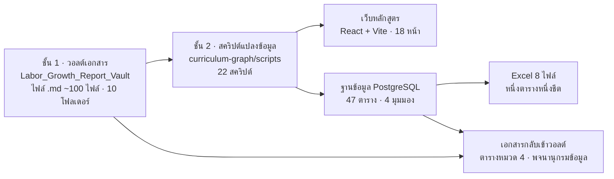

# หน้า 1 · ภาพรวมระบบสามชั้น

> **โครงการนี้ไม่ใช่ "เล่มหลักสูตร" แต่เป็นระบบที่ผลิตเล่มหลักสูตร เว็บ และฐานข้อมูลจากต้นทางชุดเดียวกัน**

## สาระบนสไลด์

| ชั้น | เก็บอะไร | แก้ที่นี่ได้ไหม |
|---|---|---|
| **ชั้น 1 · วอลต์** | ข้อความหลักสูตรทั้งหมด — คำอธิบายรายวิชา PLO YLO CLO KSA หลักฐานตลาดแรงงาน | ✅ **แก้ที่นี่เท่านั้น** |
| **ชั้น 2 · สคริปต์** | ตรรกะการแปลง ตรวจสอบ และคำนวณ | ✅ แก้เมื่อเปลี่ยนวิธีคิด |
| **ชั้น 3 · ผลลัพธ์** | เว็บ · ฐานข้อมูล · Excel · เอกสารที่สร้างอัตโนมัติ | ❌ แก้แล้วหายในรอบสร้างถัดไป |

## ตัวเลขที่บอกขนาดของระบบ

| รายการ | จำนวน |
|---|--:|
| โฟลเดอร์เนื้อหาในวอลต์ | 10 |
| สคริปต์แปลงข้อมูล | 22 |
| ตารางในฐานข้อมูล | 47 |
| มุมมองตรวจความสอดคล้อง | 4 |
| แถวข้อมูลรวม | 51,583 |
| หน้าเว็บ | 18 |

> [!tip] เล่าอย่างไร (≈90 วินาที)
> 1. เปิดด้วยปัญหา — *"เล่มหลักสูตรหนึ่งเล่มมีตัวเลขเดียวกันซ้ำอยู่หลายสิบที่ พอแก้ที่หนึ่งแล้วลืมอีกที่ เล่มจะขัดกันเอง"*
> 2. เสนอทางแก้ — *"เราจึงแยกเป็นสามชั้น เขียนความจริงไว้ที่เดียวคือวอลต์ ที่เหลือให้เครื่องสร้าง"*
> 3. ชี้ผลลัพธ์ — *"ผลคือเว็บ ฐานข้อมูล Excel และตารางในเล่ม ล้วนมาจากไฟล์ชุดเดียวกัน จะขัดกันไม่ได้โดยโครงสร้าง"*
> 4. ปิดด้วยตัวเลข — *"ตอนนี้มี 47 ตาราง 51,583 แถว ที่สอบย้อนกลับไปถึงไฟล์ต้นทางได้ทุกแถว"*

> [!question] คำถามที่มักถูกถาม
> **ถาม:** ทำไมไม่ทำงานในฐานข้อมูลตั้งแต่แรก
> **ตอบ:** เพราะผลผลิตจริงของงานนี้คือ *เอกสาร* ที่ต้องให้คนอ่านและกรรมการแก้ได้ ถ้าต้นทางเป็นฐานข้อมูลจะแก้ยากและตรวจทานยาก เราจึงให้ข้อความเป็นต้นทาง แล้วให้ฐานข้อมูลเป็นเครื่องตรวจสอบความสอดคล้องแทน

**ต้นทาง:** [[../00_Home|หน้าหลักวอลต์]] · [[../09_Database_Schema/00_Database_Home|พจนานุกรมข้อมูล]] · [[../09_Database_Schema/09_Data_Lineage|สายที่มาของข้อมูล]]

---

[[00_Presentation_Home|สารบัญ]] · [[02_Single_Source_of_Truth|หน้า 2 ➡]]
