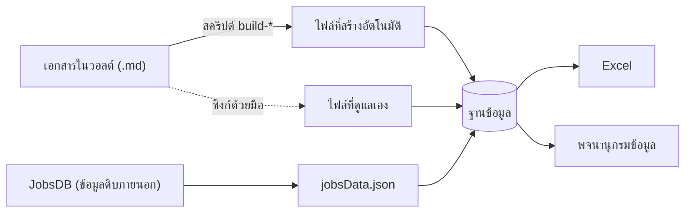

# หน้า 2 · ทิศทางเดียว และการระบุที่มาของทุกข้อมูล

> **ทุกความสัมพันธ์ในฐานข้อมูลติดป้ายว่า "เอกสารระบุ" "คำนวณได้" หรือ "เป็นข้อเสนอ" — จึงตอบได้เสมอว่าตัวเลขนี้ใครเป็นคนพูด**

## กฎทิศทางเดียว

> [!warning] ฐานข้อมูลเป็นปลายทาง ไม่ใช่ต้นทาง
> ห้ามแก้ข้อมูลในฐานข้อมูลหรือใน Excel โดยตรง ให้แก้ที่เอกสารในวอลต์แล้วสร้างใหม่

## ประเภทของแหล่งข้อมูล 3 แบบ

| ประเภท | ความหมาย | ตัวอย่าง | วิธีแก้ |
|---|---|---|---|
| **สร้างอัตโนมัติ** | สคริปต์อ่านจากเอกสาร .md ตรง ๆ | `ksaData.js` · `courseKsaData.js` · `teachingData.js` · `ksaPedagogyData.js` | แก้เอกสารแล้วรันสคริปต์ · ห้ามแก้ไฟล์ `.js` |
| **ซิงก์ด้วยมือ** | ต้องแก้ทั้งเอกสารและไฟล์ `.js` ให้ตรงกัน | `data.js` · `obeData.js` · `cloData.js` · `facultyData.js` · `refData.js` | แก้สองที่ แล้วตรวจด้วยมุมมองตรวจสอบ |
| **ข้อมูลดิบ** | ดึงจากภายนอก ไม่แก้ด้วยมือ | `jobsData.json` จาก JobsDB | ดึงใหม่ด้วยสคริปต์ scrape |

## ป้าย provenance — หัวใจของความน่าเชื่อถือ

ทุกตารางความสัมพันธ์ในฐานข้อมูลมีคอลัมน์ `provenance` ค่าใดค่าหนึ่งใน 3 ค่านี้

| ค่า | ความหมาย | ใช้ตอบกรรมการว่า |
|---|---|---|
| `stated` | เอกสารระบุตรง ๆ | "อยู่ในเล่ม หน้าที่ระบุไว้" |
| `derived` | คำนวณจากข้อมูลอื่น | "คำนวณจากข้อมูลที่ระบุไว้ ตรวจสูตรได้" |
| `authored` | เป็นข้อเสนอที่ยังไม่ผ่านการรับรอง | "เป็นข้อเสนอของทีมออกแบบ รอมติ" |

> [!tip] เล่าอย่างไร (≈90 วินาที)
> 1. ตั้งคำถามแทนผู้ฟัง — *"เวลาผมบอกว่าวิชานี้รับผิดชอบ PLO3 ระดับ M คุณควรถามว่า ใครบอก"*
> 2. เฉลย — *"ทุกความสัมพันธ์มีป้าย 3 แบบ ถ้าเป็น stated แปลว่าเล่มเขียนไว้ ถ้า derived เราคำนวณมาและกางสูตรให้ดูได้ ถ้า authored แปลว่าเรายังไม่กล้าเคลมว่าเป็นมติ"*
> 3. ย้ำผล — *"เวลารีวิว จึงคุยกันเฉพาะข้อที่เป็น authored ได้เลย ไม่ต้องรีวิวทั้งเล่ม"*
> 4. เชื่อมหน้า 19 — *"และเพราะทิศทางเป็นทางเดียว การสร้างใหม่ทั้งระบบจึงมีลำดับที่แน่นอน ซึ่งจะเล่าในหน้า 19"*

> [!question] คำถามที่มักถูกถาม
> **ถาม:** ถ้าเผลอแก้ที่ปลายทางจะรู้ได้อย่างไร
> **ตอบ:** จะหายไปเองเมื่อรัน `npm run build:db` รอบถัดไป และมุมมองตรวจสอบ 4 ตัวจะจับความไม่สอดคล้องขึ้นมาให้เห็น (ดูหน้า [[18_Database_Design|18]])

**ต้นทาง:** [[../09_Database_Schema/09_Data_Lineage|ดัชนีสายที่มาของข้อมูล]] · `curriculum-graph/data/schema.sql`

---

[[01_System_Overview|⬅ หน้า 1]] · [[00_Presentation_Home|สารบัญ]] · [[03_Vault_Map|หน้า 3 ➡]]
