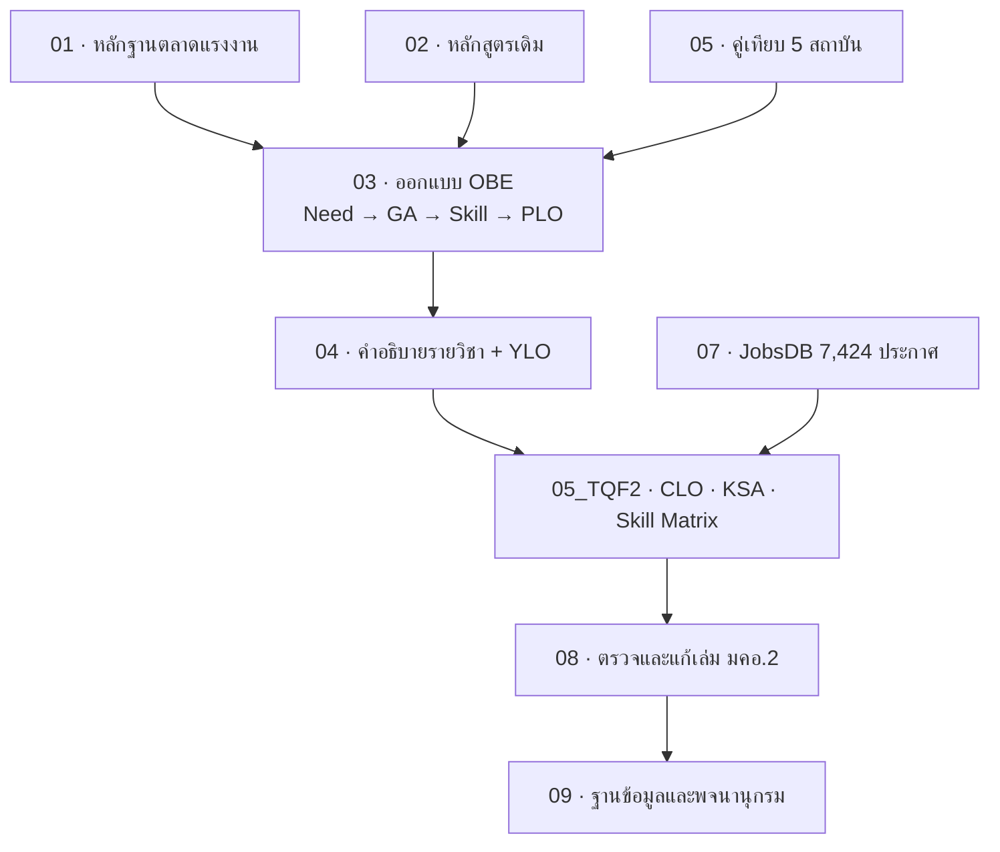

# หน้า 3 · แผนที่วอลต์ 10 โฟลเดอร์

> **โฟลเดอร์ไม่ได้แบ่งตามหัวข้อ แต่แบ่งตาม "บทบาทของเอกสาร" — หลักฐาน ข้อมูลเดิม กระบวนการออกแบบ ร่างเนื้อหา และผลตรวจ**

## สาระบนสไลด์

| โฟลเดอร์ | บทบาท | ใช้ตอบคำถามว่า |
|---|---|---|
| `01_Labor_Market_Research` | **หลักฐานภายนอก** | ทำไมต้องเปิดหลักสูตรนี้ ตลาดใหญ่แค่ไหน |
| `02_Current_Curriculum_2570` | **ข้อมูลตั้งต้น** | ต้นฉบับเดิมเขียนไว้อย่างไร |
| `03_OBE_PLO_Design_2570` | **กระบวนการออกแบบ** | PLO มาจากความต้องการข้อไหน |
| `04_Course_Descriptions_2570` | **เนื้อหารายวิชา** | แต่ละวิชาสอนอะไร ไทย–อังกฤษ |
| `05_Benchmark_AI_Programs_TH` | **คู่เทียบ** | เราต่างจากที่อื่นตรงไหน |
| `05_TQF2_Academic_Drafts` | **ร่างวิชาการ** | CLO · KSA · Skill Matrix · ฐานข้อมูล |
| `06_Curriculum_Comparison` | **วิเคราะห์เทียบ** | ซ้ำซ้อนกับสาขาใกล้เคียงหรือไม่ |
| `07_JobsDB_Semantic_Career_Analysis` | **หลักฐานประกาศงาน** | ตลาดต้องการทักษะอะไรจริง |
| `08_TQF2_Book_Revisions` | **ผลตรวจและฉบับแก้** | เล่ม มคอ.2 ต้องแก้ตรงไหนบ้าง |
| `09_Database_Schema` | **พจนานุกรมข้อมูล** | ข้อมูลถูกเก็บเป็นตารางอะไร |
| `10_Presentation` | **ชุดนำเสนอ** | จะเล่าเรื่องทั้งหมดนี้อย่างไร |

## ลำดับที่โฟลเดอร์ถูกสร้างขึ้นจริง

> [!tip] เล่าอย่างไร (≈2 นาที)
> 1. บอกหลักการแบ่งก่อน — *"ผมไม่ได้แบ่งโฟลเดอร์ตามหัวข้อ แต่แบ่งตามบทบาท เพราะเวลาถูกถามว่า *ใครบอก* เราจะได้ชี้ได้ทันทีว่าเป็นหลักฐานภายนอก หรือเป็นข้อเสนอของเรา"*
> 2. ไล่เป็นสามกอง — *"กองหลักฐานคือ 01, 05, 07 · กองออกแบบคือ 03, 04, 05_TQF2 · กองผลลัพธ์คือ 08, 09"*
> 3. ชี้ลำดับเวลา — *"ลำดับการทำงานจริงคือหลักฐานมาก่อน แล้วออกแบบ แล้วค่อยลงเล่ม ไม่ใช่เขียนเล่มก่อนแล้วหาเหตุผลย้อนหลัง"*
> 4. เชื่อมต่อ — *"หน้าถัดไปจะเจาะเข้าไปที่ผลลัพธ์ของกระบวนการนี้ คือตัวหลักสูตรเอง"*

> [!question] คำถามที่มักถูกถาม
> **ถาม:** ทำไมมีทั้ง `05_Benchmark` และ `06_Curriculum_Comparison`
> **ตอบ:** `05` คือ **หลักสูตร AI ของสถาบันอื่น** ที่เป็นคู่แข่งโดยตรง ส่วน `06` คือ **สาขาใกล้เคียง** เช่น หุ่นยนต์และเกษตรอัจฉริยะ ที่ต้องพิสูจน์ว่าไม่ซ้ำซ้อนกับหลักสูตรที่มหาวิทยาลัยมีอยู่แล้ว

**ต้นทาง:** [[../00_Home|หน้าหลักวอลต์]]

---

[[02_Single_Source_of_Truth|⬅ หน้า 2]] · [[00_Presentation_Home|สารบัญ]] · [[04_Programme_Identity|หน้า 4 ➡]]
