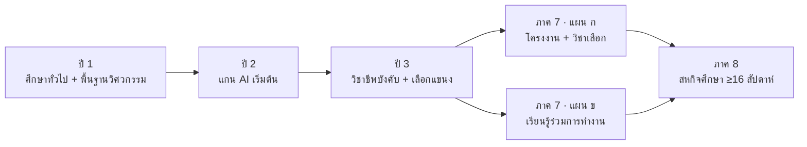

# หน้า 8 · แผนการเรียน 2 แผน · 8 ภาคการศึกษา

> **แผน ก และ แผน ข ต่างกันแค่ภาคที่ 7 เท่านั้น — ทุกอย่างอื่นเหมือนกันหมด จึงไม่ใช่หลักสูตรสองหลักสูตร**

## สาระบนสไลด์

| แผน | ชื่อ | ภาคที่ 7 | ภาคที่ 8 |
|---|---|---|---|
| **ก** | แผนปกติ | โครงงาน + วิชาชีพเลือก 3 วิชา (9 นก.) | สหกิจศึกษา |
| **ข** | บูรณาการกับสถานประกอบการ (CWIE) | การเรียนรู้ร่วมการทำงาน 1–3 (9 นก.) | สหกิจศึกษา |

| ข้อมูลในฐานข้อมูล | จำนวน |
|---|--:|
| แผนการเรียน | 2 |
| รายวิชาที่ระบุภาคเรียนแล้ว | 78 |

> [!info] จุดออกแบบที่ตั้งใจ
> **เตรียมสหกิจอยู่ก่อนภาคสุดท้าย** เพื่อให้นักศึกษาได้สถานประกอบการก่อน แล้วจึงเลือกวิชาชีพเลือกสองวิชาสุดท้ายให้สอดคล้องกับงานที่จะไปทำจริง

> [!tip] เล่าอย่างไร (≈2 นาที)
> 1. ตัดความสับสนก่อน — *"หลายคนเห็นสองแผนแล้วคิดว่าเป็นสองหลักสูตร ไม่ใช่ครับ ต่างกันแค่ภาคเดียวคือภาคที่ 7"*
> 2. เล่าเหตุผลของแผน ข — *"แผน ข มีไว้สำหรับนักศึกษาที่สถานประกอบการรับตั้งแต่ปีสี่เทอมต้น เขาจะได้เรียนรู้ร่วมการทำงานแทนการนั่งเรียนวิชาเลือกในห้อง"*
> 3. ชี้จุดออกแบบที่กรรมการชอบ — *"สังเกตว่าวิชาเตรียมสหกิจอยู่ก่อนภาคสุดท้าย เพราะเราอยากให้เด็กรู้ก่อนว่าจะไปทำงานที่ไหน แล้วค่อยเลือกวิชาสองตัวสุดท้ายให้ตรงกับงานนั้น"*
> 4. ปิดด้วยกลไกตรวจ — *"แผนการเรียนนี้ไม่ได้พิมพ์ด้วยมือ แต่สร้างจากข้อมูลรายวิชา จึงตรวจซ้ำได้ว่าหน่วยกิตรวมยังเป็น 125 และไม่มีวิชาบังคับก่อนอยู่ผิดที่"*

> [!question] คำถามที่มักถูกถาม
> **ถาม:** นักศึกษาเลือกแผนตอนไหน และเปลี่ยนแผนกลางคันได้ไหม
> **ตอบ:** เลือกก่อนขึ้นภาคที่ 7 ซึ่งเป็นจุดที่สองแผนแยกกัน ก่อนหน้านั้นทุกคนเรียนเหมือนกัน จึงเปลี่ยนได้โดยไม่เสียหน่วยกิต

**ต้นทาง:** [[../08_TQF2_Book_Revisions/14_Section4_4_Study_Plan|หมวด 4.4 แผนการเรียน]] · [[../02_Current_Curriculum_2570/08_CWIE_Integrated_Study_Plan|แผน CWIE]]

---

[[07_Prerequisites_Graph|⬅ หน้า 7]] · [[00_Presentation_Home|สารบัญ]] · [[09_OBE_Chain|หน้า 9 ➡]]
