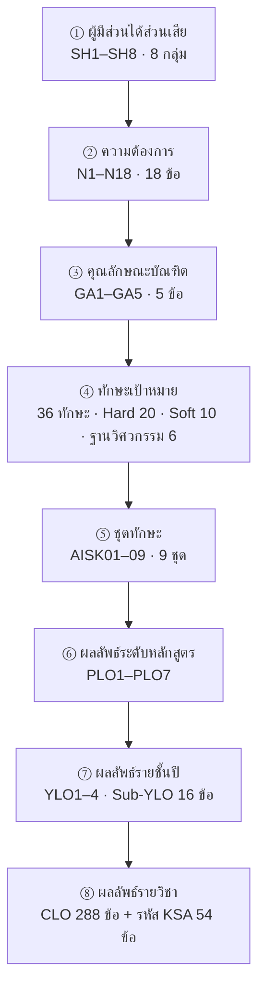

# หน้า 9 · สายธาร OBE 8 ขั้น — จากความต้องการถึงข้อสอบ

> **นี่คือหน้าสำคัญที่สุดของชุดนี้ — ทุกอย่างในหลักสูตรสอบย้อนกลับได้ตั้งแต่คะแนนในห้องเรียนถึงความต้องการของผู้ประกอบการ**

## สายธาร 8 ขั้น

## จำนวนความสัมพันธ์ที่เชื่อมแต่ละขั้น

| การเชื่อม | แถว |
|---|--:|
| ผู้มีส่วนได้ส่วนเสีย ↔ ความต้องการ | 62 |
| ความต้องการ ↔ ชุดทักษะ | 43 |
| คุณลักษณะบัณฑิต ↔ PLO | 12 |
| ทักษะ ↔ ชุดทักษะ | 58 |
| KSA ↔ PLO | 91 |
| CLO ↔ PLO | 426 |
| CLO ↔ Sub-YLO | 319 |
| CLO ↔ KSA | 963 |

> [!important] เกณฑ์ที่สายธารนี้ตอบ
> **AUN-QA Criterion 1** ต้องการให้ผลลัพธ์การเรียนรู้สอบย้อนกลับไปหาความต้องการผู้มีส่วนได้ส่วนเสียได้ครบทุกข้อ — สายธารนี้ทำให้ตอบได้ด้วยการ query ไม่ใช่ด้วยการเขียนบรรยาย

> [!tip] เล่าอย่างไร (≈3 นาที — ใช้เวลามากที่สุดในชุด)
> 1. **เล่าย้อนทาง** ไม่ใช่ตามลูกศร นี่คือเทคนิคสำคัญ เริ่มจากปลายสุดที่คนเห็นภาพง่ายที่สุด
>    - *"สมมติอาจารย์ให้คะแนนนักศึกษาข้อหนึ่งในวิชาหนึ่ง — คะแนนนั้นคือ CLO"*
>    - *"CLO ข้อนั้นป้อนเข้า Sub-YLO ของชั้นปี และป้อนเข้า PLO ข้อใดข้อหนึ่ง"*
>    - *"PLO ข้อนั้นมาจากคุณลักษณะบัณฑิตที่เราตั้งไว้ ซึ่งมาจากความต้องการที่ผู้ประกอบการบอกเรามาจริง ๆ"*
> 2. สรุปด้วยประโยคเดียว — *"แปลว่าคะแนนหนึ่งข้อในห้องเรียน เดินย้อนกลับไปถึงเสียงของผู้ประกอบการได้"*
> 3. ยกตัวเลขปิด — *"สายนี้ไม่ใช่แผนภาพสวย ๆ มีความสัมพันธ์จริงในฐานข้อมูลเกือบสองพันความสัมพันธ์"*
> 4. เตรียมหน้าถัดไป — *"ผมจะไล่ทีละขั้นในหน้า 10 ถึง 15"*

> [!question] คำถามที่มักถูกถาม
> **ถาม:** มี PLO ข้อไหนที่ไม่มีวิชาไหนพาไปถึงระดับสูงสุดหรือไม่
> **ตอบ:** มีมุมมองตรวจสอบชื่อ `vw_plo_coverage` ที่บังคับว่า **ทุก PLO ต้องได้ระดับ M จากวิชาบังคับ** ไม่นับวิชาชีพเลือก ตอบด้วยผลตรวจได้ทันที ไม่ต้องเดา

**ต้นทาง:** [[../03_OBE_PLO_Design_2570/00_OBE_Home|หน้าหลัก OBE]] · [[../03_OBE_PLO_Design_2570/05_Mapping_Tables|ตารางเชื่อมโยง]]

---

[[08_Study_Plans|⬅ หน้า 8]] · [[00_Presentation_Home|สารบัญ]] · [[10_Stakeholders_and_Needs|หน้า 10 ➡]]
