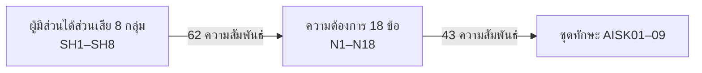

# หน้า 10 · ① ผู้มีส่วนได้ส่วนเสีย และ ② ความต้องการ

> **ความต้องการ 18 ข้อไม่ได้คิดเอง แต่มาจากผู้มีส่วนได้ส่วนเสีย 8 กลุ่ม พร้อมบันทึกขนาดกลุ่มตัวอย่างไว้ทุกกลุ่ม**

## สาระบนสไลด์

| ขั้น | รหัส | จำนวน | เก็บอะไร |
|---|---|--:|---|
| ① ผู้มีส่วนได้ส่วนเสีย | `SH1–SH8` | 8 กลุ่ม | ชื่อกลุ่ม + **ขนาดกลุ่มตัวอย่าง** |
| ② ความต้องการ | `N1–N18` | 18 ข้อ | ข้อความความต้องการ + ที่มา |
| ความเชื่อม SH ↔ N | — | 62 คู่ | กลุ่มไหนต้องการข้อไหน |
| ความเชื่อม N ↔ ชุดทักษะ | — | 43 คู่ | ความต้องการข้อนั้นตอบด้วยชุดทักษะใด |

> [!important] ทำไมต้องเก็บขนาดกลุ่มตัวอย่าง
> เพราะคำถามแรกของผู้ตรวจคือ *"ถามใคร กี่คน"* — ถ้าตอบไม่ได้ ความต้องการทั้ง 18 ข้อจะกลายเป็นความเห็นของผู้เขียนเล่มทันที

## สองรอบของการรับฟัง

| รอบ | ผลที่ได้ |
|---|---|
| รอบที่ 1 | ความต้องการ N1–N18 ที่ใช้ออกแบบ GA และ PLO |
| รอบที่ 2 | ข้อเสนอแนะต่อร่างหลักสูตร + **แผนปรับหลักสูตรที่ตอบทีละข้อ** |

> [!tip] เล่าอย่างไร (≈2 นาที)
> 1. เริ่มด้วยการรับคำถามล่วงหน้า — *"ก่อนที่จะถามว่า 18 ข้อนี้มาจากไหน ผมตอบเลยครับ"*
> 2. ชี้ที่โครงสร้างข้อมูล — *"เราไม่ได้เก็บแค่ข้อความความต้องการ แต่เก็บว่าใครเป็นคนพูด และกลุ่มนั้นมีกี่คน"*
> 3. เล่ารอบสอง — *"เรากลับไปถามซ้ำอีกรอบหลังมีร่างหลักสูตรแล้ว และครั้งนั้นเราทำแผนตอบทีละข้อว่าข้อเสนอไหนรับมาแก้ ข้อไหนไม่รับพร้อมเหตุผล"*
> 4. เชื่อมต่อ — *"ความต้องการทั้ง 18 ข้อถูกแปลงเป็นคุณลักษณะบัณฑิต 5 ข้อในหน้าถัดไป"*

> [!question] คำถามที่มักถูกถาม
> **ถาม:** มีความต้องการข้อไหนที่ไม่มีชุดทักษะใดตอบหรือไม่
> **ตอบ:** ตรวจได้จากตาราง `need_skill_set` — ความต้องการที่ไม่ปรากฏในตารางนี้คือช่องว่างที่ต้องอธิบายให้ได้ว่าทำไมหลักสูตรจึงไม่รับ

**ต้นทาง:** [[../03_OBE_PLO_Design_2570/01_Stakeholder_Needs|ความต้องการผู้มีส่วนได้ส่วนเสีย N1–N18]] · [[../05_TQF2_Academic_Drafts/17_Stakeholder_Feedback_Round2_and_Action_Plan|ข้อเสนอแนะรอบที่ 2 และแผนปรับ]]

---

[[09_OBE_Chain|⬅ หน้า 9]] · [[00_Presentation_Home|สารบัญ]] · [[11_GA_and_PLO|หน้า 11 ➡]]
