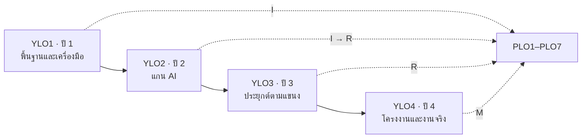

# หน้า 12 · ⑦ ผลลัพธ์รายชั้นปี และระดับพัฒนาการ I–R–M

> **PLO เดียวกันไม่ได้เกิดในปีเดียว — มันถูกแนะนำ ทบทวน แล้วจึงเชี่ยวชาญ ข้ามสามถึงสี่ปี**

## ระดับพัฒนาการ 3 ระดับ

| ระดับ | ย่อจาก | ความหมายที่ใช้ในหลักสูตรนี้ |
|---|---|---|
| **I** | Introduce | แนะนำให้รู้จักครั้งแรก · ประเมินแบบรู้–เข้าใจ |
| **R** | Reinforce | ทบทวนและใช้ซ้ำในบริบทใหม่ · ประเมินแบบประยุกต์ |
| **M** | Master | ใช้ได้เองในงานที่ซับซ้อน · เป็นหลักฐานจบหลักสูตร |

## โครงผลลัพธ์รายชั้นปี

| ระดับ | จำนวน |
|---|--:|
| YLO ราย­ชั้นปี | 4 (YLO1–YLO4) |
| Sub-YLO | 16 |
| CLO ที่ป้อนเข้า Sub-YLO | 319 ความสัมพันธ์ |

> [!important] Year Gate
> ปลายแต่ละชั้นปีมี **จุดตรวจ** ว่าผู้เรียนถึงระดับที่กำหนดของปีนั้นแล้วหรือยัง ไม่ใช่รอวัดตอนจบ

> [!tip] เล่าอย่างไร (≈2 นาที)
> 1. ใช้อุปมาที่คนเห็นภาพ — *"เหมือนสอนขับรถ ปีแรกให้รู้ว่าคันเร่งอยู่ไหน ปีสองให้ขับในสนาม ปีสามให้ขับบนถนนจริง ปีสี่ให้ขับทางไกลคนเดียว นั่นคือ I R M"*
> 2. อธิบายว่าทำไมต้องมี YLO ทั้งที่มี PLO อยู่แล้ว — *"เพราะ PLO วัดตอนจบ ซึ่งสายเกินไปที่จะแก้ YLO ทำให้เรารู้ตั้งแต่ปีสองว่าเด็กกลุ่มไหนตามไม่ทัน"*
> 3. ชี้ที่ตาราง I–R–M — *"ตารางนี้อ่านตามแนวตั้งได้ด้วย ถ้ามี PLO ข้อไหนที่ไม่มีตัว M เลย แปลว่าหลักสูตรสัญญาไว้แต่ไม่ได้พาไปถึง"*
> 4. ปิดด้วย Year Gate — *"เราจึงตั้งจุดตรวจไว้ปลายทุกชั้นปี"*

> [!question] คำถามที่มักถูกถาม
> **ถาม:** ถ้าวิชาหนึ่งประกาศว่าให้ระดับ M แต่จริง ๆ สอนแค่แนะนำ จะจับได้อย่างไร
> **ตอบ:** ดูที่ CLO ของวิชานั้นและวิธีประเมิน — ถ้าประเมินด้วยข้อสอบความจำแต่ประกาศ M แปลว่าไม่สอดคล้อง ตารางที่ใช้ตรวจคือ `clo_plo` ซึ่งเก็บระดับพัฒนาการรายข้อ ไม่ใช่รายวิชา

**ต้นทาง:** [[../04_Course_Descriptions_2570/11_Year_Level_Course_Sequence_and_YLO|กรอบรายวิชาชั้นปีและ YLO]] · [[../05_TQF2_Academic_Drafts/09_Yearly_Learning_Outcomes|ผลลัพธ์การเรียนรู้รายชั้นปี]]

---

[[11_GA_and_PLO|⬅ หน้า 11]] · [[00_Presentation_Home|สารบัญ]] · [[13_CLO_and_Mapping|หน้า 13 ➡]]
