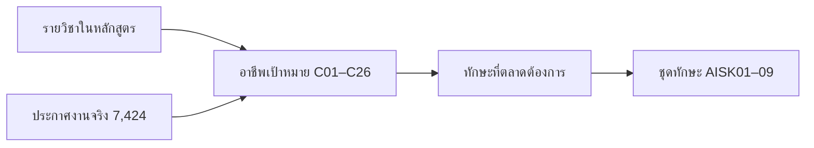

# หน้า 17 · อาชีพเป้าหมาย C01–C26 และเส้นทางรายวิชา

> **ทุกอาชีพเป้าหมายชี้กลับไปที่รายวิชาที่พาไปถึงได้จริง — ไม่ใช่รายชื่ออาชีพสวย ๆ ท้ายเล่มที่ไม่มีอะไรรองรับ**

## สาระบนสไลด์

| ข้อมูล | จำนวน |
|---|--:|
| อาชีพเป้าหมาย | 26 (`C01–C26`) |
| กลุ่มย่อยของอาชีพ | 68 |
| **รายวิชาที่นำไปสู่อาชีพนั้น** | 148 ความสัมพันธ์ |
| อาชีพที่ใช้จำแนกประกาศงาน | 17 (`C01–C17`) |

### สิ่งที่เก็บไว้ต่อหนึ่งอาชีพ

| ฟิลด์ | ตัวอย่างจาก `C01` |
|---|---|
| ชื่อไทย / อังกฤษ | วิศวกรปัญญาประดิษฐ์และการเรียนรู้ของเครื่อง / AI/ML Engineer |
| แขนงที่สังกัด | แขนง 3 (หรือ "ข้ามทุกแขนง") |
| สถานะตลาด | Mainstream · Sector Critical · Future/Emerging |
| **รายวิชาที่พาไปถึง** | `EN-131-203` `EN-131-207` `EN-132-305` `EN-135-337` `EN-135-338` `EN-134-403` |
| เหตุผล | หน้าที่หลักของอาชีพนั้นโดยย่อ |
| คำค้นที่ใช้ในตลาด | AI Engineer · Machine Learning Engineer · Applied AI Engineer |

> [!important] ทำไม 26 อาชีพ แต่จำแนกงานแค่ 17
> เพราะ **บางอาชีพยังไม่มีตลาดประกาศรับที่ชัดพอจะจำแนกได้** เช่น อาชีพกลุ่มเกิดใหม่
> เราจึงเก็บไว้เป็นอาชีพเป้าหมายเชิงออกแบบ แต่ **ไม่นับเป็นหลักฐานตลาด** — เป็นตัวอย่างของการแยก `authored` ออกจาก `stated` ตามหน้า [[02_Single_Source_of_Truth|2]]

> [!tip] เล่าอย่างไร (≈2.5 นาที)
> 1. เริ่มจากคำถามที่พ่อแม่ผู้ปกครองถามเสมอ — *"เรียนจบแล้วทำงานอะไร"*
> 2. ชี้ว่าเราตอบเป็นข้อมูล ไม่ใช่คำโฆษณา — *"ยี่สิบหกอาชีพนี้แต่ละอาชีพบอกได้ว่าต้องเรียนวิชาไหนบ้างจึงจะไปถึง รวม 148 ความสัมพันธ์"*
> 3. โชว์หนึ่งอาชีพให้ครบ — เปิด C01 แล้วอ่านรายวิชา 6 ตัว *"นี่คือเส้นทางจริงในแผนการเรียน ไม่ใช่วิชาที่แต่งขึ้น"*
> 4. ปิดด้วยความซื่อสัตย์ของข้อมูล — *"และผมจะไม่บอกว่าทั้ง 26 อาชีพมีหลักฐานตลาดเท่ากัน มี 17 อาชีพที่เรามีประกาศงานจริงรองรับ ที่เหลือเราระบุไว้ชัดว่าเป็นข้อเสนอเชิงออกแบบ"* — ข้อนี้ทำให้ผู้ฟังเชื่อทั้งชุดมากขึ้น ไม่ใช่น้อยลง

> [!question] คำถามที่มักถูกถาม
> **ถาม:** อาชีพหนึ่งอ้างวิชาที่อยู่ในคลังวิชาเลือกซึ่งอาจไม่เปิดสอน จะรับประกันได้อย่างไร
> **ตอบ:** เส้นทางอาชีพส่วนใหญ่พาดผ่านวิชาบังคับเป็นแกน แล้วใช้วิชาเลือกเป็นตัวเสริม — ตรวจได้จากตาราง `career_course` ว่าอาชีพใดพึ่งวิชาเลือกมากเกินไป ซึ่งเป็นสัญญาณให้พิจารณาย้ายวิชานั้นเข้าวิชาบังคับ

**ต้นทาง:** [[../01_Labor_Market_Research/13_Career_Codes_and_Course_Pathways_C01_C26|รหัสอาชีพและเส้นทางรายวิชา]] · [[../01_Labor_Market_Research/11_Career_Paths_by_Track|เส้นทางอาชีพตามแขนง]] · [[../07_JobsDB_Semantic_Career_Analysis/09_Career_Top_Skills_Summary|Top Skills รายอาชีพ]]

---

[[16_Labor_Market_Evidence|⬅ หน้า 16]] · [[00_Presentation_Home|สารบัญ]] · [[18_Database_Design|หน้า 18 ➡]]
