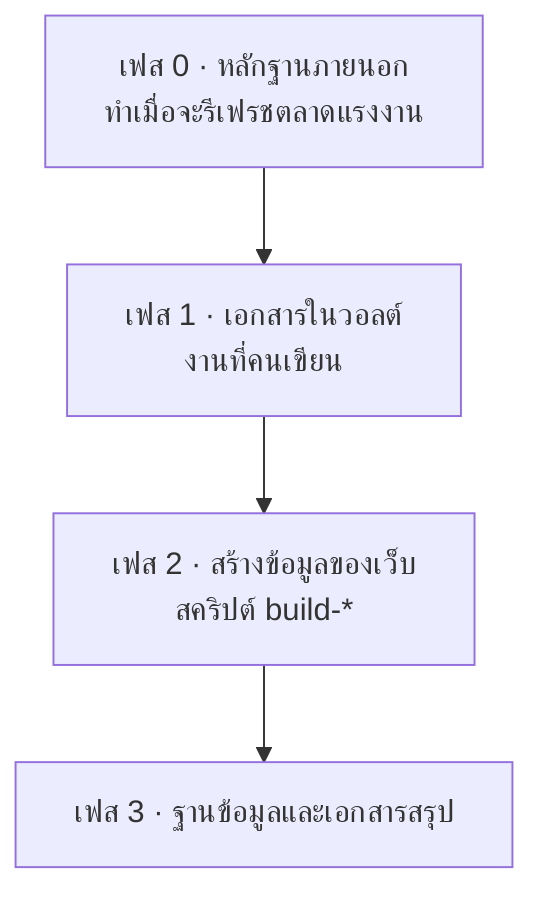

# หน้า 19 · ลำดับการสร้างข้อมูล — ต้องรันอะไรก่อนหลัง

> **ลำดับสำคัญกว่าที่คิด เพราะสคริปต์บางตัวอ่านไฟล์ที่สคริปต์ตัวก่อนหน้าเพิ่งเขียน — สลับลำดับแล้วจะได้ข้อมูลของรอบที่แล้ว**

## ภาพรวม 4 เฟส



## เฟส 0 · หลักฐานตลาดแรงงาน (รันเมื่อจะรีเฟรชข้อมูลเท่านั้น)

| # | คำสั่ง | อ่านจาก | เขียนไปที่ |
|--:|---|---|---|
| 1 | `npm run jobs:scrape-all` | JobsDB (คำค้นใน `career-job-config.mjs`) | `data/jobsdb-careers-raw.json` |
| 2 | `npm run jobs:gemini-all` | ประกาศดิบ | `src/jobsData.json` — ทักษะ + สรุปย่อ |
| 3 | `npm run jobs:classify-all` | ประกาศ + เกณฑ์ C01–C17 | `classifiedMatches` ใน snapshot |
| 4 | `npm run jobs:normalize` | ป้ายทักษะดิบ | ทักษะที่ normalise แล้ว |
| 5 | `npm run jobs:build-runtime` | `src/jobsData.json` | `src/jobsIndex.json` + `src/jobsRuntime/` (32 shards) |

## เฟส 1 · เอกสารในวอลต์ (งานที่คนทำ)

เขียนหรือแก้เอกสาร `.md` ในวอลต์ — นี่คือขั้นตอนเดียวที่ **ไม่มีสคริปต์** และเป็นต้นทางของทุกอย่าง

## เฟส 2 · สร้างข้อมูลของเว็บ ⚠️ ลำดับนี้ห้ามสลับ

| # | คำสั่ง | อ่านจาก | เขียนไปที่ |
|--:|---|---|---|
| 6 | `npm run sync:curriculum` | `04_Course_Descriptions_2570/01–09` · `05_TQF2/10_CLO_Mapping` | `src/courseRevisionData.js` · `src/cloRevisionData.js` |
| 7 | `npm run build:mapping` | `data.js` · `cloData.js` | วอลต์ `08/15_Section4_5` · `16_Section4_6` · **`17_Section4_7`** |
| 8 | `npm run build:plan` | `data.js` (แผนการเรียน) | วอลต์ `08/14_Section4_4_Study_Plan` |
| 9 | `npm run build:ksa` (4 สคริปต์ในคำสั่งเดียว) | ↓ ดูตารางย่อย | ↓ |

### รายละเอียดของ `build:ksa`

| ลำดับใน | สคริปต์ | อ่านจากวอลต์ | เขียนไปที่ |
|--:|---|---|---|
| 9.1 | `build-ksa-data` | `05_TQF2/18_KSEC_Codebook` | `src/ksaData.js` |
| 9.2 | `build-course-ksa` | `05_TQF2/10_CLO_Mapping` · `18_KSEC_Codebook` · **`08/17_Section4_7`** | `src/courseKsaData.js` + วอลต์ `05_TQF2/19_Course_and_CLO_KSEC_Tables` |
| 9.3 | `build-plo-teaching` | `08/09_Section5_Revised` · `08/12_Section6_Revised` | `src/teachingData.js` + วอลต์ `08/20_Teaching_and_Assessment_by_PLO` |
| 9.4 | `build-ksa-pedagogy` | ข้อมูล KSA | `src/ksaPedagogyData.js` + วอลต์ `05_TQF2/20_KSEC_Teaching_and_Assessment` |

> [!warning] จุดที่พลาดบ่อยที่สุด
> ขั้นที่ **9.2 อ่านไฟล์ `17_Section4_7_Skill_Set_Coverage.md` ที่ขั้นที่ 7 เป็นคนเขียน**
> ถ้ารัน `build:ksa` ก่อน `build:mapping` จะได้ข้อมูลความครอบคลุมชุดทักษะของ **รอบที่แล้ว** โดยไม่มีข้อความแจ้งเตือนใด ๆ
> **จำง่าย ๆ: mapping มาก่อน ksa เสมอ**

## เฟส 3 · ฐานข้อมูลและเอกสารสรุป

| # | คำสั่ง | ทำอะไร |
|--:|---|---|
| 10 | `npm run build:db` | รวมข้อมูลทุกไฟล์ + `jobsData.json` → `data/seed.sql` |
| 11 | `npm run db:load` | สร้างฐานข้อมูลใหม่จาก `schema.sql` + `seed.sql` แล้ว **ตรวจความสอดคล้อง** |
| 12 | `npm run db:export` | ส่งออก Excel 8 ไฟล์ → `data/exports/` |
| 13 | `npm run db:docs` | สร้างพจนานุกรมข้อมูลใหม่ → วอลต์ `09_Database_Schema/` |
| 14 | `npm run db:lineage` | สร้างดัชนีสายที่มา → วอลต์ `09_Database_Schema/09_Data_Lineage` |
| 15 | `npm run dev` / `npm run build` | รันหรือ build เว็บ (`prebuild` เรียก `jobs:build-runtime` + `build:ksa` ให้เอง) |

## คำสั่งย่อสำหรับรอบปกติ

ถ้าไม่ได้แตะข้อมูลตลาดแรงงาน (เฟส 0) รอบปกติหลังแก้เอกสารคือ

```bash
npm run sync:curriculum && npm run build:mapping && npm run build:plan && npm run build:ksa && npm run build:db && npm run db:load && npm run db:export && npm run db:docs && npm run db:lineage
```

> [!tip] เล่าอย่างไร (≈2.5 นาที)
> 1. ตั้งประเด็นก่อน — *"คำถามที่ทีมถามบ่อยที่สุดคือ แก้เอกสารแล้วต้องรันอะไรบ้าง"*
> 2. ให้จำแค่ 4 เฟส ไม่ต้องจำ 15 คำสั่ง — *"หลักฐานภายนอก → เอกสาร → ข้อมูลเว็บ → ฐานข้อมูล"*
> 3. **เน้นกับดักขั้นที่ 9.2** นี่คือสิ่งเดียวในหน้านี้ที่ถ้าไม่บอกแล้วคนจะพลาดจริง
> 4. ปิดด้วยคำสั่งเดียวยาว ๆ — *"ในทางปฏิบัติ ก็อปบรรทัดนี้ไปรันบรรทัดเดียวจบ"*

> [!question] คำถามที่มักถูกถาม
> **ถาม:** ทำไมเฟส 0 ไม่รวมอยู่ในคำสั่งเดียว
> **ตอบ:** เพราะเฟส 0 ยิงไปที่บริการภายนอกและใช้เวลานาน อีกทั้งเป็น snapshot ที่ควรเปลี่ยนเมื่อ *ตั้งใจจะเปลี่ยน* เท่านั้น — ถ้ารวมเข้าไป ตัวเลขในเล่มจะขยับเองทุกครั้งที่ build

**ต้นทาง:** `curriculum-graph/package.json` · `curriculum-graph/scripts/` · [[../09_Database_Schema/09_Data_Lineage|ดัชนีสายที่มาของข้อมูล]]

---

[[18_Database_Design|⬅ หน้า 18]] · [[00_Presentation_Home|สารบัญ]] · [[20_Generation_Prompts|หน้า 20 ➡]]
