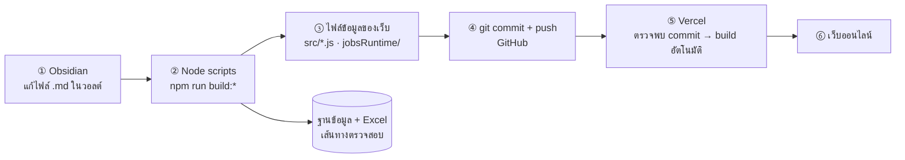

# ภาคผนวก A · เว็บหลักสูตรเกิดขึ้นได้อย่างไร — เครื่องมือและขั้นตอนทั้งหมด

> **สูตรคือ Obsidian เขียน · Git เก็บประวัติ · Node แปลงข้อมูล · Vercel เผยแพร่ — คนแตะแค่ Obsidian กับ Git ที่เหลือเป็นอัตโนมัติ**

## เครื่องมือทั้งหมดและบทบาท

| เครื่องมือ | บทบาทในโครงการ | ใครใช้ |
|---|---|---|
| **Obsidian** | เขียนและอ่านเอกสาร `.md` ทั้งวอลต์ · ใช้ wikilink เชื่อมเอกสาร · ดู mermaid และ callout | อาจารย์ผู้เขียนหลักสูตร |
| **Git + GitHub** | เก็บประวัติทุกการแก้ · ย้อนกลับได้ · เป็นตัวกลางส่งงานไป Vercel | ทุกคนในทีม |
| **Node.js ≥ 18** | รันสคริปต์แปลงข้อมูล 22 ตัว | ผู้ดูแลข้อมูล |
| **React + Vite + React Router** | ตัวเว็บหลักสูตร 18 หน้า · client-side routing | ผู้พัฒนา |
| **dagre** | จัดวางกราฟรายวิชาแบบ layered layout | ผู้พัฒนา |
| **PostgreSQL 14+** | ฐานข้อมูลตรวจความสอดคล้อง 47 ตาราง | ผู้ดูแลข้อมูล |
| **ExcelJS** | ส่งออก Excel 8 ไฟล์ให้กรรมการ | อัตโนมัติ |
| **Gemini API** | สกัดและจำแนกข้อมูลประกาศงาน (2 จุดเท่านั้น) | รันเมื่อรีเฟรชหลักฐาน |
| **Vercel** | โฮสต์เว็บ · build และ deploy อัตโนมัติเมื่อ push | อัตโนมัติ |
| **Claude Code** | ผู้ช่วยเขียนสคริปต์ ตรวจเอกสาร และสร้างเนื้อหาร่าง | ทุกขั้นตอน |

## เส้นทางจากพิมพ์ตัวอักษรถึงเว็บออนไลน์



## การตั้งค่า Vercel ที่จำเป็น 3 จุด

| จุด | ค่า | ถ้าไม่ตั้งจะเกิดอะไร |
|---|---|---|
| **Root Directory** | `curriculum-graph` | Vercel หาไฟล์ `package.json` ไม่เจอ เพราะเว็บอยู่ในโฟลเดอร์ย่อยของ repo |
| **rewrites** | ทุก path → `/index.html` (ตั้งไว้ใน `vercel.json` แล้ว) | เปิด `/plo/3` ตรง ๆ หรือกด refresh จะได้ **404** |
| **Ignored Build Step** | `git diff --quiet HEAD^ HEAD ./` | เว็บจะ build ใหม่ทุกครั้งที่ commit แตะเฉพาะไฟล์ในวอลต์ ทั้งที่เว็บไม่เปลี่ยน |

> [!info] ทำไมเว็บถึงแยกจากวอลต์
> โฟลเดอร์ `curriculum-graph/` **แยกออกจาก** `Labor_Growth_Report_Vault/` โดยตั้งใจ
> เพื่อไม่ให้ไฟล์เว็บไปปนกับไฟล์ `.md` ที่อาจารย์เปิดใน Obsidian — แต่ทั้งสองอยู่ใน Git repo เดียวกัน จึงเวอร์ชันตรงกันเสมอ

## ขั้นตอนถ้าเริ่มโครงการแบบนี้ใหม่ตั้งแต่ศูนย์

| ลำดับ | ทำอะไร | ผลลัพธ์ที่ได้ |
|--:|---|---|
| 1 | ตั้ง Git repo + สร้างวอลต์ Obsidian ในโฟลเดอร์ย่อย | มีที่เขียนและมีประวัติ |
| 2 | รวบรวมหลักฐานภายนอกก่อน — ตลาดแรงงาน คู่เทียบ ความต้องการผู้มีส่วนได้ส่วนเสีย | โฟลเดอร์ `01`, `05`, `07` |
| 3 | ออกแบบสายธาร OBE จากหลักฐาน — Need → GA → Skill → PLO | โฟลเดอร์ `03` |
| 4 | เขียนคำอธิบายรายวิชาและ YLO ให้สอดคล้องกับ PLO | โฟลเดอร์ `04` |
| 5 | ลงลึกถึง CLO · ชุดทักษะ · KSA | โฟลเดอร์ `05_TQF2` |
| 6 | สร้างเว็บ React ที่อ่านข้อมูลจากไฟล์ `.js` เพียงชุดเดียว | `curriculum-graph/src/` |
| 7 | เขียนสคริปต์ sync จากวอลต์ → ไฟล์ `.js` | ตัดงานคัดลอกด้วยมือทิ้ง |
| 8 | เขียนสคริปต์สร้างตารางกลับเข้าวอลต์ (หมวด 4.4–4.7) | เล่มกับเว็บตรงกันโดยอัตโนมัติ |
| 9 | ออกแบบ schema ฐานข้อมูล + มุมมองตรวจสอบ | จับความไม่สอดคล้องได้ด้วยเครื่อง |
| 10 | ต่อ Vercel เข้ากับ GitHub ตั้ง Root Directory และ rewrites | เว็บอัปเดตเองทุก push |

> [!warning] บทเรียนที่ควรบอกผู้ฟัง
> ลำดับที่ **7 และ 8 สำคัญกว่าที่คิด** — ช่วงแรกข้อมูลถูกคัดลอกด้วยมือจากเอกสารเข้าเว็บ ซึ่งพังทันทีที่หลักสูตรแก้หน่วยกิต
> การลงทุนเขียนสคริปต์ sync คือสิ่งที่ทำให้แก้ **125 หน่วยกิต** ครั้งเดียวแล้วทั้งระบบเปลี่ยนตาม

## รอบการทำงานประจำวัน

```bash
git pull
```

แก้เอกสารใน Obsidian → รันชุดคำสั่ง build ในหน้า [[19_Build_Order|19]] → ตรวจด้วย `npm run dev` → แล้วจึง

```bash
git add -A && git commit -m "อธิบายสิ่งที่แก้" && git push
```

Vercel จะ build และ deploy ให้เองภายในไม่กี่นาที

**ต้นทาง:** `curriculum-graph/README.md` · `curriculum-graph/vercel.json` · `curriculum-graph/package.json`

---

[[20_Generation_Prompts|⬅ หน้า 20]] · [[00_Presentation_Home|สารบัญ]] · [[22_Slides_Outline_Extended|ภาคผนวก B ➡]]
